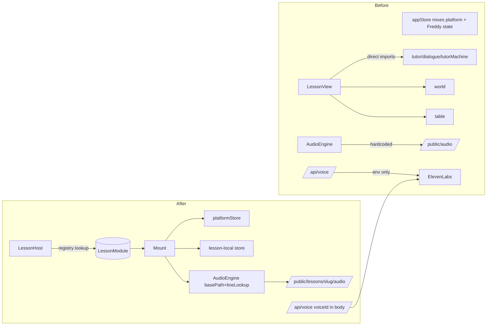

# Lesson Server Refactor — Implementation Plan

## Scope decisions (adjust during review)
- **Approach**: in-repo `src/lessons/<slug>/` modules behind a typed registry. No npm workspaces yet — defer until after the interview.
- **Lesson coverage**: Freddy Fractions ships fully refactored. Acutis and ASL ship as **registry-only stubs** with `Mount` components that render a `Coming Soon` card and a single recorded voice intro. This proves the contract is real without burning two days on content.
- **Acutis-Institute / ASL-ComputerVision sibling repos**: stay untouched. Their planning docs remain there; the lesson modules live inside SuperTutors.
- **Back-compat**: keep `/lesson` working via a redirect to `/lessons/freddy-fractions` so deep links don't break.

## Target file layout

```
SuperTutors/
  api/
    voice.ts                       (changed: accepts voiceId in body)
  public/
    lessons/
      freddy-fractions/audio/      (moved from public/audio/)
      acutis/audio/                (new — 1 intro file)
      asl/audio/                   (new — 1 intro file)
  src/
    platform/                      (new — the "lesson server")
      lesson-sdk.ts                LessonModule + LessonMountProps types
      registry.ts                  Array<LessonModule>, lookup by slug
      LessonHost.tsx               Route component, loads + mounts a module
      audio/                       Re-export of platform AudioEngine
        AudioEngine.ts             (moved, made config-driven)
        nameAudioCache.ts          (moved as-is)
      cv/                          Platform-level camera + hand-tracking
        HandTracker.tsx            (moved from src/modules/cv/)
        usePointerFromHand.ts      (moved)
      stores/
        platformStore.ts           name, muted, cvMode, current lesson slug
      ui/                          (moved from src/modules/ui/)
    lessons/
      freddy-fractions/
        index.ts                   exports the LessonModule
        Mount.tsx                  entry component (was LessonView)
        scripted/                  (was LessonScripted + LessonExploration)
        scenes/                    (was modules/world/, modules/table/)
        tutor/                     (was modules/tutor/, includes tutorMachine + dialogue.json)
        store/tutorStore.ts        Freddy-only state (freddy, guests, spotlight, toolMode, currentBeat)
        audio-lines.ts             string -> mp3 filename stem lookup
        gestures.ts                (moved from modules/cv/)
      acutis/
        index.ts
        Mount.tsx                  Coming Soon card + voice intro
      asl/
        index.ts
        Mount.tsx                  Coming Soon card + camera permission demo
    components/                    (unchanged — generic chrome)
    App.tsx                        (slimmed — platform chrome only)
    main.tsx                       (new routes)
```

## The contract (the one type that holds it all together)

```typescript
// src/platform/lesson-sdk.ts
export interface LessonModule {
  slug: string;
  meta: {
    title: string;
    tutorName: string;
    subject: string;
    audience: string;
    estimatedMinutes: number;
    cover: string;
    accent: string;          // tailwind color class for landing card
  };
  load: () => Promise<{
    Mount: React.ComponentType<LessonMountProps>;
    audio?: {
      basePath: string;
      lineLookup: (key: string) => string | undefined;
      voiceId?: string;
    };
    requires?: { camera?: boolean; microphone?: boolean };
  }>;
}

export interface LessonMountProps {
  name: string;
  onComplete: (r: { outcome: "win" | "exit"; durationMs: number }) => void;
  platform: {
    audio: AudioEngineHandle;
    cv?: CvCameraHandle;
    muted: boolean;
    setMuted: (m: boolean) => void;
  };
}
```

## Architecture before / after



---

## Phase 0 — Branch + baseline (15 min)

1. Cut a branch: `git checkout -b refactor/lesson-server`.
2. Run baseline: `npm run lint && npm run typecheck && npm test && npx playwright test`. Record pass/fail so you know what was already red.
3. Tag the commit: `git tag pre-refactor-baseline` so you can diff bundle size and revert if needed.

**Gate**: baseline test results captured in a scratch file. Do not proceed if more than one suite is red — fix the existing red first or you'll lose your ability to detect regressions.

---

## Phase 1 — Platform foundation (3–4 hours)

Goal: stand up `src/platform/` with the types, registry, and split stores. **No behavior change yet** — old `LessonView` still works, but now the store is split and `AudioEngine` is config-driven.

### 1.1 Create the SDK types
- New file [`src/platform/lesson-sdk.ts`](src/platform/lesson-sdk.ts) with the `LessonModule`, `LessonMountProps`, and helper handle interfaces (`AudioEngineHandle`, `CvCameraHandle`).
- New file [`src/platform/registry.ts`](src/platform/registry.ts) exporting `lessons: LessonModule[]` (initially empty) and `getLessonBySlug(slug)`.

### 1.2 Split the store
- New file [`src/platform/stores/platformStore.ts`](src/platform/stores/platformStore.ts) holds: `name`, `setName`, `muted`, `setMuted`, `cvMode`, `setCvMode`, `currentLessonSlug`.
- New file `src/lessons/freddy-fractions/store/tutorStore.ts` holds: `freddy`, `guests`, `spotlight`, `toolMode`, `currentBeat`, `onboardingState`. Same Zustand API.
- Delete [`src/store/appStore.ts`](src/store/appStore.ts) after re-pointing every importer. Use Grep on `useAppStore` to enumerate (currently 14 files per prior pass).
- Add a thin compatibility shim only if needed: `src/store/appStore.ts` re-exports the union for the duration of Phase 1, removed at end of Phase 2.

### 1.3 Make AudioEngine config-driven
- Move [`src/modules/audio/AudioEngine.ts`](src/modules/audio/AudioEngine.ts) to `src/platform/audio/AudioEngine.ts`.
- Change constructor to accept `{ basePath: string; lineLookup: (key: string) => string | undefined }` instead of importing `dialogue.json` directly. The old default (`/audio`, dialogue.json keys) becomes the configuration the Freddy module passes in.
- Move [`src/modules/audio/nameAudioCache.ts`](src/modules/audio/nameAudioCache.ts) unchanged to `src/platform/audio/`.
- `AudioEngine.test.ts` and `nameAudioCache.test.ts` move with their files. Update import paths only.

### 1.4 Move CV platform primitives
- Move [`src/modules/cv/HandTracker.tsx`](src/modules/cv/HandTracker.tsx) and `usePointerFromHand.ts` to `src/platform/cv/`.
- **Keep** `src/modules/cv/gestures.ts` for now (Freddy-specific pinch logic) — moves in Phase 2.

### 1.5 Move generic UI chrome
- Move `src/modules/ui/` (MuteToggle, ExitButton, DemoBadge) to `src/platform/ui/`. These are not Freddy-specific.

### Tests for Phase 1
- Run `npm run typecheck` after each subsection — TypeScript will tell you every miswired import. **Do not proceed to Phase 2 with type errors.**
- Run `npm test` after 1.3 and 1.5 — unit tests should remain green; the only changes are file locations and store splits.
- Run `npx playwright test e2e/smoke.spec.ts` after 1.5 — the existing `/lesson` route must still work because the old `LessonView` still imports the renamed modules via updated paths.

**Gate**: typecheck clean, unit tests green, smoke spec green. Commit: `refactor(platform): split store, make AudioEngine config-driven, move platform primitives`.

---

## Phase 2 — Freddy module extraction (4–6 hours)

Goal: every line of Freddy-specific code lives under `src/lessons/freddy-fractions/`. Nothing outside that folder mentions "freddy", "guest", "pizza", or "fractions".

### 2.1 Move Freddy code into the lesson folder
- Move [`src/modules/lesson/LessonView.tsx`](src/modules/lesson/LessonView.tsx) → `src/lessons/freddy-fractions/Mount.tsx`. Rename the exported component to `FreddyMount`.
- Move `LessonScripted.tsx` and `LessonExploration.tsx` → `src/lessons/freddy-fractions/scripted/`.
- Move `src/modules/world/`, `src/modules/table/` → `src/lessons/freddy-fractions/scenes/`.
- Move `src/modules/tutor/` (including `tutorMachine.ts`, `dialogue.json`, `dialogue.ts`) → `src/lessons/freddy-fractions/tutor/`.
- Move `src/modules/cv/gestures.ts` → `src/lessons/freddy-fractions/gestures.ts`.
- Move `src/modules/toast/` → `src/platform/ui/toast/` if any non-Freddy code uses it, otherwise to `src/lessons/freddy-fractions/`.
- Move `src/modules/preview/*` (`PizzaPreview`, `GuestPreview`, `PizzaInScene`) → `src/lessons/freddy-fractions/previews/`. Leave `VoicePreview` and `CvPreview` in `src/platform/previews/` since they exercise platform primitives.

### 2.2 Conform `FreddyMount` to the contract
- `FreddyMount` accepts `LessonMountProps`. Replace direct `useAppStore` calls for `name`/`muted` with the prop-supplied `platform` handle, and read Freddy-local state from `tutorStore`.
- The audio engine instance passed in via `props.platform.audio` is already configured with `/lessons/freddy-fractions/audio` basePath and the lesson's `lineLookup` — `FreddyMount` does not instantiate AudioEngine itself anymore.

### 2.3 Re-namespace audio assets
- Move all 72 MP3s + `.manifest.json` from `public/audio/` to `public/lessons/freddy-fractions/audio/`.
- Update [`scripts/generate-voice.ts`](scripts/generate-voice.ts):
  - Read lesson list from `src/platform/registry.ts` (or accept a `--lesson` flag).
  - For each lesson, read `dialogue.json` from its lesson folder and write MP3s to `public/lessons/<slug>/audio/`.
  - Update manifest to be per-lesson (`public/lessons/<slug>/audio/.manifest.json`).
- Create `src/lessons/freddy-fractions/audio-lines.ts` that exports `lineLookup(key) => "<key>.mp3"` (matches existing convention from [`dialogueSplit.ts`](src/lib/dialogueSplit.ts)).

### 2.4 Voice API multi-tenancy
- Change [`api/voice.ts`](api/voice.ts) to accept `{ name: string; voiceId?: string }`. If `voiceId` is present, use it; otherwise fall back to `process.env.ELEVENLABS_VOICE_ID` for back-compat.
- Add `voiceId` to the request body in [`src/platform/audio/nameAudioCache.ts`](src/platform/audio/nameAudioCache.ts) — accept it as a `NameAudioFetchDeps` field and forward to the POST body.
- Update the IndexedDB cache key from `normalizeNameKey(name)` to `${voiceId ?? "default"}:${normalizeNameKey(name)}` so two lessons with different voices don't share a blob. **This invalidates the existing cache**; that's fine, it'll regenerate on demand and the user told us network is fine.
- Update [`src/lib/voiceProxyValidation.ts`](src/lib/voiceProxyValidation.ts) to accept and validate `voiceId` as an optional UUID-ish string.

### 2.5 Register Freddy in the registry
- New file `src/lessons/freddy-fractions/index.ts`:
  ```typescript
  export const freddyFractionsLesson: LessonModule = {
    slug: "freddy-fractions",
    meta: { title: "Freddy's Fractions", tutorName: "Freddy", subject: "Fractions",
            audience: "Grade 3", estimatedMinutes: 6, cover: "/lessons/freddy-fractions/cover.png",
            accent: "freddy-orange" },
    load: async () => {
      const { FreddyMount } = await import("./Mount");
      const { freddyLineLookup } = await import("./audio-lines");
      return {
        Mount: FreddyMount,
        audio: { basePath: "/lessons/freddy-fractions/audio", lineLookup: freddyLineLookup,
                 voiceId: "EXAVITQu4vr4xnSDxMaL" /* the existing voice */ },
        requires: { camera: true },
      };
    },
  };
  ```
- Add to `src/platform/registry.ts`: `lessons.push(freddyFractionsLesson)`.

### 2.6 Tailwind cleanup
- In [`tailwind.config.js`](tailwind.config.js), keep platform colors (`sb-*`) at top level; namespace Freddy colors under `freddy: { ... }` so the lesson cards visually distinguish.
- Update any tailwind classes inside `src/lessons/freddy-fractions/` to use `freddy-*` prefix. Use `rg "bg-(freddy|orange|pizza)"` to enumerate.

### Tests for Phase 2
- After 2.1: typecheck clean. Run only unit tests — most should still pass; the few that grep on file paths (none, after audit) need updating.
- After 2.3: run `npm run generate-voice` in dry mode (skip if existing MP3s are already on disk) to confirm script picks up new paths. Manually verify a few MP3 paths return 200 from `npm run dev`.
- After 2.4: add a new unit test `api/voice.test.ts` (or extend `voiceProxyValidation.test.ts`) covering: voiceId provided → uses it; voiceId absent → uses env; voiceId malformed → 400. Add a test for the cache-key prefix in `nameAudioCache.test.ts`.
- After 2.6: `npx playwright test e2e/smoke.spec.ts e2e/lesson-scripted.spec.ts e2e/beat-6-aha.spec.ts e2e/beat-8-win.spec.ts e2e/cv-sandbox.spec.ts e2e/sandbox-proximity.spec.ts` — all six must remain green. Routes are still `/lesson` because Phase 3 hasn't moved them yet.

**Gate**: 0 references to `freddy`/`pizza`/`fractions` outside `src/lessons/freddy-fractions/`, `public/lessons/freddy-fractions/`, and `tailwind.config.js`. Verify with `rg -iw "freddy|pizza|fraction" src/ --glob '!src/lessons/freddy-fractions/**'`. All unit + e2e tests green.

---

## Phase 3 — LessonHost, routing, stub modules (2–3 hours)

Goal: `/lessons/:slug` works for all three modules. Landing page renders cards from the registry. Old `/lesson` redirects.

### 3.1 Build `LessonHost`
- New file `src/platform/LessonHost.tsx`. Responsibilities:
  - Read `:slug` from React Router params, look up in registry, render an error card if not found.
  - Lazy-call `module.load()`, show a tutor-themed loading state.
  - Instantiate the configured `AudioEngine` from the lesson's `audio.basePath`/`lineLookup`/`voiceId`.
  - If `requires.camera`, mount the platform `HandTracker` and pass a `CvCameraHandle` to the mount.
  - Render `<Mount platform={...} name={...} onComplete={...} />`.
  - On `onComplete`, set platformStore `currentLessonSlug = null` and navigate back to `/`.

### 3.2 Stub modules
- `src/lessons/acutis/`:
  - `index.ts` registry entry with `meta.subject = "Virtue formation"`, `accent: "acutis-blue"`, `requires: {}`.
  - `Mount.tsx`: renders an `acutis-card` (Catholic-blue palette) with a "Coming soon — listen to a sneak peek" button that plays a single recorded line via `props.platform.audio.play("intro")`. Recorded line lives at `public/lessons/acutis/audio/intro.mp3`.
  - `audio-lines.ts`: `{ intro: "intro.mp3" }`.
- `src/lessons/asl/`:
  - `index.ts` with `requires: { camera: true }`, `accent: "asl-green"`.
  - `Mount.tsx`: renders "Show me the camera." Sets up the camera via `props.platform.cv`, draws a thumbs-up overlay when a hand is detected. Includes a "Coming soon — full lessons in development" caption.
- Generate the two intro MP3s once via a manual call to ElevenLabs (a 2-line shell script or just hand-encode), commit them. Don't add them to `generate-voice.ts` until we have full dialogue files.

### 3.3 Router rewire
- Edit [`src/main.tsx`](src/main.tsx):
  ```
  /                          -> LandingPage
  /lessons/:slug             -> LessonHost
  /lesson                    -> <Navigate to="/lessons/freddy-fractions" replace />
  /preview/freddy/*          -> Freddy preview routes
  /preview/voice             -> VoicePreview
  /preview/cv                -> CvPreview
  ```
- Update preview imports to reflect new file locations.

### 3.4 LandingPage from registry
- Edit `src/modules/landing/LandingPage.tsx` (move it to `src/platform/landing/LandingPage.tsx`).
- Replace hardcoded Freddy CTA with `lessons.map(l => <TutorCard ... />)`. The card uses `meta.accent` and `meta.cover`; clicking navigates to `/lessons/${l.slug}`.
- Keep the Freddy card visually identical for the existing smoke test to still match by accessible name. Confirm `aria-label="Start the fractions lesson with Freddy"` is still emitted for the Freddy card.

### Tests for Phase 3
- New `e2e/registry.spec.ts`:
  - Landing shows 3 tutor cards.
  - Clicking Freddy card → URL is `/lessons/freddy-fractions`, restaurant scene visible.
  - Clicking Acutis card → URL is `/lessons/acutis`, "Coming soon" copy visible, intro audio button enabled.
  - Clicking ASL card → URL is `/lessons/asl`, "Show me the camera" copy visible.
- New `e2e/back-compat-redirect.spec.ts`: `/lesson` redirects to `/lessons/freddy-fractions` and lands on the restaurant scene.
- Update existing Playwright specs (`smoke.spec.ts`, `lesson-scripted.spec.ts`, `beat-6-aha.spec.ts`, `beat-8-win.spec.ts`, `cv-sandbox.spec.ts`, `sandbox-proximity.spec.ts`, `a11y.spec.ts`):
  - Replace `await page.goto("/lesson")` with `await page.goto("/lessons/freddy-fractions")`. (The redirect spec covers the back-compat case.)
  - Update `e2e/smoke.spec.ts` assertion `await expect(page).toHaveURL(/\/lesson$/)` to `/\/lessons\/freddy-fractions$/`.

**Gate**: `npx playwright test` runs all suites green. `npm run build` succeeds. Verify in built output that Freddy bundle is in its own chunk (Vite will name it after the dynamic import path). Commit: `feat(platform): registry, LessonHost, three lesson cards`.

---

## Phase 4 — Hardening + isolation enforcement (2 hours)

### 4.1 ESLint isolation rule
- Add `eslint-plugin-import` (already present? check `package.json`; if not, install).
- In `eslint.config.mjs`, add `no-restricted-imports` patterns:
  - Files under `src/lessons/<slug>/` may only import from `src/platform/`, `src/components/`, `src/lib/`, or `./` (same lesson). They may **not** import from `src/lessons/<other-slug>/`.
  - Files under `src/platform/` may **not** import from `src/lessons/`.
- Run `npm run lint` — any violation surfaces a real architectural leak.

### 4.2 Bundle size guard
- Use `vite-bundle-visualizer` (or `rollup-plugin-visualizer` against the existing Vite config) to confirm:
  - Initial JS chunk does **not** contain `tutorMachine`, `dialogue.json`, or `RestaurantScene`.
  - There are 3 lazy chunks, one per lesson.
- Capture the numbers in the PR description as the "platform proof point" for the interview.

### 4.3 Docs
- New `docs/ADDING_A_LESSON.md` (or extend README) — a 1-page recipe: create folder, implement `LessonModule`, add to registry, drop MP3s in `public/lessons/<slug>/audio/`, done. Cite the Acutis stub as the minimal example.
- Update root `README.md` "Project structure" section to reflect the new layout.

### Tests for Phase 4
- `npm run lint` clean.
- `npm run build` clean. Manually inspect `dist/` chunk names to confirm the 3 lesson chunks.
- Run the full e2e suite one final time: `npx playwright test`.

**Gate**: lint + typecheck + unit + e2e all green. Commit: `chore(platform): isolation lint rule + docs + bundle proof`.

---

## Phase 5 — Demo prep (1 hour, day-of)

Not strictly part of the refactor but the reason it exists.

- Smoke the deployed Vercel preview URL end-to-end on the actual device you'll demo on (laptop + phone if you'll show responsive).
- Pre-warm the IndexedDB voice cache for whatever demo name you'll use, so the demo doesn't hit a 2-second ElevenLabs round-trip live.
- Open the interview narrative talking points in a sticky note: "registry, dynamic import, clean contract, ESLint enforces isolation, here's the diff to add a fourth tutor."

---

## Risk register (with mitigations baked in)

- **AudioEngine config refactor breaks playback**: covered by `AudioEngine.test.ts` and the existing scripted-lesson Playwright spec, both run after Phase 1.3 and Phase 2.3.
- **Voice cache key change invalidates IndexedDB across sessions**: acknowledged; users regenerate on next play, no data loss.
- **`/api/voice` change breaks deployed back-compat**: env fallback in 2.4 preserves the old contract for any client that doesn't send `voiceId`.
- **E2E specs hardcoded to `/lesson`**: addressed in 3.4 as a single mechanical sed-style update, validated by running each spec individually.
- **Freddy state coupling deeper than expected**: the store split in 1.2 is the canary — if it touches more than ~14 files, slow down and audit before continuing.
- **MP3 path move breaks served audio**: covered by manual `npm run dev` check in 2.3 plus the audio-dependent Playwright specs.

## What I'm explicitly NOT doing
- npm workspaces / Turborepo (post-interview).
- Lesson manifest JSON loaded over the wire (registry is a TS array — simpler, statically checkable).
- Multi-tenant ElevenLabs key per lesson (single key, voiceId per lesson is enough).
- Acutis and ASL full content (stubs only; full lessons are weeks of authoring).
- Mobile/PWA-specific work.