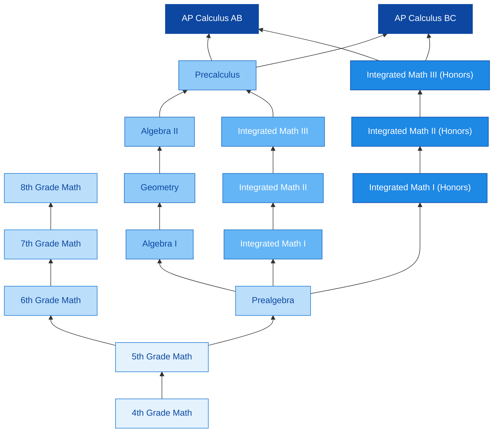
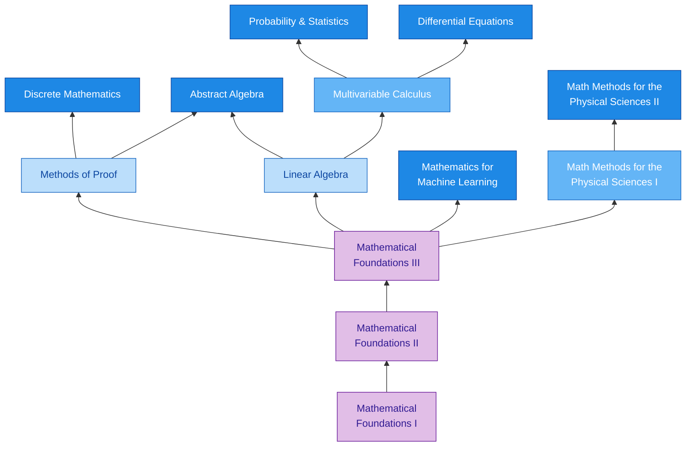
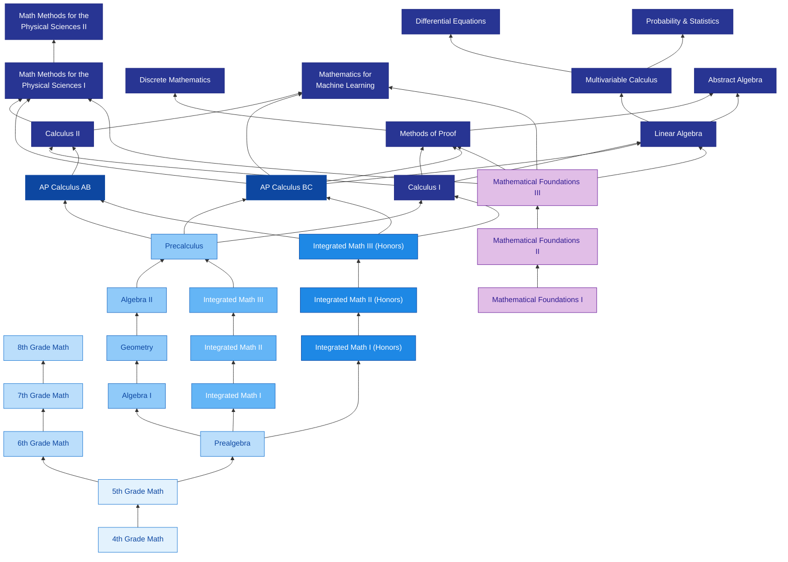

# Math Academy: Courses

Source: [mathacademy.com/courses](https://www.mathacademy.com/courses)

> All of our courses are comprehensive and [standards-based](https://www.mathacademy.com/common-core-standards), typically covering hundreds of individual topics. Each course kicks off with an **adaptive diagnostic exam** that creates a custom-fit experience by identifying any missing prerequisite knowledge and any course material the student may already know.

---

## Fully Accredited

Math Academy's math courses are fully accredited by the **Accrediting Commission for Schools, Western Association of Schools and Colleges** ([www.acswasc.org](http://www.acswasc.org)).

Math Academy, LLC. is now officially registered and listed on **UC's Directory of Online Publishers**. Your home school may add our courses to their list through their UC course management portal so we are able to issue transcripts to you for official **UC a-g credit**.

---

## Elementary School

Our lowest entry point is 4th Grade Math, which would be an appropriate starting point for any student who knows their multiplication tables up to the 12s and is capable of reading independently.

#### [4th Grade Math](https://www.mathacademy.com/courses/4th-grade-math)

Learn to add, subtract, multiply, and divide numbers with multiple digits. Encounter different types of numbers including fractions and decimals, and learn about lines and angles in geometry.

- **Prerequisite(s):** Mastery of multiplication tables up to the 12s

#### [5th Grade Math](https://www.mathacademy.com/courses/5th-grade-math)

Learn how to perform arithmetic with negative numbers, fractions, and decimals. Solve real-world problems involving measurement, data, and geometry.

- **Prerequisite(s):** [4th Grade Math](https://www.mathacademy.com/courses/4th-grade-math)

---

## Middle School

#### [6th Grade Math](https://www.mathacademy.com/courses/6th-grade-math)

Learn ratios, percentages, multi-digit division, fraction division, decimals, rational numbers, expressions, equations, geometry, and statistics.

- **Prerequisite(s):** [5th Grade Math](https://www.mathacademy.com/courses/5th-grade-math)

#### [7th Grade Math](https://www.mathacademy.com/courses/7th-grade-math)

Learn proportional relationships, percentages, rational numbers, expressions, equations, geometry, statistics, and probability, and apply them to real-world problems involving scale, finance, measurement, and data.

- **Prerequisite(s):** [6th Grade Math](https://www.mathacademy.com/courses/6th-grade-math)

#### 8th Grade Math *— Coming soon*

Learn exponents, radicals, scientific notation, equations, graphs, functions, geometry, transformations, the Pythagorean Theorem, and statistics. Solve real-world problems involving measurement, units, and data.

- **Prerequisite(s):** [7th Grade Math](https://www.mathacademy.com/courses/7th-grade-math)

#### [Prealgebra](https://www.mathacademy.com/courses/prealgebra)

This course bridges the gap between elementary-school arithmetic and middle-school algebra and geometry. Further your understanding of arithmetic and geometry, learn about variables, and solve linear equations, inequalities, and systems.

- **Prerequisite(s):** [5th Grade Math](https://www.mathacademy.com/courses/5th-grade-math)

### Prealgebra vs. 6th–8th Grade Math

Prealgebra covers the same content as the standard 6th–8th grade math courses, but in a more streamlined format. This course is appropriate for students who absorb new material quickly and can thus move comfortably at a faster pace.

---

## High School Courses

There are three sequences to choose from: the [Traditional Math Sequence](#traditional-math-sequence), the [Integrated Math Sequence](#integrated-math-sequence), and the [Integrated Math (Honors) Sequence](#integrated-math-honors-sequence). Both the traditional and integrated sequences cover the same material, the only difference being the order in which certain topics are introduced.

The noted shortcoming of the traditional sequence is that it's frequently the case that many [Algebra I](https://www.mathacademy.com/courses/algebra-i) skills have to be relearned in [Algebra II](https://www.mathacademy.com/courses/algebra-ii) after the student has taken a year off for [Geometry](https://www.mathacademy.com/courses/geometry). (However, our spaced-repetition algorithm makes this less of a problem as it keeps all previously covered skills fresh. For some families, following the traditional sequence could be more convenient, if for instance, a student is attending, or may attend, a school that only offers the traditional courses.)

The [Integrated Math (Honors) Sequence](#integrated-math-honors-sequence), however, moves at a considerably faster pace, covering **four years of math in only three**.

### Traditional Math Sequence

#### [Algebra I](https://www.mathacademy.com/courses/algebra-i)

Level up your algebra skills, learn about functions and graphing, and dive deep into quadratics.

- **Prerequisite(s):** [Prealgebra](https://www.mathacademy.com/courses/prealgebra)

#### [Geometry](https://www.mathacademy.com/courses/geometry)

Learn how to compute length, area, and volume for a wide variety of objects. Discover relationships between angles and side lengths in right triangles.

- **Prerequisite(s):** [Algebra I](https://www.mathacademy.com/courses/algebra-i)

#### [Algebra II](https://www.mathacademy.com/courses/algebra-ii)

Master the algebra of advanced functions including quadratics, logarithms, trigonometry, and more. Dive deep into the theory of polynomials.

- **Prerequisite(s):** [Geometry](https://www.mathacademy.com/courses/geometry)

#### [Precalculus](https://www.mathacademy.com/courses/precalculus)

Learn advanced trigonometry and core concepts in probability and statistics. Encounter objects from higher math including complex numbers, vectors, and matrices.

- **Prerequisite(s):** [Algebra II](https://www.mathacademy.com/courses/algebra-ii)

### Integrated Math Sequence

#### [Integrated Math I](https://www.mathacademy.com/courses/integrated-math-i)

Level up your algebra skills, learn about functions and graphing, and solve problems in geometry and real-world modeling.

- **Prerequisite(s):** [Prealgebra](https://www.mathacademy.com/courses/prealgebra)

#### [Integrated Math II](https://www.mathacademy.com/courses/integrated-math-ii)

Master the algebra of quadratics and get acquainted with more advanced functions including polynomials, logarithms, trigonometry, and more. Learn core concepts in probability.

- **Prerequisite(s):** [Integrated Math I](https://www.mathacademy.com/courses/integrated-math-i)

#### [Integrated Math III](https://www.mathacademy.com/courses/integrated-math-iii)

Dive deep into the algebra of polynomials, practice graphing trigonometric functions, and master the algebra of radical functions and logarithms. Learn core concepts in combinatorics, probability, and statistics.

- **Prerequisite(s):** [Integrated Math II](https://www.mathacademy.com/courses/integrated-math-ii)

#### [Precalculus](https://www.mathacademy.com/courses/precalculus)

Learn advanced trigonometry and core concepts in probability and statistics. Encounter objects from higher math including complex numbers, vectors, and matrices.

- **Prerequisite(s):** [Integrated Math III](https://www.mathacademy.com/courses/integrated-math-iii)

### Integrated Math (Honors) Sequence

The honors sequence covers **four years of high-school math in three years**, including Precalculus. In contrast, the standard integrated math sequence terminates at the same level as Algebra II and feeds into Precalculus.

#### [Integrated Math I (Honors)](https://www.mathacademy.com/courses/integrated-math-i-honors)

Level up your algebra skills, learn about functions and graphing, and solve problems in geometry and real-world modeling.

- **Prerequisite(s):** [Prealgebra](https://www.mathacademy.com/courses/prealgebra)

#### [Integrated Math II (Honors)](https://www.mathacademy.com/courses/integrated-math-ii-honors)

Master the algebra of advanced functions including quadratics, polynomials, logarithms, trigonometry, and more. Learn core concepts in combinatorics, probability, and statistics.

- **Prerequisite(s):** [Integrated Math I (Honors)](https://www.mathacademy.com/courses/integrated-math-i-honors)

#### [Integrated Math III (Honors)](https://www.mathacademy.com/courses/integrated-math-iii-honors)

Dive deep into the algebra of polynomials, radical and rational functions, and advanced trigonometry. Encounter objects from higher math including complex numbers, vectors, matrices, parametric equations, and polar equations.

- **Prerequisite(s):** [Integrated Math II (Honors)](https://www.mathacademy.com/courses/integrated-math-ii-honors)

### K–12 Course Map

The diagram below shows every path a student can take from 4th Grade Math through AP Calculus, including the three high-school sequences and where they converge.

*Figure 1 — K–12 course map: Elementary → Middle → three High School sequences → AP Calculus. Arrows point from prerequisite to next course.*

---

## Test Prep

Test prep courses focus the student's learning on exam-specific material and fine-tune the critical skills necessary to achieve the highest score possible.

#### [SAT Math Fundamentals](https://www.mathacademy.com/courses/sat-math-fundamentals)

Covers all specified SAT topics such as basic and advanced algebra, 2D and 3D geometry, trigonometry, functions, statistics, probability, and problem-solving.

- **Prerequisite(s):** [Algebra II](https://www.mathacademy.com/courses/algebra-ii), [Integrated Math II](https://www.mathacademy.com/courses/integrated-math-ii), or [Integrated Math II (Honors)](https://www.mathacademy.com/courses/integrated-math-ii-honors)

#### [SAT Math Prep](https://www.mathacademy.com/courses/sat-math-prep)

This is a follow-up course to [SAT Math Fundamentals](https://www.mathacademy.com/courses/sat-math-fundamentals) and is designed to help students achieve the highest possible score on the math section of the SAT exam. Please note that students can not sign up to this course directly, but must be promoted into it after completing SAT Math Fundamentals.

- **Prerequisite(s):** [SAT Math Fundamentals](https://www.mathacademy.com/courses/sat-math-fundamentals)

#### [ACT Math](https://www.mathacademy.com/courses/act-math) *— Coming soon*

Master important ACT topics, including but not limited to real and complex numbers, integer and rational exponents, vectors and matrices, linear, polynomial, radical, and exponential relationships, linear, radical, piecewise, polynomial, and logarithmic functions, geometry, statistics, and probability.

---

## AP Courses

AP Calculus AB and AP Calculus BC are high school advanced placement courses intended to prepare students for the respective College Board AP Exams. While AP Calculus BC is meant to represent the material covered in the two-semester university calculus sequence [Calculus I](https://www.mathacademy.com/courses/calculus-i) and [Calculus II](https://www.mathacademy.com/courses/calculus-ii), AP Calculus AB is a less comprehensive treatment, covering about **70% of the material**.

#### [AP Calculus AB](https://www.mathacademy.com/courses/ap-calculus-ab)

Learn about limits, continuity, derivatives, indefinite and definite integrals and how to apply these concepts in a variety of contexts.

- **Prerequisite(s):** [Precalculus](https://www.mathacademy.com/courses/precalculus) or [Integrated Math III (Honors)](https://www.mathacademy.com/courses/integrated-math-iii-honors)

#### [AP Calculus BC](https://www.mathacademy.com/courses/ap-calculus-bc)

Master the fundamentals of single-variable calculus including with vectors, parametric and polar equations. Learn how to apply tests of convergence to infinite series and to approximate functions using Taylor series.

- **Prerequisite(s):** [Precalculus](https://www.mathacademy.com/courses/precalculus) or [Integrated Math III (Honors)](https://www.mathacademy.com/courses/integrated-math-iii-honors)

---

## Mathematical Foundations

The Mathematical Foundations sequence is aimed at **adult learners** interested in pursuing advanced university courses, but lack the necessary foundational knowledge. Whether you're starting off again with the basics or just need to brush up on your calculus, this is the fastest and most efficient way to get up to speed.

#### [Mathematical Foundations I](https://www.mathacademy.com/courses/mathematical-foundations-i)

Solidify your arithmetic, learn about variables and graphs, level up your algebra, and learn the essentials of geometry.

#### [Mathematical Foundations II](https://www.mathacademy.com/courses/mathematical-foundations-ii)

Master the algebra of advanced functions including quadratics, logarithms, and trigonometry. Dive deep into the theory of polynomials, learn the basics of limits, derivatives, and integrals from calculus, and explore a variety of concepts from higher math including complex numbers, vectors, probability, and statistics.

- **Prerequisite(s):** [Mathematical Foundations I](https://www.mathacademy.com/courses/mathematical-foundations-i)

#### [Mathematical Foundations III](https://www.mathacademy.com/courses/mathematical-foundations-iii)

Learn advanced calculus techniques for computing limits, derivatives, and integrals, and apply calculus to solve problems in the context of related rates, optimization, particle motion, and differential equations. Dive deeper into complex numbers, vectors, matrices, parametric and polar curves, probability, and statistics.

- **Prerequisite(s):** [Mathematical Foundations II](https://www.mathacademy.com/courses/mathematical-foundations-ii)

### Foundations → University Course Map

The Mathematical Foundations sequence is the adult-learner on-ramp to every university-level course. From Mathematical Foundations III, learners can branch into proofs, linear algebra, ML math, or the physics methods track.

*Figure 2 — Mathematical Foundations as the entry point into the upper-division University curriculum. (Each of Methods of Proof, Linear Algebra, Mathematics for Machine Learning, and Math Methods for the Physical Sciences I also has equivalent Calculus-based entry paths — see the full map at the end of this page.)*

---

## University Courses

Our university courses are modeled after the rigorous, semester-length courses offered at elite universities, and in many cases, go a few steps beyond. These courses are comprehensive and cover every major topic reasonably included in an undergraduate treatment of the subject.

#### [Calculus I](https://www.mathacademy.com/courses/calculus-i)

Learn the mathematics of change that underlies science and engineering. Master limits, derivatives, and the basics of integration.

- **Prerequisite(s):** [Precalculus](https://www.mathacademy.com/courses/precalculus) or [Integrated Math III (Honors)](https://www.mathacademy.com/courses/integrated-math-iii-honors)

#### [Calculus II](https://www.mathacademy.com/courses/calculus-ii)

Further your understanding of calculus: master advanced integration techniques, model real-world situations using differential equations, and more.

- **Prerequisite(s):** [Calculus I](https://www.mathacademy.com/courses/calculus-i) or [AP Calculus AB](https://www.mathacademy.com/courses/ap-calculus-ab)

#### [Linear Algebra](https://www.mathacademy.com/courses/linear-algebra)

Dive deep into the math behind vectors and matrices. Learn a wide assortment of computational methods and conceptual connections that unify into an elegant whole.

- **Prerequisite(s):** [Calculus I](https://www.mathacademy.com/courses/calculus-i), [AP Calculus BC](https://www.mathacademy.com/courses/ap-calculus-bc), or [Mathematical Foundations III](https://www.mathacademy.com/courses/mathematical-foundations-iii)

#### [Multivariable Calculus](https://www.mathacademy.com/courses/multivariable-calculus)

Generalize your understanding of calculus to vector-valued functions and functions of multiple variables.

- **Prerequisite(s):** [Linear Algebra](https://www.mathacademy.com/courses/linear-algebra)

#### [Methods of Proof](https://www.mathacademy.com/courses/methods-of-proof)

Build fluency with sets and logic, the most fundamental structures and operations in mathematics. Learn what a proof is and master a variety of techniques for proving mathematical statements.

- **Prerequisite(s):** [Calculus I](https://www.mathacademy.com/courses/calculus-i), [AP Calculus BC](https://www.mathacademy.com/courses/ap-calculus-bc), or [Mathematical Foundations III](https://www.mathacademy.com/courses/mathematical-foundations-iii)

#### [Differential Equations](https://www.mathacademy.com/courses/differential-equations)

Master a variety of techniques for solving equations that arise when using calculus to model real-world situations.

- **Prerequisite(s):** [Multivariable Calculus](https://www.mathacademy.com/courses/multivariable-calculus)

#### [Discrete Mathematics](https://www.mathacademy.com/courses/discrete-mathematics)

Learn mathematical techniques for reasoning about quantities that are discrete rather than continuous. Encounter graphs, algorithms, and other areas of math that are widely applicable in computer science.

- **Prerequisite(s):** [Methods of Proof](https://www.mathacademy.com/courses/methods-of-proof)

#### [Probability & Statistics](https://www.mathacademy.com/courses/probability-and-statistics)

Learn the mathematics of chance and use it to draw precise conclusions about possible outcomes of uncertain events. Analyze real-world data using mathematically rigorous techniques.

- **Prerequisite(s):** [Multivariable Calculus](https://www.mathacademy.com/courses/multivariable-calculus)

#### [Mathematics for Machine Learning](https://www.mathacademy.com/courses/mathematics-for-machine-learning)

Learn the key skills and concepts from linear algebra, multivariable calculus, and probability & statistics that you need to know in order to understand and implement core machine learning algorithms. This course will prepare you for a university-level machine learning course that covers topics such as gradient descent, neural networks and backpropagation, support vector machines, extensions of linear regression (e.g. logistic and lasso regression), naive Bayes classifiers, principal component analysis, matrix factorization methods, and Gaussian mixture models.

- **Prerequisite(s):** [Calculus II](https://www.mathacademy.com/courses/calculus-ii), [AP Calculus BC](https://www.mathacademy.com/courses/ap-calculus-bc), or [Mathematical Foundations III](https://www.mathacademy.com/courses/mathematical-foundations-iii)

#### [Mathematical Methods for the Physical Sciences I](https://www.mathacademy.com/courses/mathematical-methods-for-the-physical-sciences-i)

Mathematical Methods for the Physical Sciences I develops the core mathematical structures and analytical tools used throughout theoretical and applied physics. Building on calculus and introductory linear algebra, the course introduces vector geometry, multivariable analysis, and differential equations in a unified framework designed for modeling physical systems.

- **Prerequisite(s):** [Calculus II](https://www.mathacademy.com/courses/calculus-ii), [AP Calculus BC](https://www.mathacademy.com/courses/ap-calculus-bc), or [Mathematical Foundations III](https://www.mathacademy.com/courses/mathematical-foundations-iii)

#### [Mathematical Methods for the Physical Sciences II](https://www.mathacademy.com/courses/mathematical-methods-for-the-physical-sciences-ii)

Mathematical Methods for the Physical Sciences II continues the development of advanced mathematical techniques used throughout modern physics. Building on the analytical framework established in the first course, students study orthogonality, multivariable integration, vector calculus theorems, and advanced methods for differential equations.

- **Prerequisite(s):** [Mathematical Methods for the Physical Sciences I](https://www.mathacademy.com/courses/mathematical-methods-for-the-physical-sciences-i)

#### [Abstract Algebra](https://www.mathacademy.com/courses/abstract-algebra) *— Coming soon*

Dive deep into the core relationships that govern how mathematical objects interact with one another. Learn to identify algebraic structures and apply mathematical reasoning to arrive at general conclusions.

- **Prerequisite(s):**
  - [Methods of Proof](https://www.mathacademy.com/courses/methods-of-proof)
  - [Linear Algebra](https://www.mathacademy.com/courses/linear-algebra)

---

## Comprehensive Curriculum

Our extensive course catalog covers the full range of content, from elementary arithmetic to upper-division undergraduate mathematics, and everything in between.

*Figure 3 — Complete Math Academy course map. Color legend, bottom-up:*
- *Light blue → Elementary / Middle School*
- *Mid blue → Traditional High School*
- *Darker blue → Integrated and Integrated Honors High School*
- *Navy → AP Calculus*
- *Indigo → University Courses*
- *Purple → Mathematical Foundations (adult-learner on-ramp; parallel to the high-school / AP path, terminating at the same gateway courses)*

---

*Need help? Email [support@mathacademy.com](mailto:support@mathacademy.com).*
