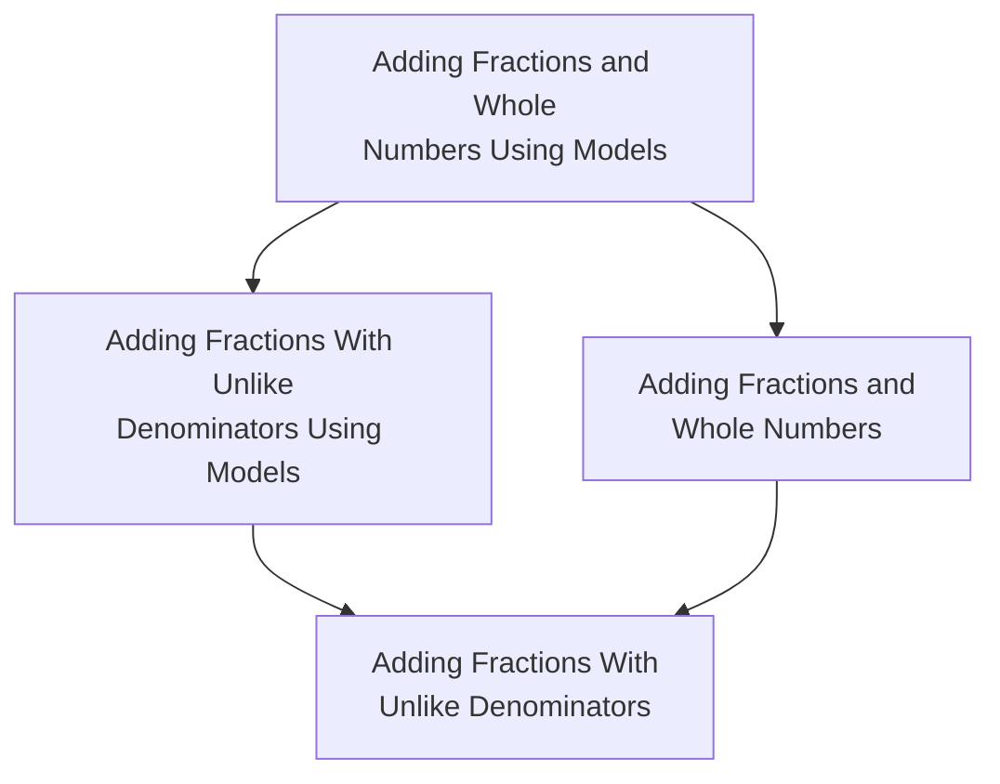

# Math Academy: How Our AI Works

Source: [mathacademy.com/how-our-ai-works](https://www.mathacademy.com/how-our-ai-works)

> Math Academy's AI is an expert system that emulates the decisions of an expert tutor regarding what tasks a student should work on at any given point in time. This is accomplished by combining the following pieces of technology.

The [**knowledge graph**](#the-knowledge-graph) stores all the information that an expert tutor would know about the structure of mathematics. What topics are there? What are the easiest and hardest variations of problems within each topic? What background knowledge must a student have in order to learn each topic? If a student struggles with a particular type of problem, what specific pieces of background knowledge are most relevant to their struggle? The answers to all these questions (and many more) are stored within our knowledge graph.

The [**student model**](#the-student-model) takes a student's answers, overlays them on the knowledge graph, and figures out what topics the student knows (and how well they know it). This is called the student's **knowledge profile**. To compute a student's knowledge profile, our student model uses [spaced repetition](#the-spaced-repetition-algorithm), a systematic method for determining when previously-learned material needs to be reviewed.

The [**diagnostic algorithm**](#the-diagnostic-algorithm) leverages the knowledge graph to minimize the number of questions needed to estimate a student's knowledge profile. It identifies what parts of the course the student has already learned, and what gaps they have in their foundational knowledge.

The [**task-selection algorithm**](#how-the-task-selection-algorithm-chooses-new-topics) takes a student's knowledge profile and uses it to determine the optimal learning tasks that will move the needle most on the student's learning. What should the student [learn next](#how-the-task-selection-algorithm-chooses-new-topics)? What do they need to [review](#how-the-task-selection-algorithm-chooses-topics-to-review)? When answering these questions, our task selection algorithm is always trying to maximize the [amount of learning](#how-the-algorithms-adapt-to-pace-of-learning) that occurs per unit of time that the student spends on the system.

---

## The Knowledge Graph

In the mathematical field of graph theory, the word "graph" refers to a diagram consisting of objects and arrows between them. In our knowledge graph, the objects are mathematical topics and the arrows between them represent relationships, such as one topic being a prerequisite for another topic. (There are lots of different kinds of relationships, some of which even refer to "sub-atomic" components within topics — but for now, we'll just focus on prerequisite relationships between topics.)

For instance, the tiny knowledge graph below shows that the topic *Adding Fractions With Unlike Denominators* (top) has two prerequisites: 1) *Adding Fractions With Unlike Denominators Using Models*, and 2) *Adding Fractions and Whole Numbers* (middle), and each of those prerequisites itself has a prerequisite *Adding Fractions and Whole Numbers Using Models* (bottom).

*Figure 1 — Tiny knowledge graph illustrating prerequisite relationships between four related fraction topics. (Source: [mathacademy.com](https://www.mathacademy.com/img/tiny-knowledge-graph.png))*

The same structure rendered as a Mermaid diagram for easy reference:

Knowledge graphs can encode a lot of complicated information that would otherwise be hard to describe and reason about. Zooming out, below is the knowledge graph for an entire course consisting of about 300 topics.

*Figure 2 — A full course's knowledge graph (~300 topics). (Source: [mathacademy.com](https://www.mathacademy.com/img/course-knowledge-graph.png))*

Fully zoomed out, Math Academy's entire curriculum consists of multiple thousands of interlinked topics spanning 4th Grade through university-level math. All these topics are connected up together in the knowledge graph. In this view, a course is simply a section of our knowledge graph. (In the visualization below, different colors represent different courses.)

*Figure 3 — Math Academy's entire curriculum knowledge graph (thousands of topics across many courses, color-coded by course). (Source: [mathacademy.com](https://www.mathacademy.com/img/large-knowledge-graph.png))*

---

## The Student Model

Our student model uses a student's answer history to compute their knowledge profile. Loosely speaking, a student's knowledge profile represents how developed their mathematical brain is. Every time they learn a new math topic, it's as if they grow a new brain cell and connect it to existing brain cells. Initially, this new brain cell is weak and requires frequent nurturing, but over time it becomes strong and requires less frequent care.

For instance, a knowledge profile for a second-semester calculus student is visualized below. Learned topics are shaded (with darker shading indicating that more successful practice has been completed), and arrows between topics represent prerequisite relationships. (Note that the knowledge profile below only shows a "subsystem" within the student's full mathematical brain — there are several hundred topics in the calculus course below, but there are thousands of topics in our entire mathematical curriculum spanning elementary school through university-level math.)

*Figure 4 — Calculus II student's knowledge profile. Shaded topics have been learned, with darker shading indicating more successful practice; arrows show prerequisite relationships. (Source: [mathacademy.com](https://www.mathacademy.com/img/calculus-knowledge-graph.png))*

More precisely, a student's knowledge profile measures how many "spaced repetitions" they have accumulated on each topic. **Spaced repetition**, also known as **distributed practice**, is a systematic method for reviewing previously-learned material that leverages the **spacing effect**: when review is spaced out over multiple sessions (as opposed to being crammed into a single session), memory is not only restored, but also further consolidated into long-term storage, which slows its decay. As a result, the more reviews are completed (and spaced out appropriately over time), the longer the memory will be retained, and the longer one can wait until the next review is needed. With this in mind, a "spaced repetition" can be described as a **minimum effective dose of successful review at the appropriate time**.

---

## The Spaced Repetition Algorithm

The purpose of a spaced repetition algorithm is to determine whether it is time for a student to review a topic that they previously learned.

- If a review remains **overdue** for too long, then the student will forget too much and move backwards in the spaced repetition procedure.
- However, if a review is performed **too early**, then the student's memory won't strengthen as much and they won't move forward as quickly. (This is undesirable because it is inefficient: time would be better spent learning new topics or reviewing topics whose reviews are actually due.)

Existing spaced repetition algorithms are limited to the context of independent flashcards — but this is not appropriate for a hierarchical body of knowledge like mathematics. For instance, if a student practices adding two-digit numbers, then they are effectively practicing adding one-digit numbers as well. In general, repetitions on advanced topics should **"trickle down"** the knowledge graph to update the repetition schedules of simpler topics that are implicitly practiced.

Having repetitions trickle down the knowledge graph may sound straightforward on the surface, but there are many devils in the details:

- **Prerequisite topics are not always implicitly practiced** — sometimes a student needs to be familiar with a prerequisite to make sense of a new topic, but the prerequisite is not fully practiced within the new topic. As a result, repetitions cannot simply trickle down to prerequisite topics. Rather, they must trickle down to **"encompassed" topics**, that is, simpler topics that are implicitly practiced as component skills.
- **Implicit repetitions need to be discounted appropriately:** they are often too early to count for full credit towards the encompassed topic's next repetition.
- **Encompassings are often fractional:** component skills are often practiced only in part as opposed to in full.

Additionally, when learning tasks consist of multiple questions, the amount of spaced repetition credit needs to vary depending on the student's performance. To account for all these details, we developed a novel theory of spaced repetition called **Fractional Implicit Repetition (FIRe)**.

---

## The Diagnostic Algorithm

When a student joins Math Academy, they take an **adaptive diagnostic exam** that leverages the knowledge graph to quickly estimate their knowledge profile. In particular, it seeks to identify the student's **"knowledge frontier"** — the boundary between what the student knows and does not know. The knowledge frontier represents the topics that the student is ready to learn.

Our diagnostics are tailored to specific courses — but in addition to assessing knowledge of course content, they also assess knowledge of lower-grade foundations that students need to know in order to succeed in the course. It is common for incoming students to lack some foundational knowledge. While this could spell doom in a traditional classroom, our diagnostics are able to estimate a student's knowledge frontier even if it is below their course. After the diagnostic, we help students fill in any missing foundational knowledge while simultaneously allowing them to learn course topics that don't rely on that missing foundational knowledge.

*Figure 5 — A student's "knowledge frontier" — the boundary between what the student knows and does not yet know. Topics on the frontier are what the student is ready to learn next. (Source: [mathacademy.com](https://www.mathacademy.com/img/knowledge-frontier.png))*

Without any clever algorithms, it would take a massive number of diagnostic questions to infer a student's knowledge frontier. Courses typically contain a few hundred topics that a student might already know, plus twice as many foundational topics that a student might be missing, for a total of **500–1,000 topics** whose knowledge needs to be assessed. However, we are able to **cut down the number of diagnostic questions by an order of magnitude** using a novel diagnostic question selection algorithm.

The algorithm first **compresses the knowledge graph** into the smallest number of topics that fully "covers" a course and its foundations at a sufficient level of granularity. Then, it repeatedly selects the topic whose assessment provides the most information about the student's knowledge profile. Each correct answer provides **positive evidence** that the student knows the topic, its prerequisites, and other related topics — while each incorrect answer provides **negative evidence** that the student does not know the topic, its "postrequisites", or other related topics.

When faced with conflicting evidence, the diagnostic algorithm carefully weights positive and negative evidence against each other to form a highly nuanced diagnosis of student knowledge that adapts appropriately to future observations, just like a tutor would.

- For instance, if a student submits a correct answer but takes an **excessively long time** relative to the expected time for a student who has mastered the topic, the weight of that evidence is diminished (because there is a higher likelihood that the student has not yet learned the topic well enough to continue building new knowledge on top of it).
- Likewise, if the evidence balances out to just barely place a student out of some topics, the system will consider those topics **"conditionally completed."** The student will initially be given tasks under the assumption that they know those topics, but if the student struggles, then the system will immediately begin **"falling backwards"** along the appropriate learning paths.

---

## How the Task Selection Algorithm Chooses New Topics

When choosing what topics a student should learn or review next, we are always trying to maximize the amount of learning that occurs per unit of time that the student spends working. To accomplish this, we leverage numerous cognitive learning strategies including **mastery learning**, **layering**, **spaced repetition**, **interleaving**, and **minimizing associative interference**.

In **mastery learning**, students demonstrate proficiency on prerequisites before moving on to more advanced topics.

We take mastery learning a step further by **"layering,"** that is, moving students forward to new topics as soon as they demonstrate mastery of prerequisites. When students continually acquire "layers" of new knowledge that exercise prerequisite or component knowledge, their existing knowledge becomes more ingrained, organized, and deeply understood. This increases the structural integrity of their knowledge base and makes it easier to assimilate new knowledge. Of course, students do periodically review what they have previously learned, but they are not "held back" to practice previously-learned topics any more than is necessary. After a student completes a lesson, new lessons are immediately unlocked.

Our task selection algorithm also minimizes **"associative interference,"** a type of learning friction that occurs when highly related pieces of knowledge are learned simultaneously or in close succession. Interference leads to confusion, impedes recall, and places a severe bottleneck on how many topics can be successfully taught simultaneously, thereby slowing down the learning process. To mitigate the effects of interference, we teach dissimilar concepts simultaneously and space out related pieces of knowledge over time whenever possible. This reduces confusion, enhances recall, and facilitates efficient, simultaneous learning of multiple topics each day.

Lastly, if a student's diagnostic reveals that they have missing foundations, then we also optimize the **timing of when to begin shoring up those foundations**. Students are generally more excited to work on topics in the course that they are enrolled in than they are to shore up missing foundations — and students tend to be more productive and consistent when they're excited about what they're doing. So, we allow students to start out completing the topics in their enrolled course that don't depend on their missing foundations. This helps students build up some momentum, make some progress towards their primary goal, and get into a habit of frequent learning. Once a student reaches the point where they need to shore up missing foundations in order to continue making progress in their enrolled course, they have built up plenty of momentum that will help maintain morale.

---

## How the Task Selection Algorithm Chooses Topics to Review

As discussed earlier, reviews follow a spaced repetition schedule that optimizes the student's long-term retention of what they learn. However, when selecting learning tasks, we also perform further optimizations to **minimize the number of reviews**. We are often able to choose tasks whose implicit repetitions **"knock out"** due reviews on other topics (and postpone reviews that will be due soon).

For instance, if a student is due for reviews on *Multiplying One-Digit Numbers*, *Adding One-Digit Numbers to Two-Digit Numbers*, and *Multiplying Two-Digit Numbers by One-Digit Numbers*, then they can knock out all of these reviews with a single review on *Multiplying Two-Digit Numbers by One-Digit Numbers*, since the repetition will "trickle down" to the other two topics which are practiced implicitly.

In general, whenever a student has due reviews, we compress them into a much smaller set of learning tasks that implicitly covers (i.e. implicitly practices) all of those due reviews. When possible, we knock out due reviews with new lessons, thereby enabling the student to obtain the necessary review without actually slowing down their rate of learning new material. We call this process **"repetition compression"** because it compresses the most spaced repetitions into the fewest tasks. It's like toppling an entire arrangement of dominoes with the fewest number of pushes.

Spaced repetition naturally gives rise to **"interleaved review"** (also known as **"mixed practice"**), a particularly potent review strategy in which minimal effective doses of practice are spread across various skills. Interleaving stands in contrast to **"blocked practice,"** a less efficient method which involves extensive consecutive repetition of a single skill. Blocked practice can give a false sense of mastery and fluency because it allows students to settle into a robotic rhythm of mindlessly applying one type of solution to one type of problem. Interleaving, on the other hand, creates a **"desirable difficulty"** that promotes vastly superior retention and generalization, making it a more effective review strategy.

---

## How the Algorithms Adapt to Pace of Learning

All of the algorithms discussed above adapt to a student's pace of learning.

Our spaced repetition algorithm adapts to every individual student's pace of learning on every individual topic. Each student has a **"student-topic learning speed"** that measures how easy the topic is for each student, and this speed indicates how many spaced repetitions each review is worth.

- For instance, a speed of **2×** indicates that a topic is easy for the student, and the student will move through the spaced repetition process twice as fast because they do not require as frequent practice on this particular topic.
- On the other hand, a speed of **0.5×** indicates that a topic is more challenging for the student, and the student will move through the spaced repetition process half as fast because they require more frequent practice on this particular topic.

The task selection algorithm further adapts by forcing students to **review topics explicitly** (instead of just knocking them out implicitly) when they are measured to be more challenging for the student. We provide this for students who need more practice absorbing implicit repetitions on difficult topics and need more work on generalizing that *"what I learned earlier is a special case (or component) of what I'm learning now."*

Even within individual learning tasks, the pace of instruction speeds up or slows down depending on a student's ability. The higher a student's accuracy during a learning task, the fewer questions they must answer to complete the task. When a student answers a question incorrectly, we increase the number of required questions to provide more opportunities for practice, more chances to learn, and more chances to demonstrate learning.

If a student answers too many questions incorrectly, we **halt the lesson** because further struggle is an ineffective use of the student's time. While the lesson is halted, we enable the student to make progress learning unrelated topics before asking them to re-attempt the halted lesson. Usually, all it takes to rebound is a bit of rest and a fresh pair of eyes.

However, if a student gets halted again on the re-attempt without making any additional forward progress, then we slow down further and give them **remedial reviews** to help them strengthen their foundations in the areas most relevant to their point of struggle. Our knowledge graph tracks the key prerequisites that are exercised in each part of each lesson, which allows us to pinpoint the exact topics that are necessary for successful remediation, even if those topics lie several steps back in the hierarchy of mathematical knowledge.

There is also a **remediation process for quizzes**: whenever a student misses a question on a quiz, we slow down and immediately follow up with a remedial review on the corresponding topic. Each quiz consists of a diverse set of topics selected randomly from what the student has previously learned, prioritizing topics in the student's enrolled course and de-prioritizing topics that have been quizzed in the past or are encompassed by other quizzable topics. The goal is to audit a student's knowledge, detect any unexpected areas of weakness, and help them shore up those areas right away.

To further adapt to a student's pace of learning, when selecting quiz questions, we also adapt the difficulty to the student's ability so that the student is **expected to score about 80% on average**. A student who scores above 80% will be given slightly more difficult question variations on the next quiz, while a student who scores below 80% will be given variations that are slightly easier. Quizzes produce the most value to learning when they are **challenging yet not overwhelming**.
