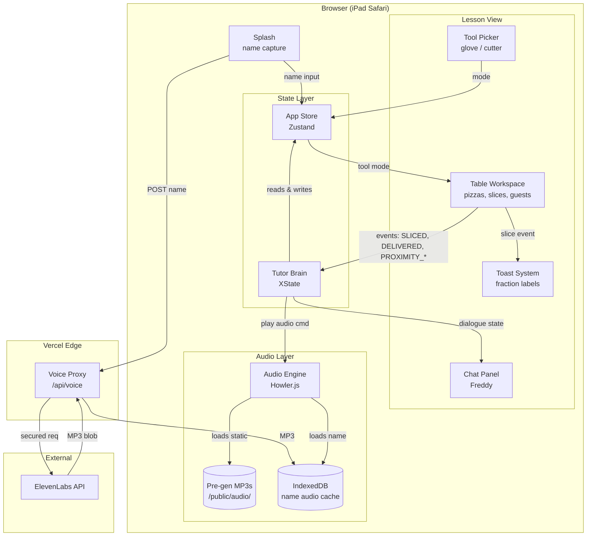
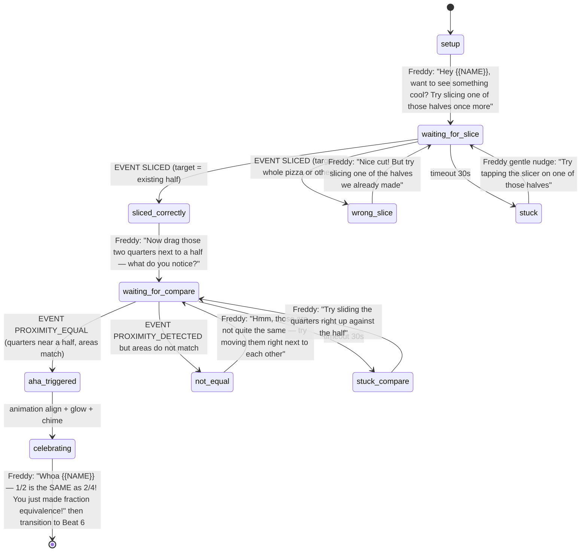

# Super Slice Pizza Tutor — PRD (Working Draft)

> **Status:** Living document. Updated each planning round. Final version produced at end of planning conversation, then converted to tasks.

---

## 1. Project Snapshot

| | |
|---|---|
| **Project** | Clone Synthesis Tutor — Week 4 Gauntlet challenger project |
| **Hiring partner** | Superbuilders |
| **Concept** | Fraction equivalence (1/2 = 2/4) |
| **Audience** | Grade 3, ~9 years old |
| **Form factor** | iPad-first web app (Safari/Chrome on iPadOS), runs in modern browser |
| **Clock** | 5 days, demo Friday noon (2026-05-22) |
| **Architecture** | Pure scripted (deterministic state machine), no LLM in tutor brain |

---

## 2. Brand & World

- **Platform name:** SuperTutors (parent brand — this is the first/fractions tutor)
- **Character:** Fractions Freddy (chef persona, slightly Italian-American voice)
- **World:** Super Slice Pizza (a pizza restaurant)
- **Visual language:** Pulled from Superbuilders (https://jobs.superbuilders.dev/jobs) — pending dedicated research round

---

## 3. Locked Decisions

### 3.1 Pedagogy
- **Manipulative shape:** Square (Sicilian-style) pizza pieces — rectangular bars with pizza theming. Combines UX benefits of bars (area preserves cleanly under split) with engagement of pizza.
- **Single representation:** One coherent manipulative throughout (NOT cookies → bars → grids switching like Synthesis).
- **Hero gesture:** Slicing with a circular pizza-cutter wheel.
- **Slicing mechanic v1:** Bisect-only. Kid drags slicer across any piece, it splits in half. Stackable: 1 → 1/2 → 1/4 → 1/8. Pedagogically clean for the equivalence target.
- **No combining gesture:** Splitting alone teaches equivalence. Brief permits ("like combining, splitting, or smashing" — OR list).
- **Drag-to-compare via proximity:** When two or more pieces/groups are placed near each other on the table, the system auto-compares and shows equal/not-equal feedback. This is the "prove it" mechanic for the check phase.
- **Progressive learning within one lesson:** Sandbox = vocabulary discovery (what halves/quarters/eighths look like by making them). Simple shares = application. AHA = synthesis. Check = mastery. Mirrors Synthesis's multi-lesson progression, compressed into one lesson's beats.

### 3.2 The Table (workspace)
- Persistent canvas where the manipulative lives — pizzas and slices stay where the kid puts them and are freely movable.
- Game-feel: more like a play space than a lesson UI.
- Multiple whole pizzas can coexist on the table.

### 3.3 Tools (Figma-style picker — kid-driven, not context-gated)
- 🧤 **Glove** — grab and move pieces (deliver to guests, rearrange on table)
- 🍕 **Pizza cutter wheel** — slice (bisect)
- Kid can swap tools freely at any time, like Figma Move vs. Pencil. No "right tool for the task" gating — the kid decides.

### 3.4 Guests
- Three facial expression states (modeled on Synthesis):
  - **Neutral** (default, on arrival)
  - **Frown / sad** (another guest has more pizza than them — unfair)
  - **Smile** (they have the correct or equal-fair amount)
- Emotional feedback loop ties fairness ↔ equivalence. The kid learns "equal" as both a math concept *and* a social outcome.

### 3.5 Tutor Brain
- **Pure scripted state machine** — no LLM, deeply authored branching. Implemented as XState (see §3.10 Tech Stack).
- **Architecture artifacts** (pulled from AI-first design framework, adapted for scripted system):
  - **Intent map** — visual diagram of student moves/answers at each beat. Living document, iterated through the week. Generated from the same source as the XState definition. Used to defend architecture in interview.
  - **Fallback matrix** — explicit "what the tutor says when student is stuck, taps wildly, gives a half-right answer." Encoded as branched transitions in the state machine.
  - **Eval rubric** — defining "good" (warmth, pacing, clarity, aha-clarity, recovery quality). Sanity-check before demo.

### 3.6 iPad-First Interactions
- Tap, hold, pinch, drag, snap
- **NO hover states** (don't exist on touch)
- Big tap targets (44pt minimum)
- WCAG AA across the board: color, typography, spacing, contrast, focus states, inputs

### 3.7 Polish Bar
- Sharp prototype with **two hero moments** + selective Synthesis-grade polish on:
  - The AHA transition
  - Warm wrong-answer recoveries
  - Win celebration
- **In scope:** voice, confetti, sound design for key moments
- **Stretch:** custom illustrations

### 3.8 Onboarding (kid-facing splash, ~10 sec)
1. Freddy intro + "What's your name?" — single input, autofocus, big tap target
2. "Ready to slice some pizza, [Name]?" — giant button → straight into the lesson
3. **Behind the scenes:** name submit triggers ElevenLabs name-audio generation in parallel (see §3.11 Audio Architecture); ready by lesson start

No parent flow, no audio check, no presence gate, no dashboard. Personalization (using the kid's name throughout, in text AND audio) gives us the warmth win.

### 3.9 Lesson Arc — 7 Beats

| # | Beat | Duration | What happens |
|---|---|---|---|
| 1 | **Splash** | ~10s | Freddy greets, name capture, table opens |
| 2 | **Sandbox / Explore** | 2–3 min | Empty table + 1–2 whole pizzas. Free play with both tools. Toast labels fractions on every slice ("you made halves!"). Freddy reacts warmly. Doubles as tutorial-by-doing for controls. *(Progressive: vocabulary acquisition)* |
| 3 | **First guest** | ~30s | One guest arrives, asks for a simple share ("I'd love half!"). Kid slices, delivers, guest smiles. First win. *(Application begins)* |
| 4 | **Two guests, equal share** | ~45s | Two guests want equal pizza. Kid figures out halves. Both smile. *(Application deepens)* |
| 5 | **The AHA — equivalence reveal** | ~60s | Freddy proposes: "Try slicing one of those halves once more." Kid slices a delivered 1/2 into two 1/4s. Drag-to-compare: the two quarters snap-align with a remaining half. Freddy names it cinematically: "Whoa, [Name] — 1/2 is the SAME as 2/4!" *(Synthesis to equivalence)* |
| 6 | **Check for understanding** | ~90s | 2–3 short problems using drag-to-compare proximity mechanic ("Prove these two groups are equal"). Branching dialogue on wrong answers. *(Mastery)* |
| 7 | **Win moment** | ~15s | All guests smile, confetti, Freddy celebrates by name. End. |

**Total kid time:** ~6–8 minutes. Compresses Synthesis's ~39 min into a focused arc.

### 3.10 Tech Stack (locked)

| Layer | Decision | Rationale |
|---|---|---|
| Build tool | **Vite + React** | Single-page interactive app, no SSR/SEO/API needs. Near-instant HMR for animation iteration. Existing user familiarity = day-1 velocity. Less framework surface to learn while shipping. |
| Language | **TypeScript** | Type safety for state machine + complex prop chains |
| Styling | **Tailwind CSS** | Fast prototyping, easy Superbuilders design token application, utility-first matches iteration speed |
| Animation | **Framer Motion** | Drag/snap/gesture primitives built-in, React-first, declarative |
| Manipulative rendering | **SVG + Framer Motion** | Accessible (ARIA), scalable, easy proximity hit-detection, easy to animate |
| Tutor brain | **XState** | Literally a finite state machine — our scripted tutor architecture *is* an XState machine. Defensible. State diagrams generate from the same source code. |
| App state | **Zustand** | Lightweight, no boilerplate, easy to integrate with XState |
| Sound effects | **Howler.js** | Reliable cross-browser audio, supports sequential playback for stitched name-audio |
| Voice (TTS) | **ElevenLabs** (hybrid pipeline) | See §3.11 — pre-gen for static, runtime for name |
| Voice security | **Vercel Edge Function** | ~10 lines to proxy ElevenLabs API key. Free on hobby tier. |
| Storage | **IndexedDB** (browser) | Cache kid's name MP3 across sessions |
| Deploy | **Vercel** | Git-push previews, free hobby tier, Edge Functions native |
| Repo | **Single Vite + React + TS app** | No monorepo overhead |

### 3.11 Audio Architecture (Hybrid TTS)

**The challenge:** dialogue is scripted (finite, authored at design time) — *except* the kid's name, which is dynamic per session.

**Solution: hybrid pipeline.**

#### Build-time pipeline (static dialogue)
1. All Freddy lines authored in `src/modules/tutor/dialogue.json` with `{{NAME}}` placeholders where personalization happens
2. `scripts/generate-voice.ts` reads dialogue, splits each line at the `{{NAME}}` slot, calls ElevenLabs for each static segment
3. MP3s saved to `/public/audio/` with deterministic filenames matching dialogue keys (e.g., `aha_reveal_a.mp3`, `aha_reveal_b.mp3`)
4. Runs in CI / locally — not at user runtime

#### Runtime pipeline (kid's name)
1. Kid enters name on splash screen
2. Splash form submit triggers `POST /api/voice` (Vercel Edge Function)
3. Edge Function proxies request to ElevenLabs API with secured key, returns MP3 blob
4. MP3 cached in IndexedDB keyed by name
5. By the time the kid taps "Ready to slice pizza, [Name]?" (~2–3 sec later), the audio is ready

#### Playback (Audio Engine)
- **Static lines:** play the matching pre-gen MP3
- **Name-injected lines:** sequential play `[pre-gen segment A]` → `[name MP3]` → `[pre-gen segment B]` via Howler.js queue
- Static segments authored with appropriate pause/intonation so the stitch sounds natural

#### Cost & failure
- **Cost:** ~$0.0001 per session (one short API call). Free tier covers thousands of sessions/month.
- **Failure mode:** if the Edge Function call fails (offline, ElevenLabs down), fall back to playing static lines without the name — lesson still works, just less personal. Logged but not blocking.

---

## 4. System Architecture

### 4.1 Module Overview

| Module | Location | Responsibility | Talks to |
|---|---|---|---|
| **Splash** | `src/modules/splash/` | Name capture, name-audio prefetch trigger | Voice Proxy, Store |
| **Lesson Orchestrator** | `src/modules/lesson/` | Beat lifecycle, transitions, root view layout | Tutor Brain, Table, Chat |
| **Tutor Brain (XState)** | `src/modules/tutor/tutorMachine.ts` | Dialogue state, branching, expected events. The "scripted brain." | Audio Engine, Chat Panel, Store |
| **Chat Panel** | `src/modules/tutor/ChatPanel.tsx` | Dialogue text bubbles, Freddy avatar, scroll | Audio Engine |
| **Table Workspace** | `src/modules/table/Table.tsx` | Pizzas, slices, guests, drag/drop, proximity detection. Emits events. | Tutor Brain (events), Tools, Store |
| **Tool Picker** | `src/modules/tools/ToolPicker.tsx` | Glove ↔ Cutter mode switching | Store |
| **Audio Engine** | `src/modules/audio/AudioEngine.ts` | Howler wrap, sequential stitching for name-injected lines | Pre-gen MP3s, IndexedDB cache |
| **Toast System** | `src/modules/toast/ToastSystem.tsx` | Fraction labels on slice events | Subscribes to Table events |
| **Voice Proxy** | `api/voice.ts` (Edge Function) | Secures ElevenLabs API key, accepts name string, returns MP3 | ElevenLabs API |
| **Pre-gen Pipeline** | `scripts/generate-voice.ts` | Build-time MP3 generation from dialogue.json | (build-time only) |
| **Store (Zustand)** | `src/store/appStore.ts` | Kid name, current beat, tool mode, guest states, table state | All components |

### 4.2 System Diagram



### 4.3 Data Flow — Typical Lesson Moment

1. Kid slices a pizza on the table
2. Table emits event: `SLICED { pieceId, resultingFractions: ["1/2","1/2"] }`
3. Tutor Brain (XState) receives event in current beat state
4. State machine transitions based on event + current beat (e.g., `sandbox.exploring` → `sandbox.acknowledge_halves`)
5. Transition action: dispatch `PLAY_DIALOGUE { key: "sandbox_first_halves" }`
6. Audio Engine receives play command:
   - Loads `/public/audio/sandbox_first_halves_a.mp3` (pre-gen segment A)
   - Loads name MP3 from IndexedDB
   - Loads `/public/audio/sandbox_first_halves_b.mp3` (pre-gen segment B)
   - Queues sequential playback via Howler
7. Chat Panel receives dialogue text + plays synced with audio
8. Toast System (subscribed to slice events independently) shows "You made halves! 1/2"
9. State machine awaits next student event

---

## 5. State Machine & Branching

The full XState machine is a hierarchical state chart with one top-level state per beat. Below is the state diagram for **Beat 5 (the AHA)** — the most architecturally interesting beat because of branching and the cinematic trigger.

### 5.1 Beat 5 (AHA) State Diagram



### 5.2 Intent Map Convention (per beat)

Each beat in the state machine follows this pattern:

- **Entry dialogue** — Freddy sets up the beat (may include `{{NAME}}` slots)
- **Expected events** — what student moves advance the state
- **Wrong/unexpected events** — branched recoveries with warm dialogue (the "miss script")
- **Timeout/stuck branch** — gentle nudge if no action for 30s
- **Exit trigger** — what event/state completes the beat

This pattern *is* the intent map. The visual diagram (above for Beat 5) is generated from the same source as the XState implementation. Per beat, we author three things in lockstep:

1. The state definition (`src/modules/lesson/beats/*.ts` — XState config)
2. Dialogue lines per transition (`src/modules/tutor/dialogue.json`)
3. Generated MP3s (build-time pipeline)

**Living document:** state diagrams update as we iterate. Final visual versions go into the demo video + interview presentation as architectural artifacts.

### 5.3 Remaining Beats (intent maps to be authored in upcoming rounds)

- Beat 1: Splash — trivial (linear)
- Beat 2: Sandbox — most complex (free-form, many possible student actions, many fraction-toast triggers)
- Beat 3: First Guest — linear with one wrong-amount branch
- Beat 4: Two Guests, Equal Share — linear with proportional-wrong branches
- Beat 5: AHA — diagrammed above
- Beat 6: Check for Understanding — 2–3 short sub-machines, drag-to-compare driven
- Beat 7: Win — linear celebration

---

## 6. File Structure

```
super-slice/
├── public/
│   ├── audio/                       # Pre-generated MP3s
│   └── images/
├── src/
│   ├── App.tsx                      # Root component
│   ├── main.tsx                     # Vite entry
│   ├── modules/
│   │   ├── splash/                  # Name capture, intro
│   │   │   ├── SplashScreen.tsx
│   │   │   └── useNameAudioPrefetch.ts
│   │   ├── lesson/                  # Lesson orchestration
│   │   │   ├── LessonView.tsx
│   │   │   └── beats/               # Beat-specific XState configs
│   │   │       ├── sandbox.ts
│   │   │       ├── firstGuest.ts
│   │   │       ├── twoGuests.ts
│   │   │       ├── aha.ts
│   │   │       ├── check.ts
│   │   │       └── win.ts
│   │   ├── tutor/                   # Scripted brain
│   │   │   ├── tutorMachine.ts      # Root XState definition
│   │   │   ├── dialogue.json        # All authored lines + audio keys
│   │   │   └── ChatPanel.tsx        # Renders bubbles
│   │   ├── table/                   # Manipulative workspace
│   │   │   ├── Table.tsx            # Root workspace
│   │   │   ├── Pizza.tsx
│   │   │   ├── Slice.tsx
│   │   │   ├── Guest.tsx            # 3 expression states
│   │   │   ├── Slicer.tsx           # Pizza cutter tool
│   │   │   ├── Glove.tsx            # Grab/move tool
│   │   │   └── proximity.ts         # Drag-to-compare detection
│   │   ├── tools/
│   │   │   └── ToolPicker.tsx
│   │   ├── audio/
│   │   │   ├── AudioEngine.ts       # Howler wrap, sequential play
│   │   │   └── nameAudioCache.ts    # IndexedDB helper
│   │   └── toast/
│   │       └── ToastSystem.tsx
│   ├── store/
│   │   └── appStore.ts              # Zustand
│   ├── styles/
│   │   └── globals.css              # Tailwind directives
│   └── types/
├── scripts/
│   └── generate-voice.ts            # Build-time MP3 generation
├── api/
│   └── voice.ts                     # Vercel Edge Function
├── package.json
├── vite.config.ts
├── tailwind.config.js
├── tsconfig.json
└── vercel.json
```

---

## 7. Defensibility — Talking Points for Demo

Anticipated "why did you build it this way?" questions and crisp answers:

| Decision | Talking Point |
|---|---|
| Scripted tutor (no LLM) | "Brief specified scripted is fine. Deterministic = testable, demoable, never embarrassing. LLM would add eval surface area and runtime risk for marginal gain." |
| XState for tutor brain | "The tutor *is* a finite state machine. XState makes the machine the source of truth — visual state diagrams generate from the same code that runs in production." |
| Vite over Next.js | "Single-page interactive app with no SSR/SEO/API needs. Picked Vite for fastest iteration loop and zero unused framework surface area." |
| Hybrid TTS pipeline | "Static for finite authored dialogue (deterministic, zero runtime cost). Runtime via Edge Function proxy for the one dynamic input (kid's name). Best of both." |
| Square pizza | "Bars are pedagogically cleanest for equivalence — area preserves under split. Pizza wrapping keeps engagement. Sicilian-style squares are a natural visual fit and avoid pie-slice distortion." |
| Bisect-only slicing | "Halves, quarters, eighths cover the equivalence target. Variable denominators (thirds, fifths) add gesture-recognition complexity and concept noise for no pedagogical payoff in v1. Roadmapped for v2." |
| iPad-first | "Brief requires iPad. Designed around touch primitives (tap, hold, pinch, drag, snap) with no hover dependencies. WCAG AA throughout." |
| Drag-to-compare for check | "Proximity-based comparison reuses the manipulative the kid already knows. Doesn't introduce a new mode for the check phase." |
| Pre-generated voice + ElevenLabs | "Studio-quality kid-friendly voice gives Freddy real character — measurable warmth differentiator from Synthesis's tap-and-type approach. Free tier covers the lesson." |
| Guest expressions | "Fairness ↔ equivalence emotional feedback loop. Kids learn 'equal' as both math and social concept." |
| SVG for manipulative | "Accessible (ARIA), scalable, easy proximity hit-detection via getBoundingClientRect, animates cleanly with Framer Motion." |
| Single coherent manipulative | "Synthesis uses 3–4 sequential representations. We use one (square pizza) — less context-switching for the kid, more time spent in the wedge gesture." |

---

## 8. Out of Scope (moved to iPad Roadmap deliverable)

These get documented as sketches + writeups for the iPad roadmap, not built:

- Parent login/signup, email collection
- Child profile creation, multi-child support
- Audio check screen
- Gender / pronoun / name pronunciation flow
- "Is the child currently present?" gate
- Home dashboard with progress bar / restaurant view / rocket-ship continue button
- Multiple lessons / curriculum / persistence
- LLM-powered conversation
- Phone responsiveness (iPad-first, desktop fallback only)
- Adaptive difficulty
- Accounts, analytics, telemetry
- **Variable-denominator slicing (thirds, fifths, sixths, etc.)** — v1 is bisect-only. v2 adds free-form slicing gesture with snap-to-intent recognition.
- **Combining gesture** — splitting alone teaches equivalence; combining is the inverse and not needed for the concept.

---

## 9. What We're Beating Synthesis On

(From background analysis of 126 student-journey screenshots — Synthesis is desktop-first, tap-and-type heavy)

- **iPad-first gestures.** Synthesis underutilizes touch — mostly tap and type. Our slicing wheel + drag direct-manipulation is a category-level differentiator.
- **Cinematic AHA.** Synthesis: static side-by-side grids. Us: animated slice/snap where equivalence becomes physically inevitable.
- **Single coherent manipulative.** Synthesis: 3–4 sequential representations. Us: one (square pizza), less context-switching.
- **Adaptive wrong-answer dialogue.** Synthesis: surface correction + redirect. Us: explicit fallback matrix with warmth and curiosity.
- **Character voice.** Synthesis: system TTS, generic. Us: ElevenLabs studio-quality kid-friendly pizza-chef character.
- **Compression.** Synthesis: ~39 min lesson. Us: 5–7 min — forces focus.

---

## 10. Deliverables (Friday noon)

1. **Deployed web app** — single lesson on fraction equivalence, public URL, modern browser, iPad-tested
2. **iPad roadmap doc** — short writeup + sketches: parent onboarding flow, multi-child, audio check, dashboard, future lessons, touch targets, gestures, variable denominators
3. **3–5 min demo video** — pre-scripted, shows conversational flow + manipulative in action
4. **README** — setup + technical decisions framed *as decisions* (reuses §7 talking points)

---

## 11. Open Decisions

- [x] **Narrative arc** — kid is cook at Super Slice Pizza; guests arrive with orders; kid slices + delivers fairly
- [x] **Lesson arc** — 7 beats locked (see §3.9)
- [x] **Tech stack** — locked (see §3.10)
- [x] **Audio architecture** — hybrid TTS locked (see §3.11)
- [x] **System architecture** — modules + diagram drafted (see §4)
- [x] **State machine pattern** — Beat 5 diagrammed; intent map convention defined (see §5)
- [ ] **Intent maps for remaining beats** (1, 2, 3, 4, 6, 7) — author next; Beat 2 (Sandbox) is highest priority since it's the most interaction-rich
- [ ] **Fallback matrix per beat** — woven into each beat's state machine; needs explicit audit
- [ ] **Eval rubric** — defining "good" (warmth, pacing, clarity, aha-clarity, recovery quality)
- [ ] **Check-for-understanding** problem specifics (mechanic confirmed; problem set TBD)
- [ ] **Win moment** specifics — confetti style, Freddy line, sound, next-action
- [ ] **Superbuilders brand research** — colors, fonts, tone (dedicated round)
- [ ] **Demo video script** — pre-script before recording
- [ ] **WCAG conformance level** — AA target, confirm
- [ ] **Tonight's scaffold deploy** — Vite app, splash screen, empty table route, Vercel preview URL live

---

## 12. Judging Criteria (from brief — our north star)

1. **Interaction quality** — does the tutor feel warm? Does the manipulative feel alive? *(This is the work.)*
2. **Lesson coherence** — explore → instruct → check, branching on wrong, clean finish.
3. **Demo-readiness** — no setup hell, no "imagine if," works in a browser the judge didn't develop in.

---

*Updated 2026-05-18, planning round 7 — added tech stack, audio architecture, system diagram, Beat 5 state diagram, file structure, defensibility talking points.*
