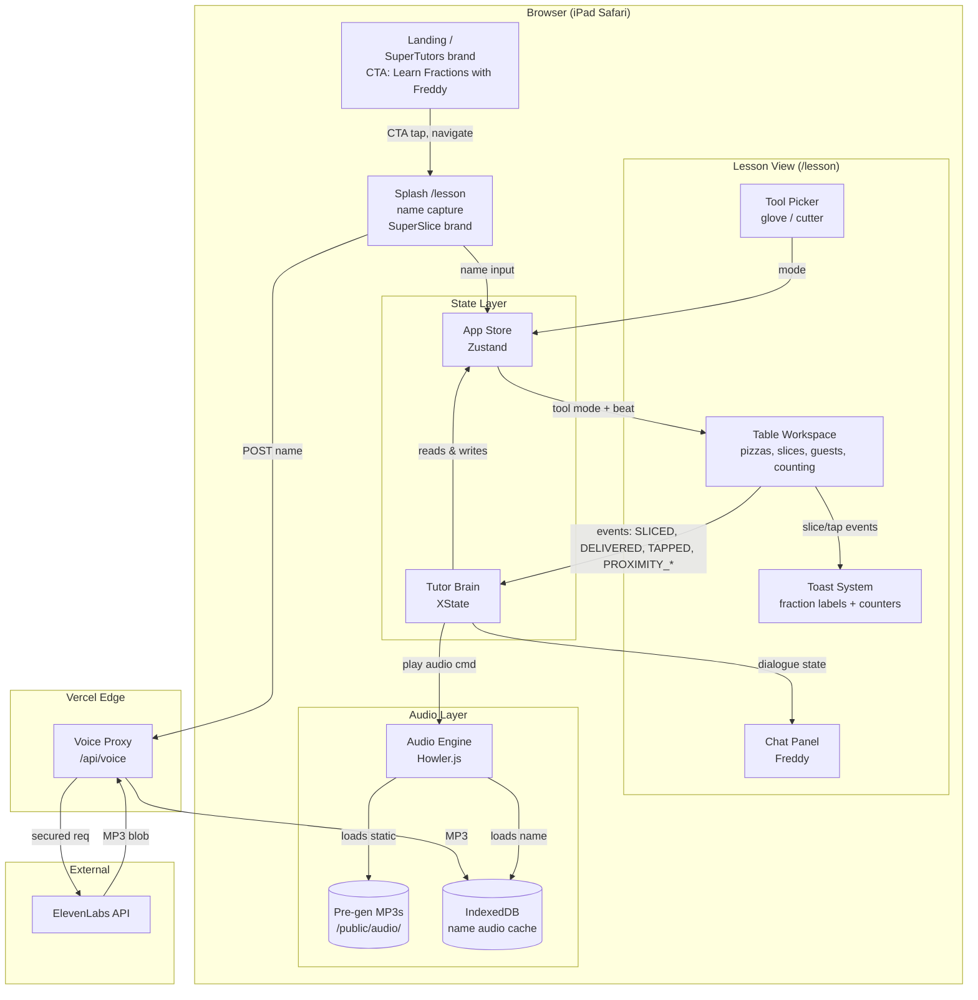
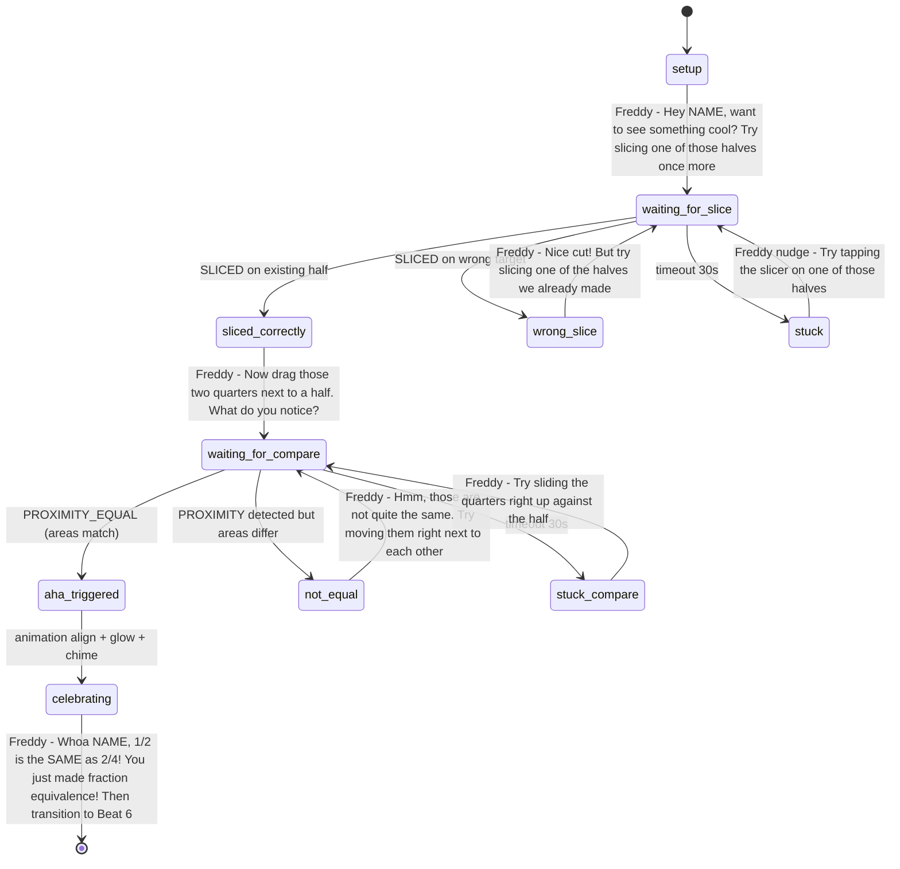
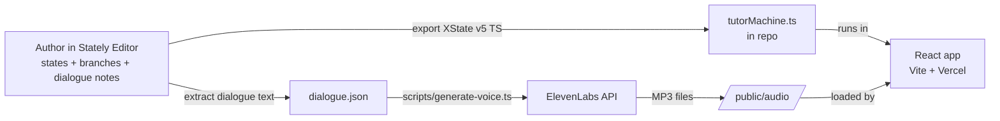

# SuperSlice Pizza Tutor — PRD

> **Status:** Official PRD for the Week 4 Gauntlet challenger project (clone Synthesis Tutor). Living document — updated as the build progresses. Supersedes `PRD-DRAFT.md`.

---

## 1. Project Snapshot

| | |
|---|---|
| **Project** | Clone Synthesis Tutor — Week 4 Gauntlet challenger project |
| **Hiring partner** | Superbuilders |
| **Concept** | Fraction equivalence (1/2 = 2/4) |
| **Audience** | Grade 3, ~9 years old |
| **Form factor** | iPad-first web app (Safari/Chrome on iPadOS), runs in modern browser |
| **Clock** | 5 days, demo Friday noon (2026-05-22) |
| **Architecture** | Pure scripted (deterministic state machine), no LLM in tutor brain |

---

## 2. Brand & World

### 2.1 Platform — SuperTutors
- Parent brand. A collection of subject-specific AI tutors, each with their own character and world.
- This project ships the **first tutor** in that collection. Brand framework supports future tutors; nothing built for additional subjects in v1.
- Deploys to `supertutors.vercel.app`.

### 2.2 This Tutor — Freddy Fractions
- **Name:** Freddy Fractions — first tutor in the SuperTutors family
- **Subject:** fractions (this lesson: fraction equivalence)
- **Character vibe:** **Super Mario meets Jersey Shore** — Italian-American chef energy, warm, lovable, expressive, fun. Hand-wavy, enthusiastic delivery. Genuine pizza-shop-owner warmth, not a cartoon caricature. Voice cast in ElevenLabs to match this brief.
- **Setting:** **SuperSlice Pizza** — Freddy's pizza shop, where he tutors fractions between (and through) pizza-making

### 2.3 Visual Language
- **SuperTutors brand** (landing page) — pulled from Superbuilders (https://jobs.superbuilders.dev/jobs); corporate-clean, portal-style
- **SuperSlice / Freddy brand** (in-lesson) — kid-friendly, restaurant-themed (warm reds, pepperoni, dough/cheese palette), game-like
- Two visual identities, intentional — the landing is the "portal" and the lesson is the "world"

### 2.4 Future Tutors (not in scope)
- Other subjects (math beyond fractions, science, history, etc.) with their own characters and worlds. SuperTutors landing supports additional CTA cards as tutors are added.

---

## 3. Locked Decisions

### 3.1 Pedagogy
- **Manipulative shape:** Square (Sicilian-style) pizza pieces — rectangular bars with pizza theming. Combines UX benefits of bars (area preserves cleanly under split) with engagement of pizza.
- **Single representation:** One coherent manipulative throughout (NOT cookies → bars → grids switching like Synthesis).
- **Hero gesture:** Slicing with a circular pizza-cutter wheel.
- **Slicing mechanic v1:** Bisect-only. Kid drags slicer across any piece, it splits in half. Stackable: 1 → 1/2 → 1/4 → 1/8. Pedagogically clean for the equivalence target.
- **No combining gesture:** Splitting alone teaches equivalence. Brief permits ("like combining, splitting, or smashing" — OR list).
- **Drag-to-compare via proximity:** When two or more pieces/groups are placed near each other on the table, the system auto-compares and shows equal/not-equal feedback. This is the "prove it" mechanic for the check phase.
- **Progressive learning within one lesson** (woven into a single continuous narrative, not separate lessons). Order updated 2026-05-19 to match the project brief's *explore → instruct → check* model: free play comes first so the kid learns the UI before any formal lesson:
  1. **Beat 2 (Sandbox / Explore):** free play with slicer + glove, kid learns the UI, observes pizzas getting sliced into halves/quarters/eighths via the toast labels. No formal vocab lesson yet — discovery mode.
  2. **Beat 3 (Vocab — Numerator/Denominator):** formal instruction begins. Freddy explains the parts: *"The top number is how many slices have pepperoni. The bottom number is ALL the slices. Put them together and that's a fraction!"* Kid taps SLICES (not individual pepperoni discs) to count which slices have pepperoni → numerator, then all slices → denominator. 1–2 variations to lock in vocab.
  3. **Beats 4–5 (First/Two Guests):** application of vocab in narrative context.
  4. **Beat 6 (AHA):** synthesis to equivalence.
  5. **Beat 7 (Check):** mastery.
  6. **Beat 8 (Win):** celebration.

  Mirrors Synthesis's multi-lesson curriculum (Numerator/Denominator → Share the Cookies) compressed into one continuous restaurant story — with the order flipped from Synthesis's "instruct then explore" to the brief-aligned "explore then instruct."

### 3.2 The Table (workspace)
- Persistent canvas where the manipulative lives — pizzas and slices stay where the kid puts them and are freely movable.
- Game-feel: more like a play space than a lesson UI.
- Multiple whole pizzas can coexist on the table.
- Supports **counting mode** (Beat 3 — Vocab): individual pizza SLICES are tappable to highlight + increment a visible counter (kid taps slices that have pepperoni → numerator; then taps all slices → denominator). Same component, different mode. **Not** tapping individual pepperoni discs.

### 3.3 Tools (Figma-style picker — kid-driven, not context-gated)
- 🧤 **Glove** — grab and move pieces (deliver to guests, rearrange on table)
- 🍕 **Pizza cutter wheel** — slice (bisect)
- Kid can swap tools freely at any time, like Figma Move vs. Pencil. No "right tool for the task" gating — the kid decides.
- **Beat 3 exception:** during the formal vocab lesson, tools are temporarily backgrounded — the primary interaction is tapping slices to count. Tools remain accessible but de-emphasized. (They were already in-use during Beat 2 Sandbox, which now comes first.)

### 3.4 Guests
- Three facial expression states (modeled on Synthesis):
  - **Neutral** (default — on arrival, while waiting, or while watching the kid prepare their order)
  - **Frown / sad** (their requested order isn't yet fulfilled — too little, wrong type, OR another guest is being unfairly favored in a shared scenario)
  - **Smile** (their specific order is satisfied — whatever amount they asked for, met or exceeded)
- **The core trigger is per-guest requirement satisfaction**, NOT inter-guest equality. A single guest asking for 1/2 and receiving 1/2 should smile, even though there's no equivalency comparison happening.
- In multi-guest equal-share scenarios this naturally creates a fairness ↔ equivalence emotional loop as a *side effect*, but the system works for any guest order independently.
- Guests do not appear until Beat 4. Beats 1–3 are pre-service prep with Freddy alone (Splash → Sandbox → Vocab).

### 3.5 Tutor Brain
- **Pure scripted state machine** — no LLM, deeply authored branching. Implemented as XState (see §3.10 Tech Stack).
- **Architecture artifacts** (pulled from AI-first design framework, adapted for scripted system):
  - **Intent map** — visual diagram of student moves/answers at each beat. Living document, iterated through the week. Generated from the same source as the XState definition. Used to defend architecture in interview.
  - **Fallback matrix** — explicit "what the tutor says when student is stuck, taps wildly, gives a half-right answer." Encoded as branched transitions in the state machine.
  - **Eval rubric** — defining "good" (warmth, pacing, clarity, aha-clarity, recovery quality). Sanity-check before demo.

### 3.6 iPad-First Interactions
- Tap, hold, pinch, drag, snap
- **NO hover states** (don't exist on touch)
- Big tap targets (44pt minimum)
- WCAG AA across the board: color, typography, spacing, contrast, focus states, inputs

### 3.7 Polish Bar
- Sharp prototype with **two hero moments** + selective Synthesis-grade polish on:
  - The AHA transition (Beat 5)
  - Warm wrong-answer recoveries
  - Win celebration (Beat 7)
- **In scope:** voice, confetti, sound design for key moments
- **Stretch:** custom illustrations, ambient restaurant audio

### 3.8 Entry Flow — Landing + Splash

Two layers, two URL routes, two distinct visual identities.

#### 3.8.1 Landing Page (`/` route — SuperTutors brand)

Lives outside the lesson. Public-facing portal.

1. SuperTutors logo + tagline
2. **CTA card:** "Learn Fractions with Freddy" — fun illustrated picture of Freddy at SuperSlice Pizza with pizza + slicer + warm restaurant scene. Kid-friendly, game-like presentation. Tap target = the whole card.
3. Tap card → navigates to `/lesson`

Future tutors would appear here as additional CTA cards (one per subject/tutor) — the layout supports a grid.

#### 3.8.2 Lesson Splash (Beat 1, `/lesson` route — SuperSlice brand)

Kid-facing splash, ~10 sec inside the lesson world.

1. Freddy intro + "What's your name?" — single input, autofocus, big tap target. Character voice in full effect ("Heyyy, welcome to SuperSlice! What's your name, kid?").
2. "Ready to slice some pizza, [Name]?" — giant button → straight into Beat 2 (Sandbox)
3. **Behind the scenes:** name submit triggers ElevenLabs name-audio generation in parallel (see §3.11 Audio Architecture); ready by Beat 2 start

No parent flow, no audio check, no presence gate, no dashboard. Personalization (using the kid's name throughout, in text AND audio) gives us the warmth win.

### 3.9 Lesson Arc — 8 Beats

> **Reordered 2026-05-19** to match the project brief's *explore → instruct → check* model. Beat 2 (Sandbox/Explore) now comes BEFORE Beat 3 (Vocab) so the kid learns the UI through discovery before any formal lesson. Previously the lesson started with vocab via "counting pepperoni" — that pattern was flipped because (a) the brief explicitly calls for exploration-first, (b) Synthesis's instruct-first pattern isn't gospel, and (c) Beat 6's AHA lands harder when the kid already owns the tools.

| # | Beat | Duration | What happens |
|---|---|---|---|
| 1 | **Splash** | ~10s | Freddy greets, name capture, table opens |
| 2 | **Sandbox / Explore** | 2–3 min | Tools available. 1–2 whole pizzas on the counter. Free play with both glove + cutter. Toast labels fractions on every slice ("You made halves! 1/2", "Now quarters! 1/4", "Eighths! 1/8"). Freddy reacts warmly to discovery moments. Doubles as tutorial-by-doing for controls. Kid signals readiness for the formal lesson when they're ready. *(Progressive: tool mastery + intuitive number sense before vocab)* |
| 3 | **Vocab — Numerator/Denominator** | 60–90s (expandable) | Formal instruction begins. Shows a pizza with some pepperoni slices, some plain. *"Now let me show you how we talk about pizzas around here."* Kid taps SLICES (not individual pepperoni discs) that have pepperoni → counter increments → numerator. Then taps all slices → denominator. Freddy names the parts: *"The top number is how many slices have pepperoni. The bottom number is ALL the slices. Put them together and that's a fraction!"* 1–2 variations to lock in vocab. *(Progressive: explicit vocabulary acquisition AFTER tool intuition. Stretch: can grow with more variations.)* |
| 4 | **First guest** | ~30s | First guest arrives at the door. Asks for a simple share ("I'd love half!"). Kid slices, delivers via glove, guest smiles. First win. *(Application begins)* |
| 5 | **Two guests, equal share** | ~45s | Second guest arrives. Both want equal pizza. Kid figures out halves. Both smile. *(Application deepens)* |
| 6 | **The AHA — equivalence reveal** | ~60s | Freddy proposes: *"Hey [Name], want to see something cool? Try slicing one of those halves once more."* Kid slices a delivered 1/2 into two 1/4s. Drag-to-compare: the two quarters snap-align with a remaining half. Freddy names it cinematically: *"Whoa, [Name] — 1/2 is the SAME as 2/4!"* *(Synthesis to equivalence)* |
| 7 | **Check for understanding** | ~90s | 2–3 short problems using drag-to-compare proximity mechanic ("Prove these two groups are equal"). Branching dialogue on wrong answers. *(Mastery)* |
| 8 | **Win moment** | ~15s | All guests smile, confetti, Freddy celebrates by name. End. |

**Total kid time:** ~7–10 minutes. Compresses Synthesis's ~39 min multi-lesson curriculum into a single focused arc.

### 3.10 Tech Stack (locked)

| Layer | Decision | Rationale |
|---|---|---|
| Build tool | **Vite + React** | Single-page interactive app, no SSR/SEO/API needs. Near-instant HMR for animation iteration. Existing user familiarity = day-1 velocity. Less framework surface to learn while shipping. |
| Language | **TypeScript** | Type safety for state machine + complex prop chains |
| Styling | **Tailwind CSS** | Fast prototyping, easy Superbuilders design token application, utility-first matches iteration speed |
| Animation | **Framer Motion** | Drag/snap/gesture primitives built-in, React-first, declarative |
| Manipulative rendering | **Raster PNG (ChatGPT-generated) wrapped in `` + Framer Motion** | Pivoted from SVG-only on 2026-05-19 — hand-coded SVG couldn't match Freddy's Pixar-painted aesthetic in our timeframe. ChatGPT/gpt-image-1 produces pixel-perfect style continuity with the character art. Proximity hit-detection still works via `getBoundingClientRect`; Framer Motion handles drag + position-swap animations between slice states. |
| Tutor brain | **XState v5** | Literally a finite state machine — our scripted tutor architecture *is* an XState machine. Defensible. Authored visually in Stately Editor (see §5), exported to TS, and dropped into the repo. |
| App state | **Zustand** | Lightweight, no boilerplate, easy to integrate with XState |
| Routing | **React Router DOM** | Two URL routes (landing `/` and lesson `/lesson`); standard, ~10KB; supports deep-linking and browser back button — important for shareable URLs and natural navigation between SuperTutors portal and the lesson world |
| Sound effects | **Howler.js** | Reliable cross-browser audio, supports sequential playback for stitched name-audio |
| Particles | **tsparticles** | ~30KB. Cheapest way to nail Fruit-Ninja-style slice splatter (cheese stretch, sauce droplets) + win confetti. Without it, hero moments feel flat. |
| Character animation (stretch) | **lottie-react** | ~50KB. Optional layer for animated Freddy facial expressions (blinks, mouth, eyebrows, body). Ships Thursday if Wednesday's SVG baseline is solid. |
| Voice (TTS) | **ElevenLabs** (hybrid pipeline) | See §3.11 — pre-gen for static, runtime for name |
| Voice security | **Vercel Edge Function** | ~10 lines to proxy ElevenLabs API key. Free on hobby tier. |
| Storage | **IndexedDB** (browser) | Cache kid's name MP3 across sessions |
| Deploy | **Vercel** | Git-push previews, free hobby tier, Edge Functions native |
| Repo | **Single Vite + React + TS app** | No monorepo overhead. Dual-push to GitHub + GitLab on `origin`. |

### 3.11 Audio Architecture (Hybrid TTS)

**The challenge:** dialogue is scripted (finite, authored at design time) — *except* the kid's name, which is dynamic per session.

**Solution: hybrid pipeline.**

#### Build-time pipeline (static dialogue)
1. All Freddy lines authored in `src/modules/tutor/dialogue.json` with `{{NAME}}` placeholders where personalization happens
2. `scripts/generate-voice.ts` reads dialogue, splits each line at the `{{NAME}}` slot, calls ElevenLabs for each static segment
3. MP3s saved to `/public/audio/` with deterministic filenames matching dialogue keys (e.g., `aha_reveal_a.mp3`, `aha_reveal_b.mp3`)
4. Runs in CI / locally — not at user runtime

#### Runtime pipeline (kid's name)
1. Kid enters name on splash screen
2. Splash form submit triggers `POST /api/voice` (Vercel Edge Function)
3. Edge Function proxies request to ElevenLabs API with secured key, returns MP3 blob
4. MP3 cached in IndexedDB keyed by name
5. By the time the kid taps "Ready to slice pizza, [Name]?" (~2–3 sec later), the audio is ready

#### Playback (Audio Engine)
- **Static lines:** play the matching pre-gen MP3
- **Name-injected lines:** sequential play `[pre-gen segment A]` → `[name MP3]` → `[pre-gen segment B]` via Howler.js queue
- Static segments authored with appropriate pause/intonation so the stitch sounds natural

#### Cost & failure
- **Cost:** ~$0.0001 per session (one short API call). Free tier covers thousands of sessions/month.
- **Failure mode:** if the Edge Function call fails (offline, ElevenLabs down), fall back to playing static lines without the name — lesson still works, just less personal. Logged but not blocking. (See §4.4 for global audio fallback.)

### 3.12 Visual & Animation Direction

#### Visual Language
- **Palette:** warm Italian-American — terracotta, mozzarella cream, tomato red, basil green, oven-glow yellow. No cold blues. Saturated, not pastel.
- **Shape language:** bold rounded forms, no hairlines or thin strokes — kid-eye-friendly, scales cleanly at any zoom.
- **Character expressions are primary.** Freddy + guests carry the warmth visually. Faces matter more than backgrounds.
- **Tactile feedback on every gesture:** slice = juice/cheese particle splatter + sound. Snap = pulse + glow + chime. Win = character bounce + confetti.
- **References:** **Duolingo** (character expressiveness, micro-animations on success), **Fruit Ninja** (juicy slice feedback, particles, satisfying physics), **Angry Birds** (caricatured emotional characters).

#### Asset Pipeline

| Asset | Created with | Rendered as | Animated with |
|---|---|---|---|
| **Freddy** (3–5 expressions) | Midjourney → Figma refine → SVG export (v1). Lottie from LottieFiles as stretch (Thursday). | SVG inline (v1) → Lottie JSON (stretch) | Framer Motion cross-fade/bounce on state change (v1) → lottie-react for facial anim (stretch) |
| **Guests** (3 expressions × N) | Midjourney → Figma → SVG | SVG inline | Framer Motion (spring on state change) |
| **Pizza** (raster, compositional) | ChatGPT (gpt-image-1) in same thread as Freddy for style continuity. Sequential decomposition: whole → 2 halves → 4 quarters → 8 eighths = 15 PNGs per variant. Shipping variants: `pepperoni-v1` (15 PNGs) and `cheese-v1` (18 PNGs — adds 3 vertical-strip thirds for Beat 3 vocab; thirds are display-only, NOT part of the bisect slicing tree). Triangle eighths use CSS `clip-path: polygon(...)` so pointer-event hit area matches the visible triangle, not the square frame. | PNG via `` (see `Pizza.tsx`); pieces wrapped in `PizzaPiece.tsx` (two-layer: visual + interactive) | Framer Motion drag + position-swap between slice states. Slicer mechanic hides parent piece and renders 2 children at parent's area split (32px gap). Cut materializes on pointer-UP. Tile-mating is aspirational, not pixel-perfect (model limit) — slicing animation hides the discontinuity. |
| **Slice particle effect** | tsparticles preset (cheese stretch, sauce droplets) | Canvas overlay | tsparticles physics |
| **Tools** (slicer wheel, glove) | ChatGPT (gpt-image-1) in same Freddy thread for style continuity. Glove: 5-finger palm-down white glove in 3 states (open, closed, pointing). Cutter: wood-handle + chrome-blade pizza cutter in 2 states (upright, cutting — rotated 90° for press-active). Each state has a 1000×1000 full sprite + 64×64 cursor-sized variant. | PNG via DOM-based `ToolSprite` component (`src/modules/world/ToolSprite.tsx`) that follows the pointer with `pointer-events: none`. OS cursor hidden via `cursor: none` on body — the sprite IS the cursor. Replaces an earlier CSS-cursor approach that Chrome on macOS silently failed to render in certain regions despite computed styles being correct. | JS-driven variant swap on every `pointermove`: glove (open/closed by press state), cutter (upright/cutting by press state), pointing-glove override when hovering `[data-cursor-pointing]` elements (ToolPicker). |
| **Landing CTA illustration** | Midjourney — THE polish piece (Freddy at SuperSlice with pizza + slicer) | PNG/WebP | Framer Motion hover/tap bounce |
| **Backgrounds** (restaurant, oven, counter) | Midjourney + light Figma cleanup | SVG / PNG | CSS / Framer Motion (subtle parallax on hero moments) |
| **Win confetti** | tsparticles confetti preset | Canvas | tsparticles physics |

#### Tool Decisions (locked)

- **AI image generation:** **Midjourney** ($10/mo) — best quality for cohesive character art + hero CTA illustration. Subscription expensed to project.
- **Freddy expressiveness strategy:** **Static SVG primary, Lottie if time** — ships baseline by Wednesday, layered Lottie facial animation Thursday if Wednesday is solid. Hedged: guaranteed baseline + stretch for "alive" feel.
- **Particles:** **tsparticles** added to stack — locked.

#### Hero Moments — Animation Targets

| Moment | What we animate |
|---|---|
| **Slice (any beat)** | Cutter wheel spin during drag. Pizza splits with `layout` animation. Cheese-stretch particles + sauce droplets (tsparticles). "Squelch + slice" SFX. Pieces gently bounce apart with spring. |
| **Snap-align (Beat 5 AHA)** | Proximity detected → glow pulse on both pieces → snap-into-alignment (spring) → chime → brief screen-glow flash. |
| **Guest reaction** | Face state change with spring bounce. Stars/sparkle particle on smile. Frown shake. |
| **Win moment (Beat 7)** | All guests bounce + smile. Full-screen confetti (tsparticles preset). Freddy big celebration animation. Triumphant SFX. |
| **Counter tick (Beat 3 — Vocab)** | Tapped slice (not pepperoni disc) highlights with wave + bounce. Counter number scales up + spring-bounces back. Subtle sparkle particle on each tap. |

#### Honest Scope

Reasonably close to Duolingo/Angry Birds polish **for hero moments** is achievable in 5 days with this pipeline. Secondary surfaces (idle states, between-beat transitions) will be simpler — bold but not heavily animated.

What we explicitly **can't** match: years of custom-illustrated character polish from a full design team. AI-assisted pipeline gets us ~80% there in ~5% of the time.

---

## 4. System Architecture

### 4.1 Module Overview

| Module | Location | Responsibility | Talks to |
|---|---|---|---|
| **Landing** | `src/modules/landing/` | SuperTutors-branded portal page at `/`. Renders CTA card(s); navigates to `/lesson` on click. | React Router |
| **Splash** | `src/modules/splash/` | Beat 1 in-lesson splash. Name capture, name-audio prefetch trigger | Voice Proxy, Store |
| **Lesson Orchestrator** | `src/modules/lesson/` | Beat lifecycle, transitions, root view layout (at `/lesson`) | Tutor Brain, Table, Chat |
| **Tutor Brain (XState)** | `src/modules/tutor/tutorMachine.ts` | Dialogue state, branching, expected events. The "scripted brain." | Audio Engine, Chat Panel, Store |
| **Chat Panel** | `src/modules/tutor/ChatPanel.tsx` | Dialogue text bubbles, Freddy avatar, scroll | Audio Engine |
| **Table Workspace** | `src/modules/table/Table.tsx` | Pizzas, slices, guests, drag/drop, proximity detection, counting mode (Beat 3 — Vocab). Emits events. | Tutor Brain (events), Tools, Store |
| **Tool Picker** | `src/modules/tools/ToolPicker.tsx` | Glove ↔ Cutter mode switching | Store |
| **Audio Engine** | `src/modules/audio/AudioEngine.ts` | Howler wrap, sequential stitching for name-injected lines, global fallback to text-only if audio fails | Pre-gen MP3s, IndexedDB cache |
| **Toast System** | `src/modules/toast/ToastSystem.tsx` | Fraction labels on slice events, counter UI for Beat 3 (Vocab) | Subscribes to Table events |
| **Voice Proxy** | `api/voice.ts` (Edge Function) | Secures ElevenLabs API key, accepts name string, returns MP3 | ElevenLabs API |
| **Pre-gen Pipeline** | `scripts/generate-voice.ts` | Build-time MP3 generation from dialogue.json | (build-time only) |
| **Store (Zustand)** | `src/store/appStore.ts` | Kid name, current beat, tool mode, guest states, table state | All components |

### 4.2 System Diagram



### 4.3 Data Flow — Typical Lesson Moment

1. Kid slices a pizza on the table
2. Table emits event: `SLICED { pieceId, resultingFractions: ["1/2","1/2"] }`
3. Tutor Brain (XState) receives event in current beat state
4. State machine transitions based on event + current beat (e.g., `sandbox.exploring` → `sandbox.acknowledge_halves`)
5. Transition action: dispatch `PLAY_DIALOGUE { key: "sandbox_first_halves" }`
6. Audio Engine receives play command:
   - Loads `/public/audio/sandbox_first_halves_a.mp3` (pre-gen segment A)
   - Loads name MP3 from IndexedDB
   - Loads `/public/audio/sandbox_first_halves_b.mp3` (pre-gen segment B)
   - Queues sequential playback via Howler
7. Chat Panel receives dialogue text + plays synced with audio
8. Toast System (subscribed to slice events independently) shows "You made halves! 1/2"
9. State machine awaits next student event

### 4.4 Operational Considerations

| Concern | Approach |
|---|---|
| **Demo mode** | Hidden `?demo=true` query param exposes keyboard shortcuts to jump to any beat. Critical for the demo video — no waiting through 8 beats per take. Also useful for the hiring partner to skip around. |
| **Session reset** | Tap-and-hold the Freddy avatar for 3 seconds → "Start over?" confirmation → reset to splash. Kid-discoverable but not accidental. |
| **Audio fallback (global)** | If any MP3 fails to load (network blip, missing file, codec mismatch), dialogue still plays as text only. Lesson never blocks on audio. Generalizes §3.11's name-audio fallback to all MP3s. |
| **Audio preloading** | Beat N's audio prefetches while kid is in Beat N-1, masking any load latency. Splash preloads Beats 1.5 + 2 (the early beats). |
| **Browser compatibility** | Primary: Safari iPadOS latest, Chrome iPadOS latest. Secondary: Chrome desktop, Safari macOS (for dev). NOT tested: phone browsers, Firefox, IE/Edge. |
| **Local dev** | `npm run dev` (Vite HMR). `npm run generate-voice` (build-time TTS regeneration). `npm run preview` (production build preview). `npm run build` (production build). |
| **State debugger** | XState Inspector enabled in dev mode via URL flag. Visualizes current state machine state for debugging. Stripped in production build. |
| **Error boundary** | Top-level React error boundary catches render failures, shows a friendly "Oops! Let's restart" with a reset button. Errors logged to console only — no telemetry in v1. |

---

## 5. State Machine & Branching

> **Beat renumbering note (2026-05-19):** §5 below was written under the original beat numbering where the AHA was Beat 5. Under the updated ordering (see §3.9), the AHA is now **Beat 6**, Check is Beat 7, and Win is Beat 8. The references below to "Beat 5" / "Beat 6" / "Beat 7" should be read as Beat 6 / Beat 7 / Beat 8 respectively. Full renames will land when this section is re-authored alongside Stately work; until then, the state machine logic is correct, only the numbering is one off.

### Canonical source: Stately Editor

The full lesson — every beat, every branch (correct / wrong / stuck / timeout), every Freddy dialogue line — is authored visually in **Stately Editor** (by the XState team). The machine exports directly to XState v5 TypeScript, which IS the production tutor brain.

**Live machine:** https://stately.ai/registry/editor/embed/ce0f4ea4-b58e-44d6-9305-afb270205f0a?machineId=2e541cb9-eef4-4c18-8720-0f4719b24692&mode=design

- **For reviewers and the hiring partner:** click the link. You can pan/zoom the entire lesson interactively, click states to see Freddy's dialogue notes, and trace any path from splash → conclusion.
- **For development:** Stately exports → drop into `src/modules/tutor/tutorMachine.ts`. Single source of truth.
- **Mermaid diagrams in this PRD** (Beat 5 below) are rendered snapshots for offline reading; the live Stately machine is canonical and will evolve as the lesson is authored.

Below is the snapshot for **Beat 5 (the AHA)** — the most architecturally interesting beat because of branching and the cinematic trigger.

### 5.1 Beat 5 (AHA) State Diagram



> **Mermaid syntax note:** state diagram transition labels are delimited by a single `:`, so additional colons inside a label break the parser. We use `-` as the speaker/quote separator instead and `NAME` (not `{{NAME}}`) as the placeholder marker so the diagram renders on GitLab/GitHub. The actual dialogue in `dialogue.json` will use the full `{{NAME}}` template syntax.

### 5.1.1 Beat 5 Logic Audit

Self-review of the Beat 5 state diagram for correctness, completeness, and narrative integrity. Two real issues surfaced (one architectural, one narrative); both addressed below.

#### Transitions verified

All 15 transitions trace correctly from `[*]` to `[*]`. No dead-ends. Every wrong / stuck branch returns to a waiting state with a warm recovery line. Final transition exits cleanly to Beat 6.

#### Implicit triggers (encoded in XState, not visible on the diagram)

| Trigger | Where it fires | Effect |
|---|---|---|
| `DIALOGUE_DONE` | Audio Engine, after every MP3 finishes | Drives every "after Freddy's line" transition (setup → wait, wrong_slice → wait, stuck → wait, sliced_correctly → wait_compare, not_equal → wait_compare, stuck_compare → wait_compare, celebrating → exit) |
| `ANIMATION_DONE` | After the visual snap + glow + chime completes | Drives `aha_triggered → celebrating` |
| State input guards | XState `cond` clauses on transitions | Slice/proximity events fired during setup/wrong_slice/stuck/not_equal/stuck_compare/aha_triggered/celebrating are ignored. Only `waiting_for_slice` accepts SLICED; only `waiting_for_compare` accepts PROXIMITY_* |

#### Event payloads (Table → Brain contract)

```
SLICED { pieceId, parentFraction, resultingFractions[] }
PROXIMITY_DETECTED { pieceIds[], totalArea, comparison: 'equal' | 'not_equal' }
TAPPED { pieceId, hasTopping }      // Beat 3 (Vocab) counting
DELIVERED { pieceId, guestId }       // Beats 3+
```

Beat 5 specifically branches on `SLICED.parentFraction === '1/2'` (correct) vs. anything else (`wrong_slice`).

#### Issue #1 — Architectural: setup precondition guard (FIXED)

**Problem:** Beat 5's opening line ("Try slicing one of those halves once more") assumes a halved pizza exists on the table. If the kid arrives at Beat 5 with no halves visible (e.g., everything was given to guests and cleared, or they re-sliced earlier), the beat dead-ends.

**Fix:** `setup` state's `entry` action runs a precondition check:
1. Scan table for any piece with `fraction === '1/2'` that is NOT owned by a guest
2. If none, place a fresh pre-halved pizza on the table (away from guest areas)
3. Then play Freddy's setup dialogue, then transition on `DIALOGUE_DONE`

#### Issue #2 — Narrative: "whose pizza am I cutting?" (FIXED)

**Problem:** After Beat 4, the only halves on the table are *with guests*. Asking the kid to slice "one of those halves" creates an awkward take-pizza-back-from-guest mechanic that breaks the social contract Freddy built up.

**Fix:** the precondition guard above places a NEW halved pizza on the table — framed narratively as "fresh out of the oven" — so the kid has an unattached half to experiment on. Freddy's setup line becomes:

> *"Hey [NAME], want to see something cool? I just pulled this fresh pizza outta the oven — it's already cut in half. Try slicing one of those halves once more, just for me."*

This keeps the guest pizzas inviolate, provides a clear target for the slice, and adds a nice Jersey-Shore-chef beat ("outta the oven, just for me").

#### Accepted v1 behavior (not bugs)

- **Wrong-attempt loops are unbounded.** `wrong_slice → waiting_for_slice` and `not_equal → waiting_for_compare` can loop forever; we trust Freddy's hints will eventually land. v2 could escalate with a "let me show you" demo after N retries.
- **Proximity threshold is TBD.** "Near each other" = bounding-box overlap OR within ~20pt threshold; final value tuned in QA.

#### Narrative integrity — passes

1. Beat 5 opens → fresh halved pizza appears → Freddy: *"want to see something cool? I just pulled this fresh pizza outta the oven..."*
2. Kid slices one half → two quarters appear (from the same pizza, area preserved)
3. Freddy: *"Now drag those two quarters next to a half. What do you notice?"*
4. Kid drags → snap-align → animation → chime → glow
5. Freddy: *"Whoa [NAME] — 1/2 is the SAME as 2/4! You just made fraction equivalence!"*
6. Smooth exit to Beat 6 (Check)

Each kid action has a clear, expected next state. No silent failures. All wrong/stuck paths warmly redirect back to the same action without losing context.

### 5.2 Intent Map Convention (per beat)

Each beat in the state machine follows this pattern:

- **Entry dialogue** — Freddy sets up the beat (may include `{{NAME}}` slots)
- **Expected events** — what student moves advance the state
- **Wrong/unexpected events** — branched recoveries with warm dialogue (the "miss script")
- **Timeout/stuck branch** — gentle nudge if no action for 30s
- **Exit trigger** — what event/state completes the beat

This pattern *is* the intent map. The visual diagram (above for Beat 5) is generated from the same source as the XState implementation. Per beat, we author three things in lockstep:

1. The state definition (`src/modules/lesson/beats/*.ts` — XState config)
2. Dialogue lines per transition (`src/modules/tutor/dialogue.json`)
3. Generated MP3s (build-time pipeline)

**Living document:** state diagrams update as we iterate. Final visual versions go into the demo video + interview presentation as architectural artifacts.

### 5.3 Remaining Beats (to be authored in Stately)

Author order, per vertical-slice-first strategy (see §5.4):
1. **Beat 5: AHA** — already sketched (above); first to be authored fully in Stately and wired end-to-end through code → voice → iPad as the vertical slice
2. **Beat 1: Splash** — trivial (linear)
3. **Beat 3: Vocab — Numerator/Denominator** (formerly Beat 1.5 "Welcome Tour") — counting sub-machine: `setup → count_pepperoni_slices → count_total_slices → reveal_vocab → variation_1 → variation_2 → exit`. Tap events drive transitions (kid taps pizza SLICES, not individual pepperoni discs). Wrong-count and stuck branches.
4. **Beat 2: Sandbox** — most complex (free-form, many possible student actions, many fraction-toast triggers)
5. **Beat 3: First Guest** — linear with one wrong-amount branch
6. **Beat 4: Two Guests, Equal Share** — linear with proportional-wrong branches
7. **Beat 6: Check for Understanding** — 2–3 short sub-machines, drag-to-compare driven
8. **Beat 7: Win** — linear celebration

### 5.4 Authoring Workflow

**Vertical-slice-first (locked).** Stately + scaffold + voice pipeline proven on Beat 5 before scaling out.



**Steps per beat:**
1. Author the beat in Stately (states, transitions, dialogue text in state/transition descriptions)
2. Export XState v5 TS via Stately's export button
3. Replace the corresponding beat config in `src/modules/lesson/beats/*.ts`
4. Run `npm run extract-dialogue` (small build script that scans the machine for dialogue text and updates `dialogue.json`)
5. Run `npm run generate-voice` to (re-)generate ElevenLabs MP3s for any new/changed dialogue
6. `git push` → Vercel preview URL updates → iPad-test

**Round trip = minutes.** Author in Stately, see it on iPad shortly after.

---

## 6. File Structure

```
super-slice/
├── public/
│   ├── audio/                       # Pre-generated MP3s
│   └── images/
│       ├── characters/
│       │   ├── freddy/              # SVG expressions (v1) + freddy.lottie.json (stretch)
│       │   └── guests/              # SVG expressions per guest character
│       ├── landing/
│       │   └── cta-hero.png         # Midjourney CTA illustration
│       ├── backgrounds/             # Restaurant scene, oven, counter
│       └── ui/                      # Tools, icons, decorative
├── src/
│   ├── App.tsx                      # Root component
│   ├── main.tsx                     # Vite entry
│   ├── modules/
│   │   ├── landing/                 # SuperTutors brand portal at /
│   │   │   ├── LandingPage.tsx
│   │   │   └── TutorCard.tsx        # CTA card (reusable for future tutors)
│   │   ├── splash/                  # Beat 1: name capture, intro
│   │   │   ├── SplashScreen.tsx
│   │   │   └── useNameAudioPrefetch.ts
│   │   ├── lesson/                  # Lesson orchestration
│   │   │   ├── LessonView.tsx
│   │   │   └── beats/               # Beat-specific XState configs
│   │   │       ├── vocab.ts         # Beat 3 (formerly Beat 1.5 Welcome Tour)
│   │   │       ├── sandbox.ts       # Beat 2
│   │   │       ├── firstGuest.ts    # Beat 3
│   │   │       ├── twoGuests.ts     # Beat 4
│   │   │       ├── aha.ts           # Beat 5
│   │   │       ├── check.ts         # Beat 6
│   │   │       └── win.ts           # Beat 7
│   │   ├── tutor/                   # Scripted brain
│   │   │   ├── tutorMachine.ts      # Root XState definition
│   │   │   ├── dialogue.json        # All authored lines + audio keys
│   │   │   └── ChatPanel.tsx        # Renders bubbles
│   │   ├── table/                   # Manipulative workspace
│   │   │   ├── Table.tsx            # Root workspace
│   │   │   ├── Pizza.tsx
│   │   │   ├── Slice.tsx
│   │   │   ├── Guest.tsx            # 3 expression states
│   │   │   ├── Slicer.tsx           # Pizza cutter tool
│   │   │   ├── Glove.tsx            # Grab/move tool
│   │   │   ├── proximity.ts         # Drag-to-compare detection
│   │   │   └── countingMode.ts      # Beat 3 tap-to-count-slices logic
│   │   ├── tools/
│   │   │   └── ToolPicker.tsx
│   │   ├── audio/
│   │   │   ├── AudioEngine.ts       # Howler wrap, sequential play, global fallback
│   │   │   └── nameAudioCache.ts    # IndexedDB helper
│   │   └── toast/
│   │       ├── ToastSystem.tsx      # Fraction labels on slice
│   │       └── CounterDisplay.tsx   # Beat 3 (Vocab) counter UI
│   ├── store/
│   │   └── appStore.ts              # Zustand
│   ├── styles/
│   │   └── globals.css              # Tailwind directives
│   └── types/
├── scripts/
│   └── generate-voice.ts            # Build-time MP3 generation
├── api/
│   └── voice.ts                     # Vercel Edge Function
├── package.json
├── vite.config.ts
├── tailwind.config.js
├── tsconfig.json
└── vercel.json
```

---

## 7. Defensibility — Talking Points for Demo

Anticipated "why did you build it this way?" questions and crisp answers:

| Decision | Talking Point |
|---|---|
| Scripted tutor (no LLM) | "Brief specified scripted is fine. Deterministic = testable, demoable, never embarrassing. LLM would add eval surface area and runtime risk for marginal gain." |
| XState for tutor brain | "The tutor *is* a finite state machine. XState makes the machine the source of truth — visual state diagrams generate from the same code that runs in production." |
| Vite over Next.js | "Single-page interactive app with no SSR/SEO/API needs. Picked Vite for fastest iteration loop and zero unused framework surface area." |
| Hybrid TTS pipeline | "Static for finite authored dialogue (deterministic, zero runtime cost). Runtime via Edge Function proxy for the one dynamic input (kid's name). Best of both." |
| Square pizza | "Bars are pedagogically cleanest for equivalence — area preserves under split. Pizza wrapping keeps engagement. Sicilian-style squares are a natural visual fit and avoid pie-slice distortion." |
| Bisect-only slicing | "Halves, quarters, eighths cover the equivalence target. Variable denominators (thirds, fifths) add gesture-recognition complexity and concept noise for no pedagogical payoff in v1. Roadmapped for v2." |
| iPad-first | "Brief requires iPad. Designed around touch primitives (tap, hold, pinch, drag, snap) with no hover dependencies. WCAG AA throughout." |
| Drag-to-compare for check | "Proximity-based comparison reuses the manipulative the kid already knows. Doesn't introduce a new mode for the check phase." |
| Pre-generated voice + ElevenLabs | "Studio-quality kid-friendly voice gives Freddy real character — measurable warmth differentiator from Synthesis's tap-and-type approach. Free tier covers the lesson." |
| Guest expressions | "Three states (neutral / sad / smile) triggered by **per-guest order satisfaction** — happy when their specific request is fulfilled. In multi-guest equal-share scenarios this also creates a fairness ↔ equivalence emotional loop as a side effect, but the core trigger is requirement satisfaction so the system works for any guest order, not just comparisons." |
| SVG for manipulative | "Accessible (ARIA), scalable, easy proximity hit-detection via getBoundingClientRect, animates cleanly with Framer Motion." |
| Single coherent manipulative | "Synthesis uses 3–4 sequential representations (cookies, bars, grids). We use one (square pizza) — less context-switching for the kid, more time spent in the wedge gesture." |
| Beat 1.5 (Welcome Tour for vocab) | "Synthesis teaches numerator/denominator as a separate ~10-min lesson before equivalence. We integrated the same pattern into our restaurant narrative — 60–90s 'welcome tour' counting pepperoni slices — so kids enter the AHA beat with vocabulary in hand, without breaking the single-lesson scope or the continuous story." |
| Demo mode | "`?demo=true` lets us jump to any beat with keyboard shortcuts — essential for recording the demo video without retakes through 8 beats. Also lets the hiring partner skip around when reviewing." |
| Visual + animation direction | "AI-assisted asset pipeline (Midjourney for illustration, LottieFiles + lottie-react for character animation, tsparticles for slice/confetti, Framer Motion throughout) lets one developer ship Duolingo-adjacent polish in 5 days. Hero moments (slice, snap, AHA, win) are deliberately over-invested; secondary surfaces are deliberately minimal. Inspired by Fruit Ninja (slice feel) and Angry Birds (character expressiveness)." |
| Stately Editor as authoring source | "The entire lesson — every beat, every branch, every dialogue line — is authored visually in Stately Editor and exported to XState v5 TypeScript. The machine you click through in the live editor IS the code running in production. Reviewers (and you) can trace any path from splash to conclusion interactively, not just read about it." |

---

## 8. Out of Scope (moved to iPad Roadmap deliverable)

These get documented as sketches + writeups for the iPad roadmap, not built:

- Parent login/signup, email collection
- Child profile creation, multi-child support
- Audio check screen
- Gender / pronoun / name pronunciation flow
- "Is the child currently present?" gate
- Home dashboard with progress bar / restaurant view / rocket-ship continue button
- Multiple lessons / curriculum / persistence
- LLM-powered conversation
- Phone responsiveness (iPad-first, desktop fallback only)
- Adaptive difficulty
- Accounts, analytics, telemetry
- **Variable-denominator slicing (thirds, fifths, sixths, etc.)** — v1 is bisect-only. v2 adds free-form slicing gesture with snap-to-intent recognition.
- **Combining gesture** — splitting alone teaches equivalence; combining is the inverse and not needed for the concept.
- **Beat 1.5 expansion** — v1 ships with 1–2 quick pepperoni-count variations. v2 could grow into a "build your own pizza" mini-game with topping selection, multiple pizza shapes, and richer vocab (sixths, eighths terminology) before equivalence.

---

## 9. What We're Beating Synthesis On

(From background analysis of 126 student-journey screenshots covering Synthesis's full multi-lesson fractions curriculum)

- **iPad-first gestures.** Synthesis is desktop-first: hover, tap-and-type, sidebar buttons. Our slicing wheel + drag + tap-to-count is a category-level differentiator.
- **Cinematic AHA.** Synthesis: static side-by-side grids. Us: animated slice/snap where equivalence becomes physically inevitable.
- **Single coherent manipulative.** Synthesis: 3–4 sequential representations (characters → cookies → bars → grids). Us: one (square pizza), less context-switching.
- **Progressive vocab integrated into narrative.** Synthesis: separate lessons for numerator/denominator vs. equivalence — kid is told "now we're doing a new lesson." Us: vocab learning is woven INTO Freddy's tour of the restaurant — same pedagogical scaffold, single continuous story.
- **Adaptive wrong-answer dialogue.** Synthesis: surface correction + redirect. Us: explicit fallback matrix with warmth and curiosity ("Hmm, those aren't quite the same — try moving them right next to each other").
- **Character voice.** Synthesis: system TTS, generic. Us: ElevenLabs studio-quality kid-friendly pizza-chef character with name personalization.
- **Compression.** Synthesis: ~39 min across multiple lessons. Us: 7–10 min in one focused arc — forces focus and respects the kid's attention.
- **Emotional feedback loop.** Synthesis: 4 characters appear but don't really react. Us: per-guest expression states tied to order satisfaction.

---

## 10. Brief Compliance & How We Exceed

Maps every requirement from the Superbuilders PRD and Gauntlet Week 4 Kickoff to our approach, and calls out where we go beyond.

### 10.1 Functional Requirements

| Brief Requirement | Our Approach | Where We Exceed |
|---|---|---|
| **Chat-style interface with scripted tutor** | Chat Panel + Freddy avatar driven by XState | (1) Studio-quality character voice via ElevenLabs — Freddy says the kid's name aloud, not just in text. (2) State diagrams generate from the same source as production code — architecture itself is a presentable artifact. |
| **Warm tone, branching on right/wrong** | Per-beat intent map + fallback matrix + "miss script" | Explicit warmth + curiosity in recoveries, not just correction. Timeout/stuck branches with gentle nudges. Dialogue authored *as character voice* (Italian-American chef), not as generic feedback. |
| **Interactive workspace with fraction blocks** | Persistent "table" with Sicilian (square) pizza pieces + slicer + glove tools | (1) iPad-native gestures throughout — tap/hold/drag/snap/pinch, NO hover. (2) Figma-style tool picker (kid-driven, not context-gated). (3) Drag-to-compare via proximity — a novel mechanic not present in Synthesis. (4) WCAG AA compliance baked in. |
| **Combining, splitting, or "smashing"** | Splitting via pizza-cutter wheel (bisect) | Honest scope call — splitting alone is sufficient for equivalence; combining is the inverse and adds gesture complexity without pedagogical payoff. v2: variable-denominator slicing. |
| **Lesson flow: explore → instruct → check** | 8-beat arc with explicit progressive scaffolding | (1) Adds explicit vocab beat (1.5) BEFORE sandbox — modeled on Synthesis's pre-equivalence numerator/denominator lesson, compressed and integrated into the narrative. (2) Cinematic AHA moment with animated slice-snap, not static side-by-side comparison. (3) Win moment ties back to narrative (all guests smile, kid celebrated by name). |

### 10.2 Deliverables

| Brief Requirement | Our Approach | Where We Exceed |
|---|---|---|
| **One working prototype on fraction equivalence** | Single deployed lesson | Compresses Synthesis's ~39 min multi-lesson curriculum into a 7–10 min single focused arc. |
| **Web app, standard browser** | Vite + React SPA on Vercel | Deploys on git push to BOTH GitHub + GitLab via dual-push remote. |
| **Demo video** | 3–5 min pre-scripted¹ | Demo mode (`?demo=true`) with beat-skip keyboard shortcuts for clean recording without retakes. Pre-scripted before recording. |
| **README** | README.md pointing to this PRD §7 talking points | Each tech decision framed as a defensible *choice* — not just "what" but "why" and "what we considered instead." |
| **iPad roadmap doc** | Sketches + writeup, post-build | Includes parent flow, multi-child, audio check, dashboard, future lessons, AND v2 features (variable denominators, expanded vocab) — shows we see the product, not just the prototype. |

¹ *Brief discrepancy: Superbuilders PRD says "1–2 minute" video; Gauntlet Week 4 Kickoff says "3–5 min video." Going with 3–5 min for thorough showcase; can cut a 90-sec version if requested.*

### 10.3 Constraints

| Brief Requirement | Our Approach | Where We Exceed |
|---|---|---|
| **Must run on iPad in browser** | iPad-first design, not "iPad-tolerant" | Designed AROUND iPad primitives (touch, no hover, 44pt tap targets, viewport-locked, gesture-native). Tested on Safari iPadOS, Chrome iPadOS. |
| **No restrictions on language/framework** | Vite + React + TypeScript with defensible rationale per layer | Architectural choices explained — XState specifically because the tutor IS a state machine; SVG specifically for accessibility + proximity hit-detection. |

### 10.4 Judging Criteria — Specific Investments

How we're specifically investing in each of the brief's three judging criteria:

| Criterion (from brief) | Our Specific Investments |
|---|---|
| **Interaction quality** ("does the tutor feel warm? does the manipulative feel alive?") | Hero gesture (pizza-cutter slice with snap + chime) · 3-state guest expressions · ElevenLabs character voice with name personalization · Framer Motion animations · WCAG AA · 44pt tap targets · Sound design on key moments (slice, snap, AHA, win) |
| **Lesson coherence** ("explore → instruct → check, branching on wrong, clean finish") | 8-beat progressive arc · Explicit Welcome → Sandbox → Apply → AHA → Check → Win structure · Drag-to-compare reuses the manipulative · Cinematic AHA · Narrative throughline (Freddy + restaurant + guests as one continuous story) · Win moment ties back to narrative |
| **Demo-readiness** ("no setup hell, no 'imagine if'") | Vite single-page app · Vercel deploy on git push · Demo-mode beat skip · No backend (Edge Function is 10 lines) · Audio fallback if MP3 fails · Pre-tested in browsers we didn't develop in · Pre-scripted demo video |

---

## 11. Deliverables (Friday noon)

1. **Deployed web app** — single lesson on fraction equivalence, public URL, modern browser, iPad-tested
2. **iPad roadmap doc** — short writeup + sketches: parent onboarding flow, multi-child, audio check, dashboard, future lessons, touch targets, gestures, variable denominators, Beat 1.5 expansion
3. **3–5 min demo video** — pre-scripted, shows conversational flow + manipulative in action (cut to 1–2 min on request)
4. **README** — setup + technical decisions framed *as decisions* (reuses §7 talking points)

---

## 12. Open Decisions

- [x] **Narrative arc** — kid is cook at SuperSlice Pizza; guests arrive with orders; kid slices + delivers fairly
- [x] **Tutor identity** — Freddy Fractions (Super Mario meets Jersey Shore vibe); first tutor in the SuperTutors family
- [x] **Setting spelling** — SuperSlice Pizza (one word, capital S)
- [x] **Lesson arc** — 8 beats locked (see §3.9), Beat 1.5 added
- [x] **Tech stack** — locked (see §3.10), React Router added for landing/lesson routing
- [x] **Audio architecture** — hybrid TTS locked (see §3.11)
- [x] **System architecture** — modules + diagram drafted (see §4); Landing module added
- [x] **State machine pattern** — Beat 5 diagrammed and audited (see §5.1 + §5.1.1)
- [x] **Beat 5 logic audit** — precondition guard + narrative fix locked (fresh-out-of-oven pizza)
- [x] **Authoring workflow** — Stately Editor canonical, vertical-slice-first (Beat 5 → scaffold → voice → iPad → expand). See §5.4.
- [x] **Stately machine URL** — https://stately.ai/registry/editor/embed/ce0f4ea4-b58e-44d6-9305-afb270205f0a?machineId=2e541cb9-eef4-4c18-8720-0f4719b24692&mode=design
- [x] **Operational considerations** — demo mode, reset, fallback, browser matrix (see §4.4)
- [x] **Brief compliance map** — see §10
- [x] **Landing page architecture** — at `/`, SuperTutors brand, CTA card → `/lesson`
- [x] **Visual & animation direction** — palette, shape language, hero moments, asset pipeline locked (see §3.12)
- [x] **AI image tool** — Midjourney ($10/mo)
- [x] **Animation libs** — tsparticles confirmed; lottie-react as stretch (Thursday)
- [ ] **Landing page CTA illustration** — Midjourney scene (Freddy at SuperSlice with pizza + slicer)
- [ ] **Midjourney prompts library** — author Freddy + guests + CTA + backgrounds prompts; iterate to brand
- [ ] **LottieFiles asset hunt** — find/adapt a pizza-chef Lottie for Freddy (stretch goal)
- [ ] **Intent maps for remaining beats** (1, 1.5, 2, 3, 4, 6, 7) — Beat 1.5 (Welcome Tour) and Beat 2 (Sandbox) are highest priority
- [ ] **Fallback matrix per beat** — woven into each beat's state machine; needs explicit audit
- [ ] **Eval rubric** — defining "good" (warmth, pacing, clarity, aha-clarity, recovery quality)
- [ ] **Check-for-understanding** problem specifics (mechanic confirmed; problem set TBD)
- [ ] **Win moment** specifics — confetti style, Freddy line, sound, next-action
- [ ] **Superbuilders brand research** — colors, fonts, tone (dedicated round)
- [ ] **Demo video script** — pre-script before recording
- [ ] **WCAG conformance level** — AA target, confirm
- [ ] **Tonight's scaffold deploy** — Vite app, landing + splash + empty table route, Vercel preview URL live

---

## 13. Judging Criteria (from brief — our north star)

1. **Interaction quality** — does the tutor feel warm? Does the manipulative feel alive? *(This is the work.)*
2. **Lesson coherence** — explore → instruct → check, branching on wrong, clean finish.
3. **Demo-readiness** — no setup hell, no "imagine if," works in a browser the judge didn't develop in.

---

*Updated 2026-05-19, planning round 12 — locked Stately Editor as canonical authoring source for the lesson state machine (live URL embedded in §5). Added §5.4 Authoring Workflow (Stately → export → repo → voice → iPad). Bumped XState to v5 (Stately's export target). Added Stately row to §7 defensibility. Vertical-slice-first strategy locked: Beat 5 fully wired end-to-end before scaling out to remaining beats.*
