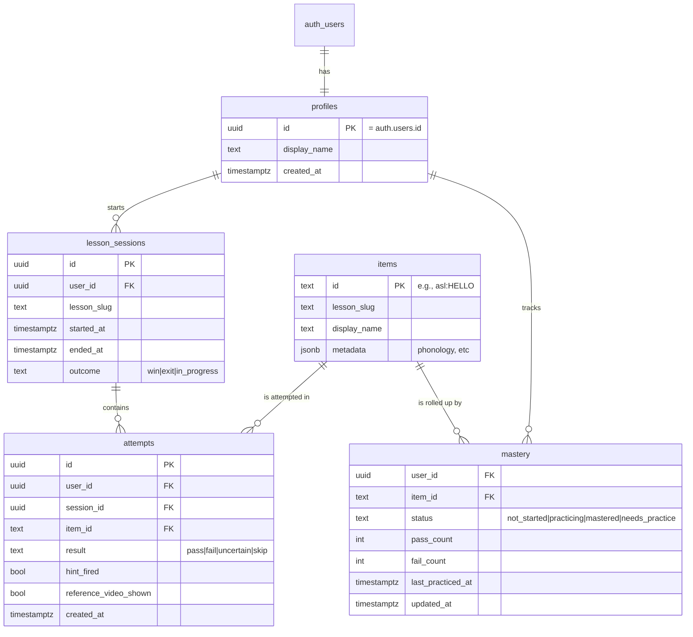
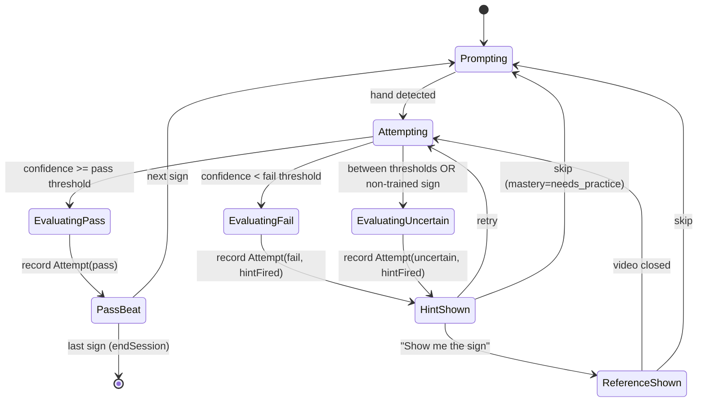

# ASL Pilot Tuesday-Demo Platform Slice

## Summary

Implement the Tuesday-demo SuperTutors slice in roughly this sequence: ground the data layer (Supabase Auth + Postgres schema + universal Item / Attempt / Mastery client), wire auth + dashboard chrome, redesign the landing-as-dashboard surface, build the ASL practice screen with MediaPipe landmarks + a from-scratch ONNX classifier on a 5–10 sign trained subset, train the classifier offline, adapt Freddy to write into the universal model, then seed demo data and update stale e2e specs. The plan honors the brainstorm's "ASL as supporting actor" framing — production-grade infra for auth/progress, design-quality UX for the dashboard and practice screen, pragmatic ML for the recognition.

---

## Problem Frame

The product motivation lives in the [origin requirements doc](../brainstorms/asl-pilot-platform-tuesday-demo-requirements.md). Plan-specific technical context: the repo has zero auth/DB/persistence today (verified by grep — no Supabase/Clerk/Firebase deps, no user/account types, no DB client); the `LessonModule` contract and `LessonHost` are already established and load-bearing; Freddy's CV pipeline (MediaPipe → 21 landmarks → gesture/pointer events) is shipped and reusable. The just-shipped Embla carousel landing redesign rendered two e2e specs partially stale, so test maintenance is unavoidable in this work regardless of intent.

---

## Requirements

This plan satisfies every requirement in the origin doc — R1 through R24. Implementation traceability is captured per-unit. Origin acceptance examples AE1–AE8 are honored by the corresponding test scenarios in U3, U5, U6, U8, U9.

**Origin actors:** A1 (K-12 student), A2 (parent buyer), A3 (Sage character), A4 (Patrick / demo evaluator).

**Origin flows:** F1 (sign-in to dashboard), F2 (ASL happy path), F3 (fail → hint → pass), F4 (repeat fail → reference video), F5 (cross-lesson activity rollup).

**Origin acceptance examples:** AE1 (covers F1, R2, R3, R5, R6), AE2 (F2, R13, R20), AE3 (F3, R13, R18, R19, R20), AE4 (F4, R19), AE5 (R14), AE6 (R4, R5, R7), AE7 (F5, R6, R8, R9, R10), AE8 (R23).

---

## Scope Boundaries

Carried verbatim from origin: voice input across all lessons; voice output for the ASL lesson; Acutis lesson content + brainlift pitch deck; separate parent-only dashboard; mobile-specific layouts; multi-language sign support / SSO / classroom rostering / server-side CV inference / production-scale isolation; persistent in-camera Sage avatar; separate `/dashboard` route; auto-skip after N fails.

### Deferred to Follow-Up Work

- **Per-stage Attempt writes inside Freddy's `LessonScripted` state machine.** Freddy writes one Attempt at lesson completion in this plan (U9). Finer-grained per-stage attempts (per `react_halves`, `react_mixed`, etc.) are a future iteration — the activity feed will read at lesson granularity, not stage granularity, in v1.
- **Generalizing the bespoke `devVoiceApi()` Vite plugin to mount arbitrary `api/*.ts` handlers.** Tuesday's demo doesn't need a second Vercel function (Supabase auth is client-side). Will likely surface when we add a server-side endpoint later.
- **Mastery rollup as a Postgres trigger.** This plan keeps mastery updates in application code for simplicity. A trigger-based rollup is cleaner and avoids race conditions under concurrent attempts — recommended once we have real concurrent users.
- **Demo-day backup recording.** A screen-recorded "best case" walkthrough as a fail-safe if live demo encounters infra issues. Not in scope of code; flagged here so it doesn't get forgotten.

---

## Context & Research

### Relevant Code and Patterns

- **Lesson-server contract:** [src/platform/lesson-sdk.ts](../../src/platform/lesson-sdk.ts) — `LessonModule`, `LessonMountProps.platform`, `CvCameraHandle`, `AudioEngineHandle`. This plan extends `LessonMountProps.platform` with an optional `progress: ProgressHandle`.
- **Lesson host orchestration:** [src/platform/LessonHost.tsx](../../src/platform/LessonHost.tsx) — `handleComplete` currently discards `outcome`; U9 hooks this to write the Freddy attempt.
- **Registry pattern:** [src/platform/registry.ts](../../src/platform/registry.ts) — static `LessonModule[]`. ASL `index.ts` already declares `requires: { camera: true }`; no registry change needed.
- **Zustand store pattern:** [src/platform/stores/platformStore.ts](../../src/platform/stores/platformStore.ts) — plain `create((set) => ({...}))` with hand-rolled localStorage helpers, slice-selectors at call site. The auth slice in U3 extends this file.
- **DI service pattern:** [src/platform/audio/nameAudioCache.ts](../../src/platform/audio/nameAudioCache.ts) — `NameAudioCache` interface + `InMemoryNameAudioCache` + `IndexedDbNameAudioCache`. U4's `ProgressClient` mirrors this exactly.
- **CV mount pattern:** [src/lessons/freddy-fractions/scripted/LessonTable.tsx](../../src/lessons/freddy-fractions/scripted/LessonTable.tsx) (lines ~67–78) — wrap a CV-using subtree in `<HandTracker>`, use `useHandLandmarks()` inside. ASL U6 mirrors this.
- **xstate factory + DI:** [src/lessons/freddy-fractions/tutor/tutorMachine.ts](../../src/lessons/freddy-fractions/tutor/tutorMachine.ts) — `createTutorMachine(deps)` with injectable engine. Reference for the ASL practice-loop state model if we go xstate (U8 currently leans toward derived-state per Freddy's "state-driven over event-driven" learning).
- **State-driven pattern:** [src/lessons/freddy-fractions/scripted/tableState.ts](../../src/lessons/freddy-fractions/scripted/tableState.ts) + `LessonScripted.tsx` — derived state via `useMemo(deriveTableState(...))` rather than event-driven counters. U8's practice loop follows this.
- **CSS-transition modal pattern:** [src/platform/landing/AboutModal.tsx](../../src/platform/landing/AboutModal.tsx) — CSS transitions over framer-motion because headless preview's hidden-tab `rAF` throttling stalls framer-motion. U6's reference-video modal and U3's sign-in dialog follow this.
- **Vercel function pattern:** [api/voice.ts](../../api/voice.ts) + [src/lib/voiceProxyValidation.ts](../../src/lib/voiceProxyValidation.ts) — thin handler in `api/`, validated business logic in `src/lib/` so Vitest can cover it. Not needed for this plan (Supabase auth is client-side), but the pattern stands if we add server endpoints later.
- **E2E test pattern:** [e2e/registry.spec.ts](../../e2e/registry.spec.ts) (contract test — landing surface + every lesson slug routable), [e2e/lesson-scripted.spec.ts](../../e2e/lesson-scripted.spec.ts) (lesson happy path with deterministic interactions). Auto-starts `npm run dev` via `webServer` block. U9 adds new specs in this style.
- **Design tokens + DESIGN.md rules:** [DESIGN.md](../../DESIGN.md) — `100dvh` not `vh`, `font-mono` for chrome/labels, `font-sans` for prose/inputs, `active = dark`, focus-ring tokens, `sb-paper` / `sb-ink` / `sb-accent-deep` palette. Every new UI file in this plan honors these.

### Institutional Learnings

The repo has no `docs/solutions/`; learnings come from the dated session journals.

- **Lesson-server contract is locked.** [Logs/2026-05-25-overnight-refactor-handoff.md](../../Logs/2026-05-25-overnight-refactor-handoff.md) — the platform/lesson SDK landed two nights ago; this plan extends it, doesn't re-architect.
- **CV pipeline is shipped and proven.** [Freddy-Fractions/journals/May-21-0308-cv-pivot-overnight.md](../../Freddy-Fractions/journals/May-21-0308-cv-pivot-overnight.md) — MediaPipe HandLandmarker, GPU→CPU fallback, hysteresis on pinch, 30fps loop. ASL reuses this — does not import MediaPipe directly from the lesson.
- **MediaPipe IS pretrained.** Same journal explicitly says "MediaPipe ships with pre-trained hand-landmark models." Freddy crossed this line; this plan inherits the precedent and documents it honestly in the pilot-quality doc.
- **Voice/API conventions.** [Freddy-Fractions/journals/May-20-1142-voice-pipeline-shipped.md](../../Freddy-Fractions/journals/May-20-1142-voice-pipeline-shipped.md) — thin handler in `api/`, validated logic in `src/lib/`, DI-first. Applies to any new server endpoints (not in this plan, but pattern to follow if we add them).
- **Design system conventions for the camera screen.** [Freddy-Fractions/journals/May-21-2334-design-system-ipad-bugs-freddy-life.md](../../Freddy-Fractions/journals/May-21-2334-design-system-ipad-bugs-freddy-life.md) — `100dvh` not `vh`, "active = dark" everywhere, framer-motion stalls in hidden tabs. Direct impact on U6.
- **Landing redesign just shipped.** [Logs/May-25-0007-landing-redesign-carousel-embla.md](../../Logs/May-25-0007-landing-redesign-carousel-embla.md) — Embla carousel + WheelGestures plugin replaced ~250 lines of custom code. e2e specs are partially stale. U5 replaces the carousel; U9 fixes the specs.
- **State-driven over event-driven.** [Freddy-Fractions/journals/May-22-0125-scripted-lesson-shipped.md](../../Freddy-Fractions/journals/May-22-0125-scripted-lesson-shipped.md) — Freddy's scripted lesson is local-state-driven via derived `tableState`, not xstate. U8 follows this for the ASL practice loop.
- **Privacy posture: no camera frames leave the browser.** Established in Freddy's CV pivot journal. ASL inherits and explicitly documents in `ASL-ComputerVision/PRIVACY.md`.

### External References

- **Supabase Auth (React) quickstart:** https://supabase.com/docs/guides/auth/quickstarts/react
- **Supabase RLS guide (2026 `(select auth.uid())` pattern):** https://supabase.com/docs/guides/database/postgres/row-level-security
- **Supabase database migrations:** https://supabase.com/docs/guides/deployment/database-migrations
- **MediaPipe HandLandmarker (Web JS) — version pinned at 0.10.35 in package.json:** https://ai.google.dev/edge/mediapipe/solutions/vision/hand_landmarker/web_js
- **ONNX Runtime Web (recommended over TF.js for custom Keras → browser):** https://onnxruntime.ai/docs/tutorials/web/
- **React 19 release notes:** https://react.dev/blog/2024/12/05/react-19
- **React 19 `useActionState`:** https://react.dev/reference/react/useActionState

---

## Key Technical Decisions

- **Recognition stack: MediaPipe HandLandmarker + custom Keras → ONNX classifier, served via `onnxruntime-web`.** Bends project brief Req 7 strict-read (MediaPipe is pretrained); matches the brainstorm's "pragmatic supporting actor" framing; inherits Freddy's already-shipped MediaPipe usage; ships in days not weeks. Documented honestly in `ASL-ComputerVision/PILOT_QUALITY.md`. Framework research confirms ONNX Runtime Web is the 2026 choice over TF.js for Keras → browser.
- **Auth state lives in an extended `platformStore` Zustand slice** (`session`, `user`, `status`). Subscribed to Supabase's `onAuthStateChange` from a top-level `AuthMount` effect. Consistent with existing store patterns; avoids a parallel React Context provider.
- **Freddy progress integration depth: one Attempt write at lesson completion.** Hook into `LessonHost.handleComplete` (currently discards `outcome`). Per-stage attempts deferred to follow-up. Activity feed reads at lesson granularity.
- **Supabase CLI for migrations.** Git-tracked schema diffs, reproducible local resets, smooth CI path later. ~2 minutes of overhead vs. raw SQL; saves "what's in prod again?" later.
- **`(select auth.uid())` RLS pattern.** ~95% perf win over bare `auth.uid()` per Supabase 2026 docs. Cached per statement instead of per row.
- **New publishable key naming: `VITE_SUPABASE_PUBLISHABLE_KEY`** (not the legacy `VITE_SUPABASE_ANON_KEY`). New projects use new format; old anon keys still work through end of 2026 but new naming avoids a rename later.
- **React 19 `useActionState` for sign-in / sign-up forms.** Cuts email/password/loading/error boilerplate from four `useState` hooks to one action call. Already in stack.
- **CSS transitions for animations that must run in headless preview tabs** (sign-in dialog, reference-video modal). Framer-motion `animate()` stalls when `visibilityState: hidden` (documented in Freddy's design-system journal). Framer-motion stays for in-view micro-interactions only.
- **Embla carousel is removed in favor of a static 3-card grid.** The carousel was the right primitive for marketing-style lesson previews; the dashboard wants a grid for scannable progress comparison. `LessonCarousel.tsx` and `TutorCard.tsx` (the latter already documented as dead in DESIGN.md) are deleted in U5.
- **`100dvh` everywhere, never `vh`.** iPad Safari status-bar retraction breaks `vh`-based layouts; per DESIGN.md and Freddy's journal.

---

## Open Questions

### Resolved During Planning

- **Schema shape:** `profiles`, `lesson_sessions`, `attempts`, `mastery`, plus `items` reference table. Resolved via framework research.
- **Browser ML runtime:** ONNX Runtime Web. Resolved.
- **Auth state location:** Zustand slice. Resolved.
- **Migration tool:** Supabase CLI. Resolved.
- **Sign-in form pattern:** React 19 `useActionState`. Resolved.

### Deferred to Implementation

- **Exact 5–10 sign selection.** Final list depends on U6's ASL-LEX filter joined with WLASL clip availability + phonological-diversity curation. Hand-extracted into `src/lessons/asl/vocab.ts`.
- **Per-class confidence thresholds.** Depend on U7's training validation results. Stored in `model_card.json` alongside the ONNX artifact.
- **Mastery rollup mechanism.** Application code in U4 by default; a Postgres trigger is in Deferred-to-Follow-Up Work for v2.
- **Pass beat animation specifics.** Design-during-implementation in U8 (color flash, scale, sound, auto-advance timing).
- **Hero copy + Continue-CTA wording for empty-progress state.** Design-during-implementation in U5.
- **Demo seed data shape.** What practice history looks best on the dashboard for the demo opening. Decided after U5 lands so we can see the dashboard rendered.

---

## Output Structure

```
SuperTutors/
├── src/
│   ├── lib/
│   │   └── supabase.ts                                  # NEW (U1)
│   ├── platform/
│   │   ├── auth/                                        # NEW (U3)
│   │   │   ├── AuthMount.tsx
│   │   │   ├── SignInDialog.tsx
│   │   │   ├── useAuth.ts
│   │   │   └── useAuth.test.ts
│   │   ├── progress/                                    # NEW (U4)
│   │   │   ├── InMemoryProgressClient.ts
│   │   │   ├── ProgressClient.test.ts
│   │   │   ├── SupabaseProgressClient.ts
│   │   │   ├── index.ts
│   │   │   ├── types.ts
│   │   │   └── useProgress.ts
│   │   ├── ui/
│   │   │   └── UserMenu.tsx                             # NEW (U3)
│   │   └── landing/
│   │       ├── ActivityFeed.tsx                         # NEW (U5)
│   │       ├── Hero.tsx                                 # NEW (U5)
│   │       ├── LessonGrid.tsx                           # NEW (U5)
│   │       ├── LessonCarousel.tsx                       # DELETE (U5)
│   │       └── TutorCard.tsx                            # DELETE (U5)
│   └── lessons/
│       └── asl/
│           ├── Mount.tsx                                # MODIFY (U6 — replaces ComingSoonMount)
│           ├── vocab.ts                                 # NEW (U6)
│           ├── vocab.test.ts                            # NEW (U6)
│           ├── store/
│           │   └── aslStore.ts                          # NEW (U6)
│           └── practice/                                # NEW (U6, U8)
│               ├── CameraGate.tsx
│               ├── ConfidenceCue.tsx
│               ├── HintCard.tsx
│               ├── HintCard.test.tsx
│               ├── PassBeat.tsx
│               ├── PhonologyIcon.tsx
│               ├── PracticeScreen.tsx
│               ├── PromptCard.tsx
│               ├── ReferenceVideoModal.tsx
│               ├── SignRecognizer.ts
│               ├── SignRecognizer.test.ts
│               ├── usePracticeLoop.ts
│               └── usePracticeLoop.test.tsx
├── supabase/                                            # NEW (U1, U2)
│   ├── migrations/
│   │   └── 20260525000001_init_schema.sql
│   └── seed.sql
├── ASL-ComputerVision/
│   ├── training/                                        # NEW (U7)
│   │   ├── extract_landmarks.py
│   │   ├── train.py
│   │   ├── export_onnx.py
│   │   ├── notebook.ipynb
│   │   └── validation_report.md
│   ├── PILOT_QUALITY.md                                 # NEW (U9)
│   └── PRIVACY.md                                       # NEW (U9)
├── public/
│   ├── lessons/
│   │   └── asl/
│   │       ├── model/                                   # NEW (U7)
│   │       │   ├── asl_classifier.onnx
│   │       │   └── model_card.json
│   │       └── videos/                                  # NEW (U6 — extracted from ASL-LEX examples)
│   │           ├── HELLO.webm
│   │           └── (one per trained sign)
│   └── ort/                                             # NEW (U8 — ONNX Runtime WASM)
└── e2e/
    ├── asl-practice-happy-path.spec.ts                  # NEW (U9)
    ├── auth.spec.ts                                     # NEW (U9)
    ├── smoke.spec.ts                                    # MODIFY (U9)
    └── registry.spec.ts                                 # MODIFY (U9)
```

---

## High-Level Technical Design

> *These illustrate the intended approach and are directional guidance for review, not implementation specification. The implementing agent should treat them as context, not code to reproduce.*

### Universal Data Model (ERD)



### ASL Practice Loop (State Diagram)



---

## Implementation Units

### Phase 1 — Foundation (data + auth)

### U1. Supabase Project + Client + Env Wiring

**Goal:** Provision the Supabase project, install the JS client, wire env vars, expose a singleton client.

**Requirements:** R1, R2 (foundation for all auth/DB work)

**Dependencies:** None

**Files:**
- Create: `src/lib/supabase.ts`
- Modify: `package.json` (add `@supabase/supabase-js`)
- Modify: `.env.local` (add `VITE_SUPABASE_URL`, `VITE_SUPABASE_PUBLISHABLE_KEY` — values from Supabase dashboard)
- Create: `.env.example` (document new vars, if not present)

**Approach:**
- Create Supabase project via the dashboard (free tier). Pick the closest region to the demo location.
- Install `@supabase/supabase-js` (v2).
- `src/lib/supabase.ts` exports a singleton `supabase` client created via `createClient(url, publishableKey, { auth: { persistSession: true, autoRefreshToken: true } })`.
- Skip OAuth provider setup; skip anonymous sign-in (real auth path is email/password per brainstorm).

**Patterns to follow:**
- `src/lib/voiceProxyValidation.ts` for the `src/lib/` pure-lib pattern.
- `import.meta.env.VITE_*` access pattern (already used elsewhere in the repo).

**Test scenarios:**
- Test expectation: none — pure infrastructure / config wiring, no behavioral test.

**Verification:**
- `npm run build` succeeds with the new dependency.
- Browser console: `supabase` client instantiates without error.
- Supabase dashboard shows the project active.

---

### U2. Supabase Schema + RLS + Migrations

**Goal:** Define `profiles`, `lesson_sessions`, `attempts`, `mastery`, and `items` tables with RLS policies; manage via Supabase CLI migrations.

**Requirements:** R2, R8, R9, R10

**Dependencies:** U1

**Files:**
- Create: `supabase/migrations/20260525000001_init_schema.sql`
- Create: `supabase/seed.sql` (items reference data; demo-account skeleton)
- Modify: `package.json` (add `supabase` as devDep — CLI)
- Modify: `.gitignore` (add `supabase/.temp/`, `supabase/.branches/`)

**Approach:**
- Tables (ID strategy: `uuid pk default gen_random_uuid()` for user-facing tables; `text pk` for `items` since IDs are stable string keys like `'asl:HELLO'`).
  - `profiles`: 1:1 with `auth.users` via `id uuid pk references auth.users(id) on delete cascade`.
  - `items`: reference data — `id text pk`, `lesson_slug text`, `display_name text`, `metadata jsonb`. Public-read RLS.
  - `lesson_sessions`: `id uuid pk`, `user_id uuid references auth.users(id) on delete cascade`, `lesson_slug text`, `started_at timestamptz default now()`, `ended_at timestamptz`, `outcome text`.
  - `attempts`: `id uuid pk`, `user_id uuid`, `session_id uuid references lesson_sessions(id) on delete cascade`, `item_id text references items(id)`, `result text` ('pass' | 'fail' | 'uncertain' | 'skip'), `hint_fired boolean default false`, `reference_video_shown boolean default false`, `created_at timestamptz default now()`.
  - `mastery`: composite PK `(user_id, item_id)`, `status text`, `pass_count int default 0`, `fail_count int default 0`, `last_practiced_at timestamptz`, `updated_at timestamptz default now()`.
- RLS: enabled on all five tables. User tables use the `(select auth.uid()) = user_id` pattern for SELECT / INSERT (with check) / UPDATE (using AND with check) / DELETE. `items` is public-readable, no writes from clients.
- Trigger: create a `profiles` row automatically on `auth.users` insert.
- Indexes: `user_id` on each user-table; `(user_id, started_at desc)` on `lesson_sessions` for activity-feed reads; `(session_id)` on `attempts`.

**Patterns to follow:**
- Supabase 2026 RLS pattern: `(select auth.uid())` wrapper per the framework research.
- `gen_random_uuid()` for primary keys; `timestamptz` for all timestamps.

**Test scenarios:**
- Test expectation: none for the migration itself — schema is validated by `supabase db reset` locally. Behavioral coverage lives in U4 (ProgressClient contract tests against InMemory + Supabase).
- Manual check: from JS client, attempt to read another user's row → RLS blocks (no row returned).

**Verification:**
- `supabase db reset` applies cleanly locally.
- `supabase db push` to remote succeeds.
- Test profile/session/attempt INSERTs from the dashboard SQL editor work; cross-user reads return empty.

---

### U3. Auth Slice + Sign-In/Sign-Up UI + UserMenu

**Goal:** Add auth state to `platformStore`, mount the Supabase auth listener, provide a sign-in/sign-up modal and a signed-in chrome menu.

**Requirements:** R1, R4

**Dependencies:** U1

**Files:**
- Modify: `src/platform/stores/platformStore.ts` (add `session`, `user`, `status`, `setSession`)
- Create: `src/platform/auth/AuthMount.tsx`
- Create: `src/platform/auth/SignInDialog.tsx`
- Create: `src/platform/auth/useAuth.ts`
- Create: `src/platform/auth/useAuth.test.ts`
- Create: `src/platform/ui/UserMenu.tsx`
- Modify: `src/App.tsx` (mount `<AuthMount />` once globally; render `<UserMenu />` only when signed in)

**Approach:**
- Store: `status: 'loading' | 'signed-in' | 'signed-out'`, `session`, `user`. `setSession(session)` derives `status` and `user`.
- `AuthMount`: a top-level effect-only component. `supabase.auth.getSession()` synchronously on mount, then `supabase.auth.onAuthStateChange((_event, session) => store.setSession(session))`. Cleanup unsubscribes.
- `useAuth()`: returns `{ user, session, status, signIn(email, password), signUp(email, password, displayName), signOut() }`. Action methods return `{ error?: string }`.
- `SignInDialog`: CSS-transition modal with sign-in + sign-up tabs. Forms use React 19 `useActionState` per framework research. Closes on success.
- `UserMenu`: chrome button at top-right (slot reused from `InfoToggle`'s position when on the landing, or its own slot in chrome layout). Click → dropdown with display name + Sign out.

**Execution note:** write `useAuth.test.ts` test-first — the auth state transitions are small, load-bearing, and easy to characterize with mocks.

**Patterns to follow:**
- `src/platform/stores/platformStore.ts` for store shape.
- `src/platform/landing/AboutModal.tsx` for CSS-transition modal.
- `src/platform/ui/InfoToggle.tsx` for chrome button styling + DESIGN.md tokens.
- React 19 `useActionState` per framework research.

**Test scenarios:**
- Happy path: `getSession` returns a session → `status` becomes `'signed-in'`, `user` matches.
- Happy path: `signIn` with valid creds → status transitions `loading` → `signed-in`; no error.
- Happy path: `onAuthStateChange('SIGNED_OUT', null)` → status becomes `signed-out`; user cleared.
- Edge case: `getSession` returns null → status is `signed-out` after init.
- Error path: `signIn` with invalid creds → status stays `signed-out`; error string returned.
- Integration: SignInDialog form submission triggers `signIn` → store updates → dialog closes.

**Verification:**
- E2E (added in U9): click "Sign in" on landing, submit demo creds, page re-renders as signed-in state.
- Manual: sign out clears session, returns to signed-out landing.

---

### U4. Universal Progress Client + SDK Integration

**Goal:** Build the `ProgressClient` interface + `InMemory` and `Supabase` impls; expose `platform.progress` via `LessonHost` to lesson Mounts.

**Requirements:** R8, R9, R10

**Dependencies:** U1, U2, U3

**Files:**
- Create: `src/platform/progress/types.ts`
- Create: `src/platform/progress/SupabaseProgressClient.ts`
- Create: `src/platform/progress/InMemoryProgressClient.ts`
- Create: `src/platform/progress/ProgressClient.test.ts`
- Create: `src/platform/progress/useProgress.ts`
- Create: `src/platform/progress/index.ts`
- Modify: `src/platform/lesson-sdk.ts` (add `progress?: ProgressHandle` to `LessonMountProps.platform`)
- Modify: `src/platform/LessonHost.tsx` (construct + pass the handle when signed in)

**Approach:**
- `ProgressHandle` interface methods: `startSession(lessonSlug)`, `endSession(sessionId, outcome)`, `recordAttempt({sessionId, itemId, result, hintFired?, referenceVideoShown?})`, `getMastery(lessonSlug)`, `getRecentActivity(limit)`.
- `SupabaseProgressClient`: wraps the supabase client + the current user's id; thin CRUD against the U2 schema. Mastery updates handled in application code (rollup-via-trigger is in Deferred-to-Follow-Up).
- `InMemoryProgressClient`: in-memory Maps; same interface. Used by tests.
- `useProgress()`: React hook returning a `ProgressHandle` bound to the current user. Constructs `SupabaseProgressClient` lazily when `useAuth().user` is set.
- `LessonHost` wiring: builds a handle once user is signed in; passes via `platform.progress` to the lesson Mount.

**Patterns to follow:**
- `src/platform/audio/nameAudioCache.ts` — exact mirror of `NameAudioCache` interface + `InMemoryNameAudioCache` + `IndexedDbNameAudioCache` structure.
- `src/platform/lesson-sdk.ts` for SDK shape extensions.

**Test scenarios:**
- Happy path: `startSession` returns a sessionId; `recordAttempt` persists; `endSession` sets outcome and ended_at.
- Happy path: `recordAttempt` updates mastery counters and `last_practiced_at` for the corresponding item.
- Happy path: `getRecentActivity(10)` returns the 10 most recent attempts ordered by `created_at desc`.
- Happy path: `getMastery(lessonSlug)` returns one entry per item the user has attempted in that lesson.
- Edge case: `recordAttempt` referencing an item_id not in `items` → error returned (constraint violation surface).
- Edge case: ending an already-ended session → idempotent (no double-write to `ended_at`).
- Integration (contract test): runs the same suite against both `InMemoryProgressClient` and `SupabaseProgressClient` (Supabase suite gated by an env flag so CI without Supabase can still run unit suite).
- Integration: `LessonHost` passes a working `ProgressHandle` to Mount when `useAuth().status === 'signed-in'`; passes `undefined` otherwise.

**Verification:**
- All ProgressClient tests pass.
- Manual: from the Freddy Mount (after U9 lands), completing a lesson visibly inserts rows into `lesson_sessions`, `attempts`, and `mastery` in Supabase.

---

### Phase 2 — Surfaces (landing redesign + ASL UI shell)

### U5. Landing-as-Dashboard Redesign

**Goal:** Rewrite the landing surface to serve both signed-in dashboard and signed-out marketing on one canvas; replace the Embla carousel with the Hero + 3-Lesson Grid + Activity Feed pattern.

**Requirements:** R5, R6, R7

**Dependencies:** U3 (needs auth state), U4 (needs progress data when signed in)

**Files:**
- Modify: `src/platform/landing/LandingPage.tsx` (branches on auth state; orchestrates new components)
- Create: `src/platform/landing/Hero.tsx`
- Create: `src/platform/landing/LessonGrid.tsx`
- Create: `src/platform/landing/ActivityFeed.tsx`
- Modify: `src/platform/landing/FreddyPosterCard.tsx` (extend with optional progress overlay)
- Modify: `src/platform/landing/ComingSoonPosterCard.tsx` (extend with optional progress overlay)
- Delete: `src/platform/landing/LessonCarousel.tsx`
- Delete: `src/platform/landing/TutorCard.tsx`
- Create: `src/platform/landing/LessonGrid.test.tsx`
- Create: `src/platform/landing/ActivityFeed.test.tsx`

**Approach:**
- `LandingPage` reads `useAuth().status`:
  - `'loading'` → minimal skeleton.
  - `'signed-out'` → Hero (marketing variant — "Tutors for the AI generation" or similar, with Sign-in / Get-started CTAs) + LessonGrid (signed-out — lessons render with Coming-Soon chips and no progress) + no ActivityFeed.
  - `'signed-in'` → Hero (personalized — display name + "Continue your ASL practice" CTA into the most recent active lesson) + LessonGrid (per-lesson progress bars + counters) + ActivityFeed (last 10 attempts).
- Same outer canvas (chrome unchanged: MuteToggle stays; InfoToggle stays; UserMenu added when signed in). Lessons' visual identities (Freddy yellow, Acutis cream/laurel, ASL sky/hand) preserved via the existing poster card components.
- Activity feed: compact rows — "Practiced HELLO ✓ · 2m ago · ASL with Sage", "Practiced Equivalent Fractions ✓ · yesterday · Freddy". Empty state when no activity.
- Lesson cards: when signed-in, overlay a progress strip (e.g., "12 / 18 mastered" + thin progress bar) on each card.

**Patterns to follow:**
- `src/platform/landing/FreddyPosterCard.tsx`, `ComingSoonPosterCard.tsx` for visual identity.
- DESIGN.md for tokens (font-mono labels, sb-paper/sb-ink, h-[100dvh], focus rings).
- `src/platform/landing/AboutModal.tsx` for CSS-transition pattern (if any new modals are added in this unit).

**Test scenarios:**
- Happy path: signed-out user → marketing hero + 3 lesson teasers visible; no progress overlays.
- Happy path: signed-in user with progress → personalized hero + lesson cards show progress + populated activity feed.
- Edge case: signed-in user with no progress yet → hero shows generic "Pick a lesson to start" CTA; lesson cards show "Not started" state; activity feed shows empty state.
- Edge case: unauthenticated click on any lesson card → opens SignInDialog; after sign-in, lesson navigation happens automatically.
- Integration: `useProgress().getRecentActivity` returning 0 items renders empty-state visual cleanly.

**Verification:**
- E2E: visit `/` signed-out → marketing landing renders; sign in → page transforms to dashboard within one frame.
- Visual review (`/design-review`): hero + grid + activity feed all honor DESIGN.md tokens; no AI-slop visuals.

---

### U6. ASL Lesson — Mount, Vocab, Practice Screen Shell, Hint Card, Reference Video

**Goal:** Replace the ASL `ComingSoonMount` with a real practice-screen scaffold: vocab catalog (75–100 items + phonology for 5–10 trained), camera permission, full-viewport practice screen, phonological hint card UI, on-demand reference video modal. The classifier wiring + state machine come in U8 — this unit builds everything *around* the recognizer.

**Requirements:** R11, R16, R18, R19, R22, R23

**Dependencies:** U4 (platform.progress) and U5 (navigation entry from dashboard)

**Files:**
- Modify: `src/lessons/asl/Mount.tsx` (replace `<ComingSoonMount />` with real practice scaffold)
- Modify: `src/lessons/asl/index.ts` (no voice config — ASL has no voice output per brainstorm)
- Create: `src/lessons/asl/vocab.ts`
- Create: `src/lessons/asl/vocab.test.ts`
- Create: `src/lessons/asl/store/aslStore.ts`
- Create: `src/lessons/asl/practice/PracticeScreen.tsx`
- Create: `src/lessons/asl/practice/CameraGate.tsx`
- Create: `src/lessons/asl/practice/PromptCard.tsx`
- Create: `src/lessons/asl/practice/HintCard.tsx`
- Create: `src/lessons/asl/practice/HintCard.test.tsx`
- Create: `src/lessons/asl/practice/PhonologyIcon.tsx`
- Create: `src/lessons/asl/practice/ReferenceVideoModal.tsx`
- Create: `public/lessons/asl/videos/{ID}.webm` (one reference video per trained sign — extracted from ASL-LEX `ASL examples/` folder)

**Approach:**
- `vocab.ts`: TypeScript file exporting `Sign[]`. Each entry: `{ id: 'asl:HELLO', glyph: 'HELLO', trained: boolean, phonology?: { handshape, location, movement, palmOrientation }, referenceVideo?: string }`. Phonology required for trained signs only; reference video paths point to `/lessons/asl/videos/{id}.webm` for the trained subset. The 5–10 hero signs are hand-curated for phonological diversity using ASL-LEX columns (`SignType.2.0 = OneHanded`, varied `Handshape.2.0`, varied `MajorLocation.2.0`, low `bglm_aoa`, high `SignFrequency`, `InCDI = Yes`). Cross-referenced with WLASL clip availability for training data.
- `aslStore.ts`: lesson-local Zustand store — `currentSignIdx`, `attemptState` ('prompting' | 'attempting' | 'passing' | 'failing' | 'uncertain' | 'reference-shown'), `hintShown`, `referenceShown`, `sessionId`.
- `Mount.tsx`: top-level component. Mounts `<HandTracker>` provider; conditionally renders `<CameraGate />` if permission denied; otherwise mounts `<PracticeScreen />` inside the provider. Uses `platform.progress` from props (passed by `LessonHost`) to start a session on mount.
- `PracticeScreen`: full-viewport (`h-[100dvh]`) container with the camera feed visible as background; overlays `<PromptCard />` (top-center), `<ConfidenceCue />` (subtle edge cue — built in U8), and conditionally renders `<HintCard />` and `<ReferenceVideoModal />` based on aslStore state.
- `HintCard`: receives `{ targetSign, observedSign? }` props. Four-quadrant grid: Handshape (icon + label), Location (icon + label), Movement (icon + arrow direction), Palm Orientation (icon). When `observedSign` is present (e.g., classifier returned a different known class), show comparison framing ("You signed A — close your thumb to make S"). When null (uncertain), show general guidance.
- `PhonologyIcon`: tiny SVG illustrations for the handshapes used by the trained subset (A, B, S, 5, O, L — chosen by U6 curation). Hand-drawn, cohesive with the SuperTutors brand. Reuses the inline-SVG glyph approach from existing poster cards.
- `ReferenceVideoModal`: CSS-transition modal with autoplay-loop video. Closable via Escape or backdrop click. Triggered by "Show me the sign" button on `HintCard`.
- `CameraGate`: permission prompt UI. Reuses the existing CV permission modal copy and treatment from Freddy (per journal learning — don't reinvent permissions per lesson).

**Patterns to follow:**
- `src/lessons/freddy-fractions/Mount.tsx` for Mount lifecycle.
- `src/lessons/freddy-fractions/store/tutorStore.ts` for store shape.
- `src/lessons/freddy-fractions/scripted/LessonTable.tsx` lines ~67–78 for HandTracker mount pattern.
- `src/platform/landing/ComingSoonPosterCard.tsx` for inline SVG glyph approach.
- `src/platform/landing/AboutModal.tsx` for CSS-transition modal.
- DESIGN.md tokens; `h-[100dvh]`; "active = dark".

**Test scenarios:**
- Happy path: `vocab.ts` exports 75–100 sign entries.
- Happy path: all `trained: true` signs have complete phonology data; trained signs reference an existing video file.
- Happy path: `HintCard` renders all four phonological breakdowns for a target sign with complete data.
- Happy path: clicking "Show me the sign" opens `ReferenceVideoModal` with the correct video.
- Edge case: `HintCard` receives a target sign with incomplete phonology → falls back to "general guidance" framing without crashing.
- Edge case: `ReferenceVideoModal` closes on Escape and on backdrop click.
- Edge case: camera permission denied → `CameraGate` shown; practice attempt state not entered.
- Edge case: camera permission granted → `PracticeScreen` mounts with `HandTracker` active.
- Integration: navigating from the dashboard's ASL lesson card mounts `PracticeScreen`.

**Verification:**
- `vocab.test.ts` and `HintCard.test.tsx` pass.
- E2E: visit `/lessons/asl` signed-in → `CameraGate` renders OR practice screen mounts if permission cached.
- Visual review: hint card renders on top of camera feed without occluding the hand area.

---

### Phase 3 — ASL Recognition (offline training + runtime)

### U7. ASL Classifier Training + ONNX Export

**Goal:** Train a from-scratch classifier (Keras) on MediaPipe-landmark sequences for the 5–10 hero signs; validate per-class accuracy; export to ONNX; produce a validation report that feeds the pilot-quality doc.

**Requirements:** R12, R13, R15

**Dependencies:** U6 (vocab.ts locks the trained subset)

**Files:**
- Create: `ASL-ComputerVision/training/extract_landmarks.py` (run MediaPipe over WLASL clips for chosen signs; save landmark CSVs)
- Create: `ASL-ComputerVision/training/train.py` (Keras model definition + training loop)
- Create: `ASL-ComputerVision/training/export_onnx.py` (Keras → tf2onnx → `.onnx`)
- Create: `ASL-ComputerVision/training/notebook.ipynb` (orchestrating notebook — calls the .py files; produces validation outputs)
- Create: `ASL-ComputerVision/training/validation_report.md` (per-class accuracy, confusion matrix, threshold recommendations)
- Create: `public/lessons/asl/model/asl_classifier.onnx` (artifact)
- Create: `public/lessons/asl/model/model_card.json` (classes, input shape, per-class thresholds, training metadata)

**Approach:**
- For each of the 5–10 hero signs, extract WLASL video clips → run MediaPipe `HandLandmarker` (Python bindings) per-frame → save (frame_idx, 21 × 3 landmark vector) CSVs.
- Pad / truncate to a fixed sequence length (e.g., 30 frames). Normalize relative to wrist landmark (translation-invariance) and scale by max-distance (scale-invariance).
- Augmentation: small rotations (±15°), slight scaling, frame jitter (drop random frames + re-pad), brightness/contrast-equivalent perturbation. Critical with small data.
- Architecture: small from-scratch Keras model — Conv1D on the sequence axis or a small MLP on pooled landmark features. From-scratch weights (no pretrained transfer). MediaPipe landmark extraction is the *pretrained* part; documented honestly.
- Training: 80/10/10 split. Train ~5–30 epochs with early stopping. Per-class target ≥ 80% top-1 on validation.
- Export via `tf2onnx.convert.from_keras(model, output_path="public/lessons/asl/model/asl_classifier.onnx", opset=17)`.
- `model_card.json`: `{ classes: ['HELLO', ...], inputShape: [1, 30, 63], thresholds: { 'HELLO': { pass: 0.85, fail: 0.4 }, ... }, training: { date, framework, epochs, augmentation } }`. Per-class thresholds chosen by inspecting validation-set ROC curves.
- Validation report: per-class precision/recall, confusion matrix, sample failure cases. Threshold rationale spelled out. This document feeds directly into `ASL-ComputerVision/PILOT_QUALITY.md` (U9).

**Execution note:** This work happens in Python under `ASL-ComputerVision/training/`. The notebook + .py files are not bundled with the React app — only the `.onnx` artifact + `model_card.json` ship to the browser.

**Patterns to follow:**
- Standard Keras training boilerplate.
- The `Sign[]` schema in `vocab.ts` is the contract — classifier output classes must match trained-sign IDs exactly.

**Test scenarios:**
- Validation: per-class top-1 ≥ 80% on the held-out set for chosen 5–10 signs (target). Document if not met.
- Validation: confusion matrix shows phonologically-distinct signs are well-separated.
- Sanity: ONNX model loads in a Node script via `onnxruntime-node`; inference on a random landmark sequence returns probability of the correct shape.
- Integration: classifier output classes match `vocab.ts` trained-set IDs exactly.

**Verification:**
- Validation report documents per-class accuracy and a confusion matrix.
- Browser smoke test (manual): load `asl_classifier.onnx` via `onnxruntime-web`, run inference on dummy input, get probability vector of the correct shape.

---

### U8. ASL Practice Loop Runtime — Recognition + Decision Logic + Progress Writes

**Goal:** Wire MediaPipe landmarks → ONNX classifier → pass/fail/uncertain decision → state transitions in `aslStore` → progress writes via `platform.progress`.

**Requirements:** R13, R14, R17, R20, R21

**Dependencies:** U4 (progress client), U6 (vocab + Mount shell + hint card UI), U7 (model artifact)

**Files:**
- Create: `src/lessons/asl/practice/SignRecognizer.ts`
- Create: `src/lessons/asl/practice/SignRecognizer.test.ts`
- Create: `src/lessons/asl/practice/usePracticeLoop.ts`
- Create: `src/lessons/asl/practice/usePracticeLoop.test.tsx`
- Create: `src/lessons/asl/practice/ConfidenceCue.tsx`
- Create: `src/lessons/asl/practice/PassBeat.tsx`
- Modify: `src/lessons/asl/practice/PracticeScreen.tsx` (wire everything together)
- Modify: `package.json` (add `onnxruntime-web`)
- Modify: `vite.config.ts` (copy ONNX WASM files to `public/ort/` if needed; configure `ort.env.wasm.wasmPaths` at runtime)
- Create: `public/ort/` (ONNX Runtime WASM files — copied from node_modules at build time or manually staged)

**Approach:**
- `SignRecognizer`: loads the ONNX model once via `ort.InferenceSession.create('/lessons/asl/model/asl_classifier.onnx')`. Buffers the last 30 frames of MediaPipe landmarks (21 × 3 each, normalized identically to training). On demand (per N frames — likely every 6–10 frames at 30fps, tuned during implementation): runs `session.run({ input: tensor })`, returns `{ topClass, confidence }`. Applies per-class thresholds from `model_card.json` to classify as `'pass' | 'fail' | 'uncertain'`. For non-trained vocab items (recognizer asked to classify a sign not in its class list): deterministically returns `'uncertain'`.
- `usePracticeLoop` hook: owns the practice state machine. Reads from `useHandLandmarks()` + `SignRecognizer`; writes to `aslStore` and `platform.progress`. Follows Freddy's "state-driven over event-driven" pattern — transitions are derived from observable conditions (confidence value, hand-presence, time-in-state) not event counters.
  - `'prompting'` (showing prompt, no attempt) → `'attempting'` (landmarks detected, recognizer running)
  - On entering `'attempting'`: call `platform.progress.startSession(...)` if not started; store sessionId in aslStore.
  - On `'pass'`: `recordAttempt({ result: 'pass' })`; show `<PassBeat />`; advance to next sign OR completion (calls `endSession`).
  - On `'fail'`: `recordAttempt({ result: 'fail', hintFired: true })`; `aslStore.hintShown = true`.
  - On `'uncertain'`: `recordAttempt({ result: 'uncertain', hintFired: true })`; `aslStore.hintShown = true` with general-guidance framing.
  - On `'skip'`: `recordAttempt({ result: 'skip' })`; mark mastery 'needs_practice'; advance.
  - On `'reference shown'`: `recordAttempt({ ..., referenceVideoShown: true })` (this flag is set on the next attempt's record, indicating the learner saw the reference before passing).
- `ConfidenceCue`: small ambient indicator (corner ring with a subtle pulse keyed to recognition activity, or a slim edge bar with confidence value). Subtle — doesn't compete with the camera feed or the prompt.
- `PassBeat`: full-screen flash + checkmark + auto-advance after ~1.5s. Spring scale animation. Framer-motion is fine here (not headless-tab-critical — only fires during active demo / use).

**Patterns to follow:**
- ONNX Runtime Web setup: copy WASM to `public/ort/`, set `ort.env.wasm.wasmPaths = "/ort/"`. Documented in framework research.
- `src/lessons/freddy-fractions/scripted/tableState.ts` for derived-state pattern.
- `src/platform/cv/HandTracker.tsx` integration via `useHandLandmarks()`.

**Test scenarios:**
- Happy path: `SignRecognizer` with high-confidence prediction → returns `'pass'`.
- Happy path: confidence between fail/pass thresholds → returns `'uncertain'`.
- Happy path: confidence below fail threshold → returns `'fail'`.
- Edge case: `SignRecognizer` asked to classify a non-trained vocab item → returns `'uncertain'` deterministically.
- Edge case: no hand detected → recognizer returns `'no_hand'`; no Attempt recorded.
- Error path: ONNX model fails to load → graceful error state with "Reload" affordance.
- Integration: **Covers AE2.** `usePracticeLoop` on pass → `PassBeat` fires; `recordAttempt({result:'pass'})` called; next sign loads.
- Integration: **Covers AE3.** `usePracticeLoop` on fail → `HintCard` shown with phonology; `recordAttempt({result:'fail', hintFired:true})` called.
- Integration: **Covers AE5.** `SignRecognizer` on non-trained sign → returns `'uncertain'`; general-guidance hint shown; never `'pass'`.
- Integration: `endSession` is called exactly once at lesson completion (not on every sign).

**Verification:**
- Manual: sign correctly → pass beat fires; sign incorrectly → hint card emerges with correct phonology; click "Show me the sign" → reference video plays; retry → eventual pass.
- E2E: `e2e/asl-practice-happy-path.spec.ts` (added in U9) covers a full deterministic pass with a mocked recognizer.

---

### Phase 4 — Integration & Demo Prep

### U9. Freddy Adapter + Demo Seed + e2e Updates + Pilot-Quality Docs

**Goal:** Wire Freddy to write into the universal progress model on completion; pre-seed the demo account with substantive practice history; update the two stale e2e specs; add new e2e specs for auth + ASL happy path; write the pilot-quality + privacy docs.

**Requirements:** R3, R10, R15, R23, R24

**Dependencies:** U4 (progress client), U5 (landing — for activity feed visibility), U7 + U8 (model artifact + validation report inform pilot-quality doc)

**Files:**
- Modify: `src/platform/LessonHost.tsx` (in `handleComplete`: if `progress` handle exists, call `endSession` + `recordAttempt`)
- Create: `src/lessons/freddy-fractions/freddyProgressAdapter.ts` (extracts the lesson's "win" outcome into an Attempt for `freddy:fractions-equivalence`)
- Modify: `src/lessons/freddy-fractions/Mount.tsx` (call `platform.progress?.startSession('freddy-fractions')` on mount; thread sessionId; pass itemId to `onComplete`)
- Modify: `src/platform/lesson-sdk.ts` (extend `LessonMountProps.onComplete` signature with optional `itemId`)
- Create: `supabase/seed/demo_account.sql` (insert demo user via auth-admin OR document the dashboard steps; insert ~8 lesson_sessions, ~30 attempts, mastery rows for demo user)
- Create: `ASL-ComputerVision/PILOT_QUALITY.md` (covers Req 8 + Req 15 — camera/lighting conditions, signing distance + body framing, validation set, accuracy targets, confidence thresholds, known limitations, pretrained-model evidence)
- Create: `ASL-ComputerVision/PRIVACY.md` (covers Req 13 — camera frames stay local, MediaPipe inference is in-browser, only attempt outcomes go to Supabase as text, no video upload)
- Modify: `e2e/smoke.spec.ts` (update stale heading assertion for new landing)
- Modify: `e2e/registry.spec.ts` (update lesson-chip / Coming-Soon assertions for new dashboard chrome)
- Create: `e2e/auth.spec.ts`
- Create: `e2e/asl-practice-happy-path.spec.ts`

**Approach:**
- Items reference data (U2's `seed.sql`) gains `freddy:fractions-equivalence` (display name: "Equivalent Fractions"). The ASL items are seeded from `vocab.ts` (one row per trained sign).
- `LessonHost.handleComplete`: if signed-in and `platform.progress` is set, on `outcome === 'win'` call `recordAttempt({sessionId, itemId, result: 'pass'})` then `endSession(sessionId, 'win')`. On `'exit'`, just `endSession(sessionId, 'exit')` (no Attempt).
- Freddy `Mount.tsx`: on mount, `platform.progress?.startSession('freddy-fractions')` and stash the sessionId in lesson-local state. On `onComplete`, pass `itemId: 'freddy:fractions-equivalence'`.
- Demo seed: 1 demo user (e.g., `demo@supertutors.app`, fixed password). Insert ~8 lesson_sessions over 7 days (5 ASL, 3 Freddy). ~30 attempts distributed realistically (mix of pass / fail-then-pass / uncertain / occasional skip). Mastery: 5 ASL signs `'mastered'`, 3 `'practicing'`, `freddy:fractions-equivalence` `'mastered'`. Goal: dashboard renders rich on demo open.
- `PILOT_QUALITY.md`: structured per project brief Req 8 — supported camera and lighting conditions ("well-lit room, single hand visible, 0.5–1.5m from camera"), expected signing distance and body framing, held-out validation set details (from U7), per-class accuracy targets and observed values, confidence thresholds (pass / fail boundaries with rationale), known limitations and failure cases (including a candid section on the catalog-vs-trained gap and the MediaPipe pretrained-landmark trade-off).
- `PRIVACY.md`: explicit walkthrough of where each kind of data lives. Camera frames → browser only, never uploaded. MediaPipe inference → browser via WASM. Sign classification → browser via ONNX Runtime Web. Attempt outcomes → Supabase Postgres (text rows: lesson_slug, item_id, result, timestamps; no video).
- `e2e/smoke.spec.ts`: replace the broken `"tutors for the ai generation"` heading assertion with the new Hero copy from U5.
- `e2e/registry.spec.ts`: update Coming-Soon chip assertions to match new lesson card chrome (signed-out variant). The lesson-routability assertions stay.
- `e2e/auth.spec.ts`: new — signed-out → click Sign in → submit demo creds → dashboard transforms.
- `e2e/asl-practice-happy-path.spec.ts`: new — signed-in user with mock recognizer returning a known-good sequence → pass beat fires → attempt persisted.

**Patterns to follow:**
- `e2e/lesson-scripted.spec.ts` for e2e style.
- Supabase CLI seed via `supabase db push --include-seed` or dashboard-applied SQL.
- DESIGN.md DOCS DISCIPLINE: imperative voice, concise prose, anchored to brief requirement numbers.

**Test scenarios:**
- Happy path: **Covers AE7.** Freddy `'win'` outcome triggers `Attempt(pass)` + `Mastery` update for `freddy:fractions-equivalence`; activity feed shows the session next time the dashboard loads.
- Happy path: Freddy `'exit'` outcome triggers `endSession` without an Attempt.
- Happy path (e2e): **Covers AE1.** Sign-in dialog → submit demo creds → dashboard transforms with progress data.
- Happy path (e2e): **Covers AE6.** Click into a lesson while signed-out → sign-in dialog appears.
- Happy path (e2e): signed-in user navigates to ASL with mock recognizer → practice screen mounts → simulated landmark input → pass beat fires.
- Integration: demo account's activity feed shows expected attempts in chronological order.

**Verification:**
- All e2e specs pass (`npm run test:e2e`).
- Manual: log in as demo user → dashboard renders with rich data (5 mastered ASL signs visible; ~30 recent activity entries; Freddy card shows mastered).
- Pilot-quality and privacy docs are readable, accurate, and reference brief requirement numbers explicitly.

---

## System-Wide Impact

- **Interaction graph.** Auth listener on app boot drives the platformStore; all subscribers (UserMenu, landing branches, LessonHost) re-render on auth-state change. LessonHost gains a new dependency on `useAuth` and `useProgress`. Lessons receive a new optional `platform.progress` they may or may not consume.
- **Error propagation.** Supabase network errors should surface as toast / inline messages, not crashes. The auth sign-in form already handles the error case via `useActionState` return. Camera failures continue to surface via the existing HandTracker error states.
- **State lifecycle risks.**
  - *Sign-out during an active lesson.* For Tuesday, signing out mid-lesson navigates to landing without saving the in-progress session. Acceptable demo behavior; flagged.
  - *Mastery rollup race condition.* Two rapid attempts on the same item could race; mastery counters are updated in application code (not a DB trigger), so concurrent writes could lose increments. Low likelihood for single-user demo; rollup-via-trigger is in Deferred-to-Follow-Up.
  - *Partial session writes.* If the browser closes mid-lesson, `lesson_sessions.ended_at` stays null. The activity feed handles this gracefully (shows the session in progress).
- **API surface parity.** `LessonModule.LessonMountProps.platform.progress` is new and optional. Existing lessons (Acutis stub) keep working without changes — they receive `progress` but don't consume it. Freddy's adapter is the only lesson that actively writes.
- **Integration coverage.** The ProgressClient contract test runs the same suite against `InMemoryProgressClient` and `SupabaseProgressClient` so the prod path is exercised. E2E specs cover the auth → dashboard → lesson loop end-to-end.
- **Unchanged invariants.** The `LessonModule` registration shape, ESLint isolation rules (platform never imports from lessons; lessons never import each other), audio system, MediaPipe `HandTracker`, registry-driven routing, and the existing CV permission flow are all untouched. The chrome layer (MuteToggle, InfoToggle) is unchanged structurally — UserMenu is added next to existing chrome, not replacing it.

---

## Risk Analysis & Mitigation

| Risk | Likelihood | Impact | Mitigation |
|---|---|---|---|
| **Model accuracy below 80% for some trained signs** | Med | Med | U6 curates the hero subset for phonological distinctness; U7 tunes per-class thresholds; pilot-quality doc documents per-class accuracy honestly per Req 8 |
| **Patrick probes the "no pretrained" rule strictly** | Med | High | Pilot-quality doc explicitly frames the trade-off; "from-scratch classifier on top of pretrained landmark front-end" is the stable, honest answer; Freddy precedent is cited |
| **Supabase RLS locks user out in dev** | Low | Med | Local Supabase via CLI (`supabase start`); service-role key documented for emergency dev access; revert plan: temporarily disable RLS for debugging then re-enable |
| **Landing redesign visual regression breaks specs** | Med | Low | U9 explicitly updates the stale specs; visual QA via `/design-review` post-build |
| **ONNX Runtime Web WASM serving issues in Vite** | Med | Med | Copy `.wasm` files to `public/ort/`; set `ort.env.wasm.wasmPaths = "/ort/"`; documented in framework research |
| **Camera permission UX surprises on demo day** | Low | Med | Reuse Freddy's existing CV permission pattern; `CameraGate` component; demo rehearsal with permission already granted |
| **Train-test mismatch (WLASL clip context vs. live webcam)** | High | Med | Augmentation in U7 (rotation/scale/jitter/lighting); demo with known-good lighting; pilot-quality doc documents supported camera/lighting conditions per Req 8 |
| **Demo seed shape doesn't render well** | Low | Low | U9's seed can be iterated after U5 lands to confirm visual fit; cheap to revise |
| **Build velocity slips** | Med | High | Cut order pre-decided per Phase 5.1.5: drop on-demand reference videos (Req 10 satisfied by text-only phonological hint), then drop trained-vocab count to 5, then drop activity feed on dashboard |
| **e2e suite stays broken into Tuesday** | Low | Med | U9 explicitly addresses; suite re-runs at every push; demo doesn't require green CI but proof-of-discipline matters in interview |

---

## Phased Delivery

### Phase 1 — Foundation (U1, U2, U3, U4)
Data + auth + progress client. After Phase 1, the platform has real auth and a working progress write/read path (via `InMemoryProgressClient` in tests + `SupabaseProgressClient` against a real Supabase project). Nothing the user sees changes yet.

### Phase 2 — Surfaces (U5, U6)
The visible surfaces. After Phase 2, signed-in users see the new dashboard; clicking into ASL mounts a practice screen with the hint-card UI ready (but no recognizer yet — placeholder behavior for UI development).

### Phase 3 — ASL Recognition (U7, U8)
U7 (offline training) can begin in parallel with Phase 2 — it doesn't depend on UI. U8 wires the trained model into the live practice loop. After Phase 3, the ASL lesson is demo-ready end-to-end.

### Phase 4 — Integration & Demo Prep (U9)
Freddy adapter, demo seed, e2e fixes, pilot-quality + privacy docs. After Phase 4, the demo account renders rich, the e2e suite is green, the brief-compliance docs exist, and the platform demos as one product.

---

## Documentation / Operational Notes

- **Docs to write in this plan:** `ASL-ComputerVision/PILOT_QUALITY.md`, `ASL-ComputerVision/PRIVACY.md`. Both delivered in U9.
- **Docs to update (light touch):** `docs/ARCHITECTURE.md` (add a short section on auth + progress layer); `README.md` (add Supabase env vars + CLI setup steps). Both can land in U9 as small modifications, or be deferred to a documentation-only follow-up PR.
- **Demo-day operational checklist:** pre-seed demo account on Supabase before the demo; verify ONNX model loads in the browser; verify camera permission granted in target browser; have a screen-recorded "best case" walkthrough as a fail-safe (flagged in Deferred-to-Follow-Up).
- **Deploy posture:** Vercel preview deploys are the staging environment. Local dev is the demo target (eliminates network-flake risk during the demo). Supabase project is production-grade from day one.
- **Env vars to add in Vercel + locally:** `VITE_SUPABASE_URL`, `VITE_SUPABASE_PUBLISHABLE_KEY` (client-readable). No service-role key in client builds.

---

## Sources & References

- **Origin document:** [docs/brainstorms/asl-pilot-platform-tuesday-demo-requirements.md](../brainstorms/asl-pilot-platform-tuesday-demo-requirements.md)
- **Strategy:** [STRATEGY.md](../../STRATEGY.md)
- **Project brief:** [ASL-ComputerVision/References/project_brief.pdf](../../ASL-ComputerVision/References/project_brief.pdf)
- **Lesson-server architecture:** [docs/ARCHITECTURE.md](../ARCHITECTURE.md)
- **Adding a lesson:** [docs/ADDING_A_LESSON.md](../ADDING_A_LESSON.md)
- **Lesson-server refactor handoff:** [Logs/2026-05-25-overnight-refactor-handoff.md](../../Logs/2026-05-25-overnight-refactor-handoff.md)
- **Recent landing redesign:** [Logs/May-25-0007-landing-redesign-carousel-embla.md](../../Logs/May-25-0007-landing-redesign-carousel-embla.md)
- **Freddy CV pivot:** [Freddy-Fractions/journals/May-21-0308-cv-pivot-overnight.md](../../Freddy-Fractions/journals/May-21-0308-cv-pivot-overnight.md)
- **Freddy design-system + iPad lessons:** [Freddy-Fractions/journals/May-21-2334-design-system-ipad-bugs-freddy-life.md](../../Freddy-Fractions/journals/May-21-2334-design-system-ipad-bugs-freddy-life.md)
- **Freddy voice pipeline:** [Freddy-Fractions/journals/May-20-1142-voice-pipeline-shipped.md](../../Freddy-Fractions/journals/May-20-1142-voice-pipeline-shipped.md)
- **DESIGN.md:** [DESIGN.md](../../DESIGN.md)
- **ASL-LEX 2.0 dataset:** `ASL-ComputerVision/References/ASL-LEX 2.0/` (gitignored, local-only)
- **WLASL dataset:** `ASL-ComputerVision/References/WLASL-dataset/` (gitignored, local-only)
- **Supabase Auth Quickstart (React):** https://supabase.com/docs/guides/auth/quickstarts/react
- **Supabase RLS guide:** https://supabase.com/docs/guides/database/postgres/row-level-security
- **Supabase migrations:** https://supabase.com/docs/guides/deployment/database-migrations
- **MediaPipe HandLandmarker (Web JS):** https://ai.google.dev/edge/mediapipe/solutions/vision/hand_landmarker/web_js
- **ONNX Runtime Web:** https://onnxruntime.ai/docs/tutorials/web/
- **React 19 release notes:** https://react.dev/blog/2024/12/05/react-19
- **React 19 `useActionState`:** https://react.dev/reference/react/useActionState
